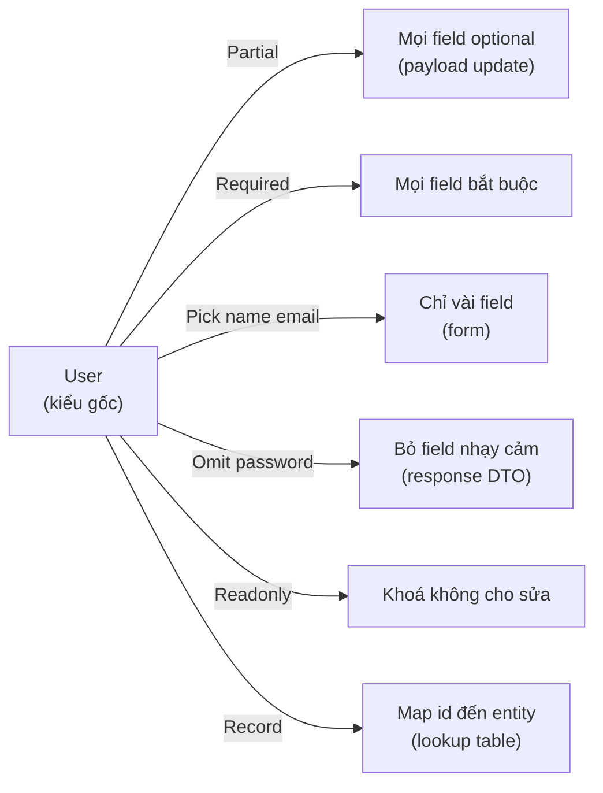

# Utility Types

**Utility type** (kiểu tiện ích dựng sẵn) là các kiểu có sẵn trong TypeScript giúp bạn biến đổi nhanh một kiểu đã có thành kiểu mới mà không phải viết lại từ đầu. Ví dụ `Partial` làm mọi thuộc tính thành tùy chọn, `Pick` chọn ra một vài thuộc tính, `Readonly` khóa không cho sửa. Bài này giúp người mới học nắm các utility type thông dụng để xử lý kiểu gọn gàng và ít lặp lại hơn.

[](pathname:///img/typescript/utility-types.webp)

---

:::note[Ghi nhớ nhanh]

- ⭐ **Utility type biến đổi kiểu gốc thành biến thể tự động (DRY)** — sửa kiểu gốc thì mọi biến thể cập nhật theo, không phải định nghĩa lại thủ công.
- **`Partial`/`Required` bật tắt optional, `Readonly` khóa sửa** — lưu ý `Readonly` chỉ shallow, object lồng bên trong vẫn sửa được.
- **`Pick`/`Omit` chọn/bỏ key, `Record<K, V>` tạo map key→value** — `Omit` cực hữu dụng cho DTO (bỏ field nhạy cảm như `password`).
- **`Exclude`/`Extract`/`NonNullable` lọc union; `Parameters`/`ReturnType`/`InstanceType`** — lấy kiểu từ function/class mà không khai báo lại.
- ⭐ **`Awaited<T>` (TS 4.5+) lấy kiểu bên trong Promise** — kết hợp `as const` + `typeof` để tạo type từ giá trị (single source of truth).

:::

---

## Mục lục

- [Vì sao có utility types?](#vì-sao-có-utility-types)
- [Partial và Required](#partial-và-required)
- [Readonly](#readonly)
- [Pick và Omit](#pick-và-omit)
- [Record](#record)
- [Exclude, Extract, NonNullable](#exclude-extract-nonnullable)
- [Parameters, ReturnType, InstanceType](#parameters-returntype-instancetype)
- [Awaited](#awaited)
- [Câu hỏi phỏng vấn](#câu-hỏi-phỏng-vấn)

---

## Vì sao có utility types?

Từ một kiểu gốc như `User`, ta thường cần nhiều **biến thể**: bản tất cả optional (cho update), bản chỉ vài field (cho form), bản readonly... Nếu định nghĩa lại thủ công thì trùng lặp, và khi `User` đổi field phải sửa khắp nơi — rất dễ sót.

**Vấn đề:**

```ts
interface User { id: number; name: string; email: string; }

// Định nghĩa lại thủ công cho mỗi biến thể — trùng lặp
interface UserUpdate { id?: number; name?: string; email?: string }
interface UserForm   { name: string; email: string }
interface UserRO     { readonly id: number; readonly name: string; readonly email: string }

// Thêm field "phone" vào User → phải nhớ sửa cả 3 chỗ trên, dễ sót
```

**Giải pháp:**

```ts
interface User { id: number; name: string; email: string; }

type UserUpdate = Partial<User>;          // tất cả optional
type UserForm   = Pick<User, "name" | "email">; // chỉ vài field
type UserRO     = Readonly<User>;         // khóa không cho sửa

// Thêm field "phone" vào User → cả 3 biến thể tự cập nhật theo
```

Utility types là các phép **biến đổi kiểu** dựng sẵn (`Partial<T>`, `Required<T>`, `Pick<T,K>`, `Omit<T,K>`, `Record<K,V>`, `Readonly<T>`, `ReturnType<T>`...), suy ra **tự động** từ kiểu gốc → DRY, gốc đổi thì biến thể cập nhật theo.

Sơ đồ dưới minh hoạ cách từ một kiểu gốc `User` sinh ra nhiều biến thể qua các utility type khác nhau:



:::tip[Dùng thực tế]

- **Payload update**: dùng `Partial<User>` để client chỉ gửi field cần đổi.
- **Chọn field cho form/response**: dùng `Pick<User, ...>` hoặc `Omit<User, "password">`.
- **Map id → entity**: dùng `Record<string, User>` cho cache hoặc lookup table.
- **Props bất biến**: dùng `Readonly<Props>` để khóa, tránh mutate nhầm.

:::

---

## Partial và Required

`Partial<T>` — biến mọi property thành **optional**.

```ts
interface User { id: number; name: string; email: string; }

type UserUpdate = Partial<User>;
// { id?: number; name?: string; email?: string }

function update(id: number, data: Partial<User>) { /* ... */ }
update(1, { name: "An" }); // OK, chỉ truyền field cần
```

`Required<T>` — ngược lại, bắt **mọi field bắt buộc**.

```ts
interface Config { host?: string; port?: number; }

type StrictConfig = Required<Config>;
// { host: string; port: number }
```

---

## Readonly

`Readonly<T>` — mọi property thành **không sửa được**.

```ts
type FrozenUser = Readonly<User>;

const u: FrozenUser = { id: 1, name: "An", email: "a@b.c" };
u.name = "Bình"; // Error
```

:::warning[Cần lưu ý]

`Readonly` chỉ **shallow** — không đệ quy. Property là object nested vẫn
sửa được:

```ts
type Config = Readonly<{ db: { host: string } }>;
const c: Config = { db: { host: "localhost" } };
c.db.host = "x"; // Vẫn OK! (db không readonly)
```

Cần đệ quy phải tự viết `DeepReadonly<T>` hoặc dùng thư viện
(`type-fest`).

:::

---

## Pick và Omit

`Pick<T, K>` — **lấy** một số key.

```ts
interface User { id: number; name: string; email: string; password: string; }

type UserPublic = Pick<User, "id" | "name">;
// { id: number; name: string }
```

`Omit<T, K>` — **loại bỏ** một số key.

```ts
type UserSafe = Omit<User, "password">;
// { id: number; name: string; email: string }
```

:::tip[Mẹo]

`Omit` cực hữu dụng cho **DTO** — định nghĩa một entity gốc rồi tạo
variant không có field nhạy cảm:

```ts
type UserEntity = { id: number; name: string; password: string; };
type UserResponse = Omit<UserEntity, "password">;
type UserCreateRequest = Omit<UserEntity, "id">;
```

Một nguồn sự thật, nhiều biến thể — sync tự động khi entity thay đổi.

:::

---

## Record

`Record<K, V>` — tạo object có **key** kiểu `K`, **value** kiểu `V`.

```ts
type Role = "admin" | "user" | "guest";
type Permissions = Record<Role, string[]>;

const perms: Permissions = {
  admin: ["read", "write", "delete"],
  user:  ["read", "write"],
  guest: ["read"],
};
```

Thiếu key sẽ báo lỗi — TS đảm bảo **đủ** mọi role.

---

## Exclude, Extract, NonNullable

`Exclude<T, U>` — loại bỏ các thành phần trong `T` thuộc `U`.

```ts
type T1 = Exclude<"a" | "b" | "c", "a">; // "b" | "c"
type T2 = Exclude<string | number | null, null>; // string | number
```

`Extract<T, U>` — ngược lại, **lấy** các thành phần.

```ts
type T3 = Extract<"a" | "b" | "c", "a" | "c">; // "a" | "c"
```

`NonNullable<T>` — loại `null` và `undefined`.

```ts
type T4 = NonNullable<string | null | undefined>; // string
```

---

## Parameters, ReturnType, InstanceType

Lấy type **liên quan đến function/class** mà không cần khai báo lại.

```ts
function createUser(id: number, name: string): User {
  return { id, name, email: "", password: "" };
}

type Args = Parameters<typeof createUser>;     // [number, string]
type Ret  = ReturnType<typeof createUser>;     // User
```

```ts
class Logger { log(msg: string) {} }

type LoggerInstance = InstanceType<typeof Logger>; // Logger
```

:::info[Phân tích]

`typeof someFunction` lấy **function type** của giá trị, dùng kết hợp
với utility:

```ts
const config = { url: "/api", timeout: 5000 };
type Config = typeof config; // { url: string; timeout: number }
```

Pattern này — kết hợp `as const` + `typeof` + utility — là cách viết
**type từ giá trị** (single source of truth) thay vì duy trì hai chỗ:

```ts
const STATUS = ["pending", "active", "done"] as const;
type Status = typeof STATUS[number]; // "pending" | "active" | "done"
```

:::

---

## Awaited

`Awaited<T>` — lấy type **bên trong Promise** (đệ quy với nested Promise).

```ts
type A = Awaited<Promise<string>>;          // string
type B = Awaited<Promise<Promise<number>>>; // number

async function fetchUser(): Promise<User> {
  return null as any;
}

type FetchResult = Awaited<ReturnType<typeof fetchUser>>; // User
```

:::tip[Mẹo]

`Awaited` (TS 4.5+) thay thế hoàn toàn cách viết cũ:

```ts
// Cũ — khó nhớ, error-prone
type Unwrap<T> = T extends Promise<infer U> ? U : T;

// Mới — chuẩn library
type Unwrap<T> = Awaited<T>;
```

Khi đọc kiểu `Awaited<ReturnType<typeof asyncFn>>` thấy quen rồi sẽ rất
nhanh — đây là pattern xuất hiện đầy trong codebase Next.js, tRPC...

:::

---

## Câu hỏi phỏng vấn

Những câu thường gặp về chủ đề này. Tự trả lời trước, rồi bấm **Xem đáp án** để đối chiếu.

**1. `Partial`, `Required`, `Readonly` được cài đặt thế nào bằng mapped type? Hãy viết lại `Partial` bằng tay.**

<details className="qa">
<summary>Xem đáp án</summary>

Cả ba đều là **mapped type**: duyệt qua từng key của `T` rồi bật/tắt modifier.

```ts
type MyPartial<T>  = { [P in keyof T]?: T[P] };
type MyRequired<T> = { [P in keyof T]-?: T[P] };
type MyReadonly<T> = { readonly [P in keyof T]: T[P] };
```

Các mảnh ghép:

- `keyof T` — union các key của `T`.
- `[P in keyof T]` — lặp qua từng key, `P` là key hiện tại.
- `T[P]` — indexed access, lấy kiểu của property đó.
- `?` / `readonly` — **thêm** modifier; `-?` / `-readonly` — **gỡ** modifier (cú pháp `+`/`-` có từ TS 2.8).

Mặc định modifier của key gốc được **giữ nguyên** vì đây là *homomorphic mapped type* (map trực tiếp trên `keyof T`). Đó là lý do `Partial<Readonly<User>>` vẫn còn `readonly`.

```ts
interface User { readonly id: number; name?: string }
type A = MyRequired<User>;  // { readonly id: number; name: string }
```

</details>

**2. Vì sao `Partial` và `Readonly` chỉ shallow? Khi nào cần `DeepPartial` và rủi ro kèm theo là gì?**

<details className="qa">
<summary>Xem đáp án</summary>

Vì mapped type chỉ chạy **một vòng trên key ở tầng ngoài cùng**, còn giá trị `T[P]` được giữ nguyên xi, không bị biến đổi tiếp:

```ts
type Config = Readonly<{ db: { host: string } }>;
const c: Config = { db: { host: "localhost" } };
c.db = {} as any;     // Error — db readonly
c.db.host = "x";      // OK! — bên trong không đụng tới
```

Cần bản đệ quy khi làm việc với **object lồng nhiều tầng**: merge config từng phần, patch state lồng nhau, hoặc fixture cho test.

```ts
type DeepPartial<T> = { [P in keyof T]?: DeepPartial<T[P]> };
```

Rủi ro:

- **Đụng nhầm kiểu dựng sẵn**: `Date`, `Map`, `Set`, `RegExp`, function đều bị "mổ xẻ" thành object có mọi method optional — sai hoàn toàn. Phải thêm nhánh loại trừ.
- **Mảng**: `DeepPartial<T[]>` biến phần tử thành optional, dễ sinh `undefined` ngoài ý muốn.
- **Hiệu năng**: đệ quy sâu làm chậm type-check, có thể chạm lỗi TS2589.
- **Mất an toàn**: mọi field optional nghĩa là compiler không còn bắt được việc quên truyền dữ liệu.

Thực tế nên dùng bản đã kiểm nghiệm của `type-fest` thay vì tự viết.

</details>

**3. `Pick` và `Omit` khác nhau ra sao? `Omit` được dựng lại từ `Pick` và `Exclude` như thế nào?**

<details className="qa">
<summary>Xem đáp án</summary>

`Pick<T, K>` là **allowlist** — giữ đúng những key bạn liệt kê. `Omit<T, K>` là **denylist** — giữ tất cả trừ những key bạn liệt kê.

```ts
interface User { id: number; name: string; email: string; password: string }

type A = Pick<User, "id" | "name">;   // { id; name }
type B = Omit<User, "password">;      // { id; name; email }
```

`Omit` không phải nguyên thuỷ — nó được ghép từ hai utility khác trong `lib.es5.d.ts`:

```ts
type Omit<T, K extends keyof any> = Pick<T, Exclude<keyof T, K>>;
```

Đọc từ trong ra: lấy `keyof T` (tất cả key), dùng `Exclude` bỏ đi những key thuộc `K`, rồi `Pick` phần còn lại. Vì vậy `Omit` thừa hưởng mọi đặc tính của `Pick` — giữ modifier `readonly`/`?`, nhưng cũng thừa hưởng các hạn chế (xem câu về call signature và union).

Mẹo chọn: danh sách cần giữ ngắn thì dùng `Pick`; danh sách cần bỏ ngắn thì dùng `Omit`. Với dữ liệu nhạy cảm, `Pick` an toàn hơn.

</details>

**4. Vì sao `Omit` không báo lỗi khi truyền một key không tồn tại, còn `Pick` thì có? Viết một `StrictOmit` an toàn hơn.**

<details className="qa">
<summary>Xem đáp án</summary>

Khác biệt nằm ở **constraint của tham số `K`** trong định nghĩa gốc:

```ts
type Pick<T, K extends keyof T> = { [P in K]: T[P] };
type Omit<T, K extends keyof any> = Pick<T, Exclude<keyof T, K>>;
```

`Pick` buộc `K extends keyof T` nên gõ sai key là lỗi ngay. `Omit` chỉ buộc `K extends keyof any` (tức `string | number | symbol`) — nghĩa là mọi chuỗi đều hợp lệ, gõ nhầm `"passwrod"` vẫn qua và bạn lặng lẽ nhận về kiểu còn nguyên field `password`.

```ts
type Bug = Omit<User, "passwrod">; // không lỗi — password vẫn còn!
```

Đây là lựa chọn có chủ đích của TS team để `Omit` dùng được trong ngữ cảnh generic (khi `keyof T` chưa xác định) và khi bỏ key của một union. Bản chặt hơn:

```ts
type StrictOmit<T, K extends keyof T> = Omit<T, K>;

type Ok  = StrictOmit<User, "password">;  // OK
type Bad = StrictOmit<User, "passwrod">;  // Error — đúng như mong muốn
```

</details>

**5. `Record<K, V>` dùng khi nào? Khác gì với index signature dạng `[key: string]: V`?**

<details className="qa">
<summary>Xem đáp án</summary>

`Record<K, V> = { [P in K]: V }` — tạo object có key kiểu `K`, value kiểu `V`. Sức mạnh thật của nó lộ ra khi `K` là **union literal**:

```ts
type Role = "admin" | "user" | "guest";
const perms: Record<Role, string[]> = {
  admin: ["read", "write"],
  user: ["read"],
};  // Error — thiếu "guest"
```

| | `Record<Role, V>` (union literal) | `{ [key: string]: V }` |
|---|---|---|
| Tập key | Đóng, biết trước | Mở, key nào cũng được |
| Thiếu key | Báo lỗi (exhaustive) | Không kiểm tra được |
| Key lạ | Báo lỗi | Chấp nhận |
| Kiểu khi truy cập | `V` | `V`, hoặc `V \| undefined` nếu bật `noUncheckedIndexedAccess` |
| Hợp cho | Bảng cấu hình theo enum/union, đảm bảo phủ hết nhánh | Cache, lookup table, dữ liệu động từ API |

Lưu ý: `Record<string, V>` thì gần như tương đương index signature — khác biệt chỉ có ý nghĩa khi `K` là tập key hữu hạn.

</details>

**6. Phân biệt `Exclude` với `Omit`, và `Extract` với `Pick` — cặp nào làm việc trên union, cặp nào trên object?**

<details className="qa">
<summary>Xem đáp án</summary>

`Exclude` / `Extract` lọc **union các kiểu**; `Omit` / `Pick` lọc **key của object**.

| Utility | Đối tượng | Định nghĩa |
|---|---|---|
| `Exclude<T, U>` | Union | `T extends U ? never : T` |
| `Extract<T, U>` | Union | `T extends U ? T : never` |
| `Pick<T, K>` | Object | `{ [P in K]: T[P] }` |
| `Omit<T, K>` | Object | `Pick<T, Exclude<keyof T, K>>` |

```ts
type Status = "draft" | "active" | "archived";
type Live = Exclude<Status, "archived">;   // "draft" | "active"
type Gone = Extract<Status, "archived">;   // "archived"

interface User { id: number; name: string; password: string }
type Safe = Omit<User, "password">;        // { id; name }
```

`Exclude`/`Extract` là **distributive conditional type**: khi `T` là union, TS chạy điều kiện trên từng nhánh rồi gộp kết quả — đó là lý do chúng lọc được union. Còn `Omit` chính là `Exclude` áp lên `keyof T` rồi `Pick` lại, nên hai nhóm này liên quan chặt với nhau: nhóm union là *nguyên liệu*, nhóm object là *ứng dụng*.

</details>

**7. `NonNullable<T>` khác gì so với việc bật `strictNullChecks`? Hai thứ này thay thế nhau được không?**

<details className="qa">
<summary>Xem đáp án</summary>

Hai thứ ở hai tầng hoàn toàn khác nhau.

`strictNullChecks` là **cờ compiler**, bật toàn dự án. Khi bật, `null` và `undefined` trở thành kiểu riêng, không còn tự động thuộc mọi kiểu — `let s: string = null` thành lỗi, và bạn buộc phải narrow trước khi dùng giá trị có thể null.

`NonNullable<T>` là một **phép biến đổi kiểu cục bộ**, gỡ `null | undefined` khỏi một kiểu cụ thể:

```ts
type T = NonNullable<string | null | undefined>; // string
```

Không thay thế nhau được, thậm chí phụ thuộc nhau: nếu **tắt** `strictNullChecks` thì `null`/`undefined` đã bị hấp thụ vào mọi kiểu, `NonNullable` gần như vô nghĩa. Ngược lại, bật `strictNullChecks` không tự loại null ở đâu cả — bạn vẫn cần `NonNullable` (hoặc narrow bằng `if`) tại từng chỗ.

Thứ tự đúng: bật `strictNullChecks` làm nền, rồi dùng `NonNullable` như công cụ dọn kiểu ở nơi đã biết chắc giá trị tồn tại.

</details>

**8. `ReturnType`, `Parameters`, `InstanceType`, `ConstructorParameters` lấy thông tin bằng cơ chế nào bên dưới?**

<details className="qa">
<summary>Xem đáp án</summary>

Tất cả đều dựa trên **conditional type + từ khoá `infer`** — khớp mẫu (pattern matching) trên kiểu, rồi bắt lấy phần cần.

```ts
type ReturnType<T extends (...a: any) => any> =
  T extends (...a: any) => infer R ? R : any;

type Parameters<T extends (...a: any) => any> =
  T extends (...a: infer P) => any ? P : never;

type InstanceType<T extends abstract new (...a: any) => any> =
  T extends abstract new (...a: any) => infer R ? R : any;

type ConstructorParameters<T extends abstract new (...a: any) => any> =
  T extends abstract new (...a: infer P) => any ? P : never;
```

`infer R` nghĩa là "chỗ này là một kiểu nào đó, đặt tên nó là `R` cho tôi dùng ở nhánh true". `Parameters` trả về một **tuple** (`[number, string]`), nên kết hợp rất hợp với rest parameter và spread.

Một cạm bẫy đáng nhớ: với hàm **overload**, conditional type chỉ khớp được **chữ ký cuối cùng**, nên `ReturnType` của hàm overload thường không như bạn mong đợi.

</details>

**9. `Awaited<T>` xử lý Promise lồng nhau ra sao? Vì sao nó thay thế được cách viết cũ với `infer`?**

<details className="qa">
<summary>Xem đáp án</summary>

`Awaited<T>` (TS 4.5+) bóc Promise **đệ quy** cho tới khi không còn lớp nào:

```ts
type A = Awaited<Promise<string>>;            // string
type B = Awaited<Promise<Promise<number>>>;   // number
type C = Awaited<number>;                     // number — không phải Promise thì giữ nguyên
type D = Awaited<Promise<string> | number>;   // string | number — phân tán trên union
```

Cách viết cũ chỉ bóc **một lớp** và dễ sai:

```ts
type Unwrap<T> = T extends Promise<infer U> ? U : T;
type E = Unwrap<Promise<Promise<number>>>;    // Promise<number> — còn sót một lớp
```

Ngoài đệ quy, `Awaited` còn xử lý đúng các trường hợp mà bản tự viết hay bỏ sót: **thenable** (bất cứ object nào có `.then`, chứ không chỉ `Promise`), phân tán trên union, và giữ nguyên `null`/`undefined`. Nó mô phỏng đúng ngữ nghĩa của `await` trong runtime — đó là lý do nên dùng bản dựng sẵn.

Pattern hay gặp nhất: `Awaited<ReturnType<typeof fetchUser>>` để lấy kiểu dữ liệu thật mà một hàm async trả về.

</details>

**10. Trong `ReturnType<typeof fn>`, `typeof` đóng vai trò gì? Vì sao không viết trực tiếp `ReturnType<fn>` được?**

<details className="qa">
<summary>Xem đáp án</summary>

TypeScript có **hai không gian tên tách biệt**: *value space* (biến, hàm, const) và *type space* (interface, type alias, class). `ReturnType<...>` cần một **kiểu** làm type argument, nhưng `fn` là một **giá trị** — nó chỉ tồn tại ở value space.

`typeof` ở vị trí kiểu là **type query operator** — cây cầu bắc từ value space sang type space, cho ra kiểu của giá trị đó:

```ts
function createUser(id: number, name: string): User { /* ... */ }

type Args = Parameters<typeof createUser>;  // [number, string]
type Ret  = ReturnType<typeof createUser>;  // User
type Bad  = ReturnType<createUser>;         // Error — "refers to a value, not a type"
```

Lưu ý `typeof` ở đây **khác hoàn toàn** toán tử `typeof` lúc runtime (trả về chuỗi `"function"`); trùng từ khoá nhưng khác ngữ cảnh.

Trường hợp `class` thì đặc biệt: tên class tồn tại ở **cả hai** space — `Logger` là kiểu instance, còn `typeof Logger` là kiểu của chính constructor. Đó là lý do phải viết `InstanceType<typeof Logger>` chứ không phải `InstanceType<Logger>`.

</details>

**11. Khi áp `Partial` lên một union type, kết quả có phân tán (distribute) trên từng nhánh không? Còn `Omit` thì sao?**

<details className="qa">
<summary>Xem đáp án</summary>

`Partial` **có** phân tán, `Omit` **không** — đây là một trong những cạm bẫy hay gặp nhất.

`Partial` là *homomorphic mapped type* (map trực tiếp trên `keyof T`), và loại mapped type này tự động phân tán trên union:

```ts
type A = { kind: "a"; x: number };
type B = { kind: "b"; y: string };

type P = Partial<A | B>;
// = Partial<A> | Partial<B> — vẫn còn hai nhánh
```

`Omit` thì không, vì nó tính `keyof (A | B)` — mà `keyof` của một union chỉ cho ra **các key chung**:

```ts
type O = Omit<A | B, "kind">;
// keyof (A|B) = "kind" → Exclude bỏ hết → kết quả là {} — mất sạch x và y!
```

Cách sửa là tự phân tán bằng conditional type trên naked type parameter:

```ts
type DistributiveOmit<T, K extends PropertyKey> =
  T extends any ? Omit<T, K> : never;

type O2 = DistributiveOmit<A | B, "kind">; // { x: number } | { y: string }
```

Quy tắc nhớ: gặp discriminated union mà muốn dùng `Omit`/`Pick`, hãy bọc qua bản distributive trước.

</details>

**12. `Pick` / `Omit` làm mất đi những gì khi áp lên type có index signature, có method overload, hoặc có call signature?**

<details className="qa">
<summary>Xem đáp án</summary>

Cả hai đều xây trên `keyof` + mapped type, mà `keyof` chỉ thấy **property**, nên mọi thứ không phải property đều rơi rụng.

Call signature và construct signature bị **xoá sạch** — kết quả trở thành object type thuần, không gọi được nữa:

```ts
type Fn = { (x: number): string; meta: string };
type R = Omit<Fn, "nothing">;   // { meta: string } — mất khả năng gọi
```

Index signature làm `Omit` mất tác dụng, vì `keyof` cho ra `string`/`number` và `Exclude` không cắt được một literal ra khỏi `string`:

```ts
type Dict = { [k: string]: number; a: number };
type D = Omit<Dict, "a">;  // index signature vẫn còn → "a" vẫn truy cập được
```

Về **method overload**: nếu overload nằm ở một property (`obj.fn`) thì `T[P]` lấy nguyên kiểu nên vẫn giữ; nhưng nếu chính `T` là hàm overload thì phần call signature bị bỏ như trên.

Ngoài ra, áp lên **class** sẽ mất member `private`/`protected` và mất quan hệ nominal với class gốc — kết quả chỉ còn là một object type bình thường.

</details>

**13. Utility type nào phù hợp nhất để tạo DTO ẩn field nhạy cảm như `password`? Vì sao nên ưu tiên nó hơn khai báo một interface mới?**

<details className="qa">
<summary>Xem đáp án</summary>

Câu trả lời quen thuộc là `Omit`:

```ts
type UserEntity = { id: number; name: string; email: string; password: string };
type UserResponse = Omit<UserEntity, "password">;
type UserCreateRequest = Omit<UserEntity, "id">;
```

Ưu điểm so với viết một interface mới bằng tay: **một nguồn sự thật**. Thêm field `phone` vào `UserEntity` là mọi biến thể tự cập nhật, không phải sửa nhiều chỗ và không sợ sót. Interface viết tay sẽ trôi dần khỏi entity theo thời gian mà compiler không hề cảnh báo.

Nhưng với dữ liệu **nhạy cảm**, `Pick` thường là lựa chọn an toàn hơn:

```ts
type UserResponse = Pick<UserEntity, "id" | "name" | "email">;
```

Lý do: `Omit` là denylist — mai này ai đó thêm `passwordResetToken` vào entity thì field đó **tự động lọt ra** response. `Pick` là allowlist, mọi field mới mặc định bị giữ lại bên trong. Nguyên tắc bảo mật "mặc định từ chối" nghiêng hẳn về `Pick`. Nhớ rằng đây chỉ là an toàn ở tầng kiểu — vẫn phải thực sự lọc dữ liệu lúc chạy.

</details>

**14. `Uppercase`, `Lowercase`, `Capitalize`, `Uncapitalize` thuộc nhóm nào và được cài đặt ở đâu? Vì sao không viết lại chúng bằng TS thuần được?**

<details className="qa">
<summary>Xem đáp án</summary>

Chúng thuộc nhóm **intrinsic string manipulation types**, thường dùng kèm template literal type:

```ts
type Ev = `on${Capitalize<"click">}`;  // "onClick"
type U  = Uppercase<"get" | "post">;   // "GET" | "POST"
```

Trong `lib.es5.d.ts` chúng được khai báo bằng từ khoá đặc biệt `intrinsic`:

```ts
type Uppercase<S extends string> = intrinsic;
```

Nghĩa là **không có phần thân viết bằng TS** — phần cài đặt nằm trong chính mã nguồn của compiler (checker gọi thẳng vào hàm xử lý chuỗi của JS).

Không viết lại bằng TS thuần được vì hệ kiểu của TS không có phép **biến đổi ký tự**. Template literal type cho phép tách và ghép chuỗi ở tầng kiểu, nhưng không có cách nào đổi `"a"` thành `"A"` — trừ khi bạn tự khai một bảng ánh xạ 26+ ký tự rồi duyệt đệ quy, vừa cực kỳ tốn hiệu năng type-check vừa không xử lý nổi Unicode. Vì vậy TS chọn cài đặt chúng ở tầng compiler.

</details>

**15. `ThisType`, `Omit` với generic chưa gán, và `Extract` với `never` — chuyện gì xảy ra khi kết quả rút gọn về `never`?**

<details className="qa">
<summary>Xem đáp án</summary>

`ThisType<T>` là một **marker type**, không thêm property nào; nó chỉ có tác dụng trong object literal có contextual type và khi bật `noImplicitThis`, để khai báo kiểu của `this` bên trong các method — kiểu mà Vue Options API dùng.

`Omit<T, K>` khi `T` còn là type parameter chưa gán sẽ bị **hoãn đánh giá** (deferred): TS chưa biết `keyof T` nên chưa rút gọn được, dẫn tới autocomplete kém và thường không gán ngược về `T` được.

`Extract<T, never>` luôn cho `never`, vì không nhánh nào của `T` extends `never`.

Khi kết quả rút về `never`:

- `never` là **union rỗng** — không giá trị nào gán được vào nó, nên chỗ dùng sẽ báo lỗi khó hiểu kiểu "Type 'string' is not assignable to type 'never'".
- `never` bị **nuốt trong union**: `string | never` là `string`, nên lỗi hay ẩn đi và chỉ lộ ở nơi rất xa.
- `Record<never, V>` cho `{}`, và mapped type trên `never` cho object rỗng.

Thấy `never` xuất hiện ngoài ý muốn thường nghĩa là bạn đã lọc quá tay, hoặc hai kiểu đem so không hề giao nhau — hãy hover từng bước trung gian để tìm chỗ union bị rỗng.

</details>

**16. Vì sao lạm dụng chuỗi utility lồng nhau kiểu `Partial<Omit<Pick<T, K>, K2>>` là code smell? Bạn refactor thế nào cho dễ đọc?**

<details className="qa">
<summary>Xem đáp án</summary>

Vấn đề không nằm ở utility type mà ở việc **dồn quá nhiều phép biến đổi vào một biểu thức vô danh**:

- Người đọc phải giải mã từ trong ra ngoài mới biết kiểu cuối cùng là gì, và cái tên không nói lên **ý định nghiệp vụ**.
- Thông báo lỗi bị "duỗi" ra thành một khối kiểu dài, rất khó soi.
- Mỗi tầng là một lần instantiate — chồng nhiều tầng trên union lớn làm chậm type-check.
- Thường là triệu chứng: kiểu gốc `T` ôm quá nhiều vai trò, nên chỗ nào dùng cũng phải gọt lại.

Cách refactor — đặt tên cho từng bước trung gian theo ngữ nghĩa:

```ts
// Khó đọc
type Form = Partial<Omit<Pick<User, "id" | "name" | "email">, "id">>;

// Dễ đọc
type UserProfile = Pick<User, "id" | "name" | "email">;
type UserProfileDraft = Partial<Omit<UserProfile, "id">>;
```

Xa hơn: tách kiểu gốc thành các mảnh nhỏ rồi ghép lại (`UserIdentity & UserContact`), khai báo DTO tường minh ở biên hệ thống, hoặc đi theo hướng schema-first (Zod) rồi suy kiểu từ schema — vừa có validate lúc chạy vừa có kiểu sạch.

</details>

