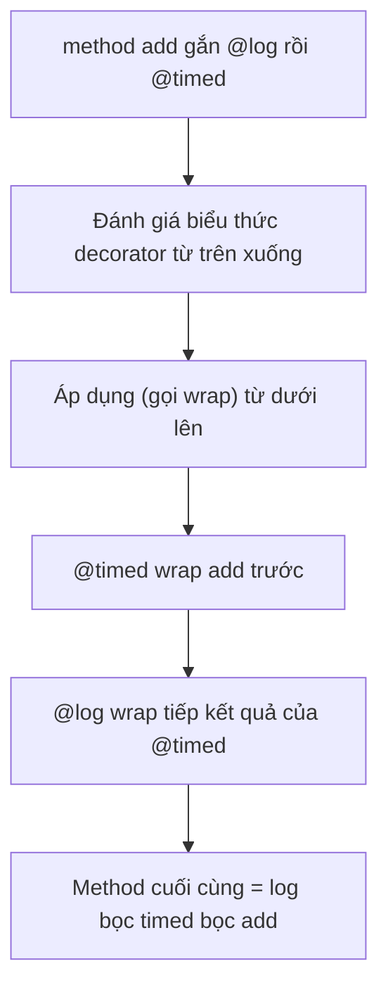
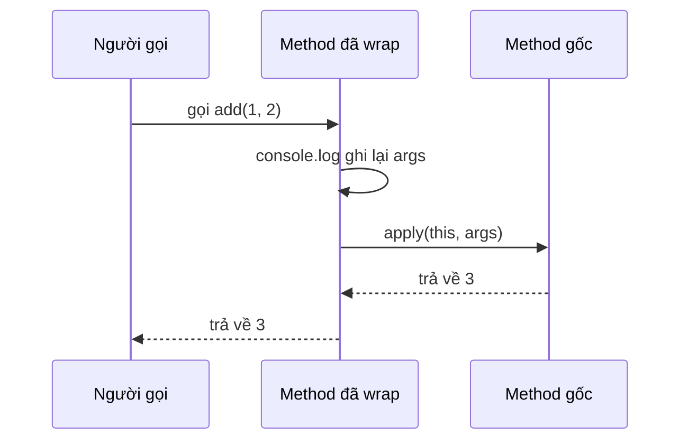

# Decorators

**Decorator** (chú thích gắn thêm hành vi) là một cú pháp đặc biệt bắt đầu bằng dấu `@`, dùng để gắn thêm hoặc thay đổi hành vi cho class, phương thức hay thuộc tính mà không phải sửa trực tiếp bên trong chúng. Đây thực chất là một hàm chạy lúc khai báo để bổ sung logic như ghi log, kiểm tra quyền hay đăng ký metadata. Bài này giúp người mới học hiểu khái niệm decorator và cách dùng phổ biến của nó trong TypeScript.

---

:::note[Ghi nhớ nhanh]

- ⭐ **Decorator `@something` là hàm gắn thêm hành vi/metadata** — cho class, method, property hoặc parameter một cách khai báo, tách khỏi logic nghiệp vụ (logging, DI, ORM mapping).
- **Nhiều decorator xếp chồng** — đánh giá biểu thức từ trên xuống, nhưng áp dụng (wrap) từ dưới lên.
- **4 loại: class, method, property, parameter** — property/parameter decorator chủ yếu ghi metadata, không truy cập được giá trị runtime.
- ⭐ **Legacy cần `experimentalDecorators` + `emitDecoratorMetadata`** — NestJS, TypeORM, Angular dùng bản này; decorator Stage 3 chuẩn ES (TS 5.0+) có signature khác, không trộn lẫn hai loại.
- **App React/Next thường không cần decorator** — dùng higher-order function hoặc hook gọn hơn.

:::

---

## Mục lục

- [Vì sao có decorators?](#vì-sao-có-decorators)
- [Decorator là gì?](#decorator-là-gì)
- [Class Decorator](#class-decorator)
- [Method Decorator](#method-decorator)
- [Property Decorator](#property-decorator)
- [Parameter Decorator](#parameter-decorator)
- [Decorator hiện đại (Stage 3)](#decorator-hiện-đại-stage-3)

---

## Vì sao có decorators?

Nhiều mối quan tâm **cắt ngang (cross-cutting)** — ghi log, đo thời gian
chạy, kiểm tra quyền, validate input, đăng ký metadata — không thuộc về
logic chính của method. Nếu nhét thủ công vào từng method thì **lặp code**
và **lẫn lộn** với nghiệp vụ:

**Vấn đề:**

```ts
class Calc {
  add(a: number, b: number) {
    console.log("Call add với", [a, b]);   // logging lặp
    const start = performance.now();         // đo thời gian lặp
    const result = a + b;                    // logic chính bị chìm
    console.log("Mất", performance.now() - start, "ms");
    return result;
  }

  sub(a: number, b: number) {
    console.log("Call sub với", [a, b]);   // lại lặp y hệt
    const start = performance.now();
    const result = a - b;
    console.log("Mất", performance.now() - start, "ms");
    return result;
  }
}
```

**Giải pháp:**

```ts
// Gắn @log / @timed một cách KHAI BÁO, tách hẳn khỏi logic chính
class Calc {
  @log
  @timed
  add(a: number, b: number) { return a + b; }

  @log
  @timed
  sub(a: number, b: number) { return a - b; }
}
```

Decorator `@something` gắn lên **class / method / property / parameter** để
**thêm hành vi hoặc metadata** một cách khai báo, tách khỏi logic nghiệp vụ.
Đây là nền tảng của Angular, NestJS và TypeORM. (Lưu ý: cần bật
`experimentalDecorators` cho decorator legacy, hoặc dùng decorator chuẩn ES
trên TS 5.0+ — xem mục [Bật decorator](#bật-decorator).)

Khi nhiều decorator xếp chồng trên cùng một method, thứ tự đánh giá và thứ tự áp dụng ngược nhau — sơ đồ dưới minh hoạ với `@log` và `@timed`:



:::tip[Dùng thực tế]

- **Angular / NestJS**: `@Component`, `@Injectable` đánh dấu class cho DI
  container.
- **TypeORM**: `@Entity`, `@Column` map class/property sang bảng và cột
  trong database.
- **Logging / đo hiệu năng**: `@log`, `@timed` wrap method để ghi log hoặc
  đo thời gian mà không đụng vào nội dung method.
- **Binding dữ liệu**: `@Input` (Angular) khai báo property nhận dữ liệu
  từ component cha.

:::

---

## Decorator là gì?

Decorator là **hàm** gắn vào class, method, property hoặc parameter để
**thêm hành vi** mà không sửa code gốc.

Cú pháp dùng `@decoratorName`:

```ts
@sealed
class User {
  @log
  greet() {}
}
```

Decorator được dùng nhiều trong:

- **NestJS**: `@Controller`, `@Get`, `@Injectable`.
- **TypeORM**: `@Entity`, `@Column`, `@PrimaryGeneratedColumn`.
- **Angular**: `@Component`, `@NgModule`.

---

## Bật decorator

TS 5.0 trở lên hỗ trợ **decorator chuẩn ECMAScript Stage 3** mặc định.
Decorator **legacy** (cú pháp cũ) cần flag:

```json
{
  "compilerOptions": {
    "experimentalDecorators": true,
    "emitDecoratorMetadata": true
  }
}
```

Phần lớn framework hiện tại (NestJS, TypeORM) **vẫn dùng legacy**. Tài
liệu dưới đây mô tả legacy decorator.

---

## Class Decorator

Áp dụng cho cả class — nhận chính constructor làm tham số.

```ts
function logged<T extends { new(...args: any[]): {} }>(target: T) {
  return class extends target {
    constructor(...args: any[]) {
      super(...args);
      console.log(`Created instance of ${target.name}`);
    }
  };
}

@logged
class User {
  constructor(public name: string) {}
}

new User("An"); // log: "Created instance of User"
```

---

## Method Decorator

Áp dụng cho method — có thể wrap, log, validate.

```ts
function log(target: any, key: string, descriptor: PropertyDescriptor) {
  const original = descriptor.value;
  descriptor.value = function (...args: any[]) {
    console.log(`Call ${key} với`, args);
    return original.apply(this, args);
  };
}

class Calc {
  @log
  add(a: number, b: number) { return a + b; }
}

new Calc().add(1, 2); // log: Call add với [1, 2]
```

Sơ đồ dưới cho thấy lúc runtime, method đã bị decorator wrap sẽ chèn logic ghi log trước khi gọi method gốc:



---

## Property Decorator

Áp dụng cho property — thường dùng metadata.

```ts
function required(target: any, key: string) {
  console.log(`${key} là bắt buộc`);
}

class User {
  @required
  name: string = "";
}
```

Property decorator **không** truy cập được giá trị runtime (chỉ biết
tên property). Để validate giá trị, kết hợp với class decorator hoặc
reflect-metadata.

---

## Parameter Decorator

Áp dụng cho tham số — đánh dấu metadata cho DI (NestJS).

```ts
function inject(token: string) {
  return function (target: any, key: string, index: number) {
    // Lưu metadata
  };
}

class UserService {
  constructor(@inject("Logger") private logger: any) {}
}
```

:::info[Phân tích]

**Mô hình DI** của NestJS/Angular dựa hoàn toàn vào decorator + metadata:

1. `@Injectable()` đánh dấu class có thể inject.
2. Decorator parameter (`@Inject`) báo container biết cần inject loại
   nào.
3. `emitDecoratorMetadata: true` khiến TS sinh ra metadata về type tham
   số (qua `reflect-metadata`).
4. Container đọc metadata tại runtime để khởi tạo dependency.

Vì vậy cần cả `experimentalDecorators` lẫn `emitDecoratorMetadata` — và
import `reflect-metadata` ở entry file.

:::

---

## Decorator hiện đại (Stage 3)

TS 5.0+ hỗ trợ **decorator chuẩn ECMAScript** không cần `experimentalDecorators`.

```ts
function logged<This, Args extends any[], Return>(
  target: (this: This, ...args: Args) => Return,
  context: ClassMethodDecoratorContext,
) {
  return function (this: This, ...args: Args): Return {
    console.log(`Call ${String(context.name)}`);
    return target.call(this, ...args);
  };
}

class Calc {
  @logged
  add(a: number, b: number) { return a + b; }
}
```

:::warning[Cần lưu ý]

**Decorator legacy** và **decorator mới (Stage 3) không tương thích** —
signature khác hẳn:

| | Legacy | Stage 3 (mới) |
|--|--|--|
| Tham số method decorator | `(target, key, descriptor)` | `(target, context)` |
| Cần flag | `experimentalDecorators` | Không (TS 5+) |
| Metadata | Qua `reflect-metadata` | Qua `context.metadata` |
| Framework hỗ trợ | NestJS, TypeORM, Angular | Đang dần migrate |

→ **Chọn một** theo framework đang dùng. Tránh trộn lẫn trong cùng project.

:::

:::tip[Mẹo]

Trong code app thông thường, **đa số trường hợp không cần decorator** —
chúng phù hợp cho framework metadata-driven (DI, ORM). Với app
React/Next, dùng **higher-order function** hoặc **hook** thường gọn hơn:

```ts
// Thay vì @logged
const logged = <F extends (...a: any[]) => any>(fn: F): F => {
  return ((...args) => {
    console.log("Call", args);
    return fn(...args);
  }) as F;
};
```

:::
