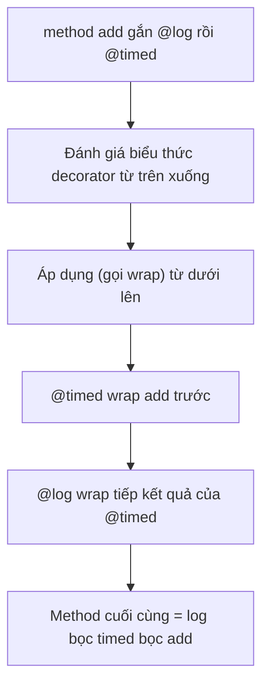
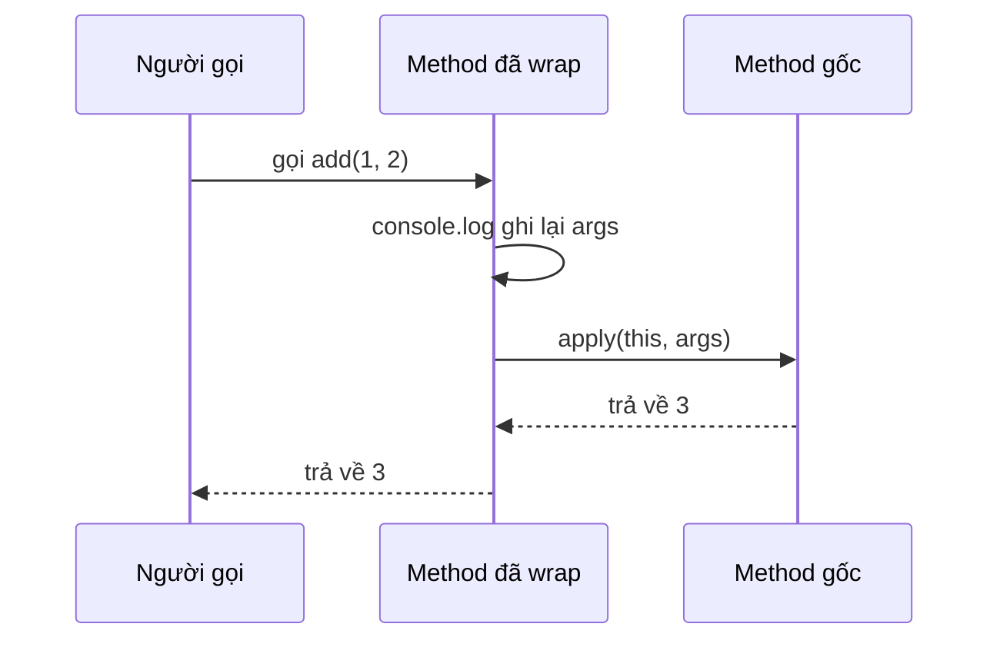

# Decorators

**Decorator** (chú thích gắn thêm hành vi) là một cú pháp đặc biệt bắt đầu bằng dấu `@`, dùng để gắn thêm hoặc thay đổi hành vi cho class, phương thức hay thuộc tính mà không phải sửa trực tiếp bên trong chúng. Đây thực chất là một hàm chạy lúc khai báo để bổ sung logic như ghi log, kiểm tra quyền hay đăng ký metadata. Bài này giúp người mới học hiểu khái niệm decorator và cách dùng phổ biến của nó trong TypeScript.

[](pathname:///img/typescript/decorators.webp)

---

:::note[Ghi nhớ nhanh]

- ⭐ **Decorator `@something` là hàm gắn thêm hành vi/metadata** — cho class, method, property hoặc parameter một cách khai báo, tách khỏi logic nghiệp vụ (logging, DI, ORM mapping).
- **Nhiều decorator xếp chồng** — đánh giá biểu thức từ trên xuống, nhưng áp dụng (wrap) từ dưới lên.
- **4 loại: class, method, property, parameter** — property/parameter decorator chủ yếu ghi metadata, không truy cập được giá trị runtime.
- ⭐ **Legacy cần `experimentalDecorators` + `emitDecoratorMetadata`** — NestJS, TypeORM, Angular dùng bản này; decorator Stage 3 chuẩn ES (TS 5.0+) có signature khác, không trộn lẫn hai loại.
- **App React/Next thường không cần decorator** — dùng higher-order function hoặc hook gọn hơn.

:::

---

## Mục lục

- [Vì sao có decorators?](#vì-sao-có-decorators)
- [Decorator là gì?](#decorator-là-gì)
- [Class Decorator](#class-decorator)
- [Method Decorator](#method-decorator)
- [Property Decorator](#property-decorator)
- [Parameter Decorator](#parameter-decorator)
- [Decorator hiện đại (Stage 3)](#decorator-hiện-đại-stage-3)
- [Câu hỏi phỏng vấn](#câu-hỏi-phỏng-vấn)

---

## Vì sao có decorators?

Nhiều mối quan tâm **cắt ngang (cross-cutting)** — ghi log, đo thời gian
chạy, kiểm tra quyền, validate input, đăng ký metadata — không thuộc về
logic chính của method. Nếu nhét thủ công vào từng method thì **lặp code**
và **lẫn lộn** với nghiệp vụ:

**Vấn đề:**

```ts
class Calc {
  add(a: number, b: number) {
    console.log("Call add với", [a, b]);   // logging lặp
    const start = performance.now();         // đo thời gian lặp
    const result = a + b;                    // logic chính bị chìm
    console.log("Mất", performance.now() - start, "ms");
    return result;
  }

  sub(a: number, b: number) {
    console.log("Call sub với", [a, b]);   // lại lặp y hệt
    const start = performance.now();
    const result = a - b;
    console.log("Mất", performance.now() - start, "ms");
    return result;
  }
}
```

**Giải pháp:**

```ts
// Gắn @log / @timed một cách KHAI BÁO, tách hẳn khỏi logic chính
class Calc {
  @log
  @timed
  add(a: number, b: number) { return a + b; }

  @log
  @timed
  sub(a: number, b: number) { return a - b; }
}
```

Decorator `@something` gắn lên **class / method / property / parameter** để
**thêm hành vi hoặc metadata** một cách khai báo, tách khỏi logic nghiệp vụ.
Đây là nền tảng của Angular, NestJS và TypeORM. (Lưu ý: cần bật
`experimentalDecorators` cho decorator legacy, hoặc dùng decorator chuẩn ES
trên TS 5.0+ — xem mục [Bật decorator](#bật-decorator).)

Khi nhiều decorator xếp chồng trên cùng một method, thứ tự đánh giá và thứ tự áp dụng ngược nhau — sơ đồ dưới minh hoạ với `@log` và `@timed`:



:::tip[Dùng thực tế]

- **Angular / NestJS**: `@Component`, `@Injectable` đánh dấu class cho DI
  container.
- **TypeORM**: `@Entity`, `@Column` map class/property sang bảng và cột
  trong database.
- **Logging / đo hiệu năng**: `@log`, `@timed` wrap method để ghi log hoặc
  đo thời gian mà không đụng vào nội dung method.
- **Binding dữ liệu**: `@Input` (Angular) khai báo property nhận dữ liệu
  từ component cha.

:::

---

## Decorator là gì?

Decorator là **hàm** gắn vào class, method, property hoặc parameter để
**thêm hành vi** mà không sửa code gốc.

Cú pháp dùng `@decoratorName`:

```ts
@sealed
class User {
  @log
  greet() {}
}
```

Decorator được dùng nhiều trong:

- **NestJS**: `@Controller`, `@Get`, `@Injectable`.
- **TypeORM**: `@Entity`, `@Column`, `@PrimaryGeneratedColumn`.
- **Angular**: `@Component`, `@NgModule`.

---

## Bật decorator

TS 5.0 trở lên hỗ trợ **decorator chuẩn ECMAScript Stage 3** mặc định.
Decorator **legacy** (cú pháp cũ) cần flag:

```json
{
  "compilerOptions": {
    "experimentalDecorators": true,
    "emitDecoratorMetadata": true
  }
}
```

Phần lớn framework hiện tại (NestJS, TypeORM) **vẫn dùng legacy**. Tài
liệu dưới đây mô tả legacy decorator.

---

## Class Decorator

Áp dụng cho cả class — nhận chính constructor làm tham số.

```ts
function logged<T extends { new(...args: any[]): {} }>(target: T) {
  return class extends target {
    constructor(...args: any[]) {
      super(...args);
      console.log(`Created instance of ${target.name}`);
    }
  };
}

@logged
class User {
  constructor(public name: string) {}
}

new User("An"); // log: "Created instance of User"
```

---

## Method Decorator

Áp dụng cho method — có thể wrap, log, validate.

```ts
function log(target: any, key: string, descriptor: PropertyDescriptor) {
  const original = descriptor.value;
  descriptor.value = function (...args: any[]) {
    console.log(`Call ${key} với`, args);
    return original.apply(this, args);
  };
}

class Calc {
  @log
  add(a: number, b: number) { return a + b; }
}

new Calc().add(1, 2); // log: Call add với [1, 2]
```

Sơ đồ dưới cho thấy lúc runtime, method đã bị decorator wrap sẽ chèn logic ghi log trước khi gọi method gốc:



---

## Property Decorator

Áp dụng cho property — thường dùng metadata.

```ts
function required(target: any, key: string) {
  console.log(`${key} là bắt buộc`);
}

class User {
  @required
  name: string = "";
}
```

Property decorator **không** truy cập được giá trị runtime (chỉ biết
tên property). Để validate giá trị, kết hợp với class decorator hoặc
reflect-metadata.

---

## Parameter Decorator

Áp dụng cho tham số — đánh dấu metadata cho DI (NestJS).

```ts
function inject(token: string) {
  return function (target: any, key: string, index: number) {
    // Lưu metadata
  };
}

class UserService {
  constructor(@inject("Logger") private logger: any) {}
}
```

:::info[Phân tích]

**Mô hình DI** của NestJS/Angular dựa hoàn toàn vào decorator + metadata:

1. `@Injectable()` đánh dấu class có thể inject.
2. Decorator parameter (`@Inject`) báo container biết cần inject loại
   nào.
3. `emitDecoratorMetadata: true` khiến TS sinh ra metadata về type tham
   số (qua `reflect-metadata`).
4. Container đọc metadata tại runtime để khởi tạo dependency.

Vì vậy cần cả `experimentalDecorators` lẫn `emitDecoratorMetadata` — và
import `reflect-metadata` ở entry file.

:::

---

## Decorator hiện đại (Stage 3)

TS 5.0+ hỗ trợ **decorator chuẩn ECMAScript** không cần `experimentalDecorators`.

```ts
function logged<This, Args extends any[], Return>(
  target: (this: This, ...args: Args) => Return,
  context: ClassMethodDecoratorContext,
) {
  return function (this: This, ...args: Args): Return {
    console.log(`Call ${String(context.name)}`);
    return target.call(this, ...args);
  };
}

class Calc {
  @logged
  add(a: number, b: number) { return a + b; }
}
```

:::warning[Cần lưu ý]

**Decorator legacy** và **decorator mới (Stage 3) không tương thích** —
signature khác hẳn:

| | Legacy | Stage 3 (mới) |
|--|--|--|
| Tham số method decorator | `(target, key, descriptor)` | `(target, context)` |
| Cần flag | `experimentalDecorators` | Không (TS 5+) |
| Metadata | Qua `reflect-metadata` | Qua `context.metadata` |
| Framework hỗ trợ | NestJS, TypeORM, Angular | Đang dần migrate |

→ **Chọn một** theo framework đang dùng. Tránh trộn lẫn trong cùng project.

:::

:::tip[Mẹo]

Trong code app thông thường, **đa số trường hợp không cần decorator** —
chúng phù hợp cho framework metadata-driven (DI, ORM). Với app
React/Next, dùng **higher-order function** hoặc **hook** thường gọn hơn:

```ts
// Thay vì @logged
const logged = <F extends (...a: any[]) => any>(fn: F): F => {
  return ((...args) => {
    console.log("Call", args);
    return fn(...args);
  }) as F;
};
```

:::

---

## Câu hỏi phỏng vấn

Những câu thường gặp về chủ đề này. Tự trả lời trước, rồi bấm **Xem đáp án** để đối chiếu.

**1. Decorator thực chất là gì ở mức JavaScript? Nó chạy vào thời điểm nào — lúc khai báo class hay lúc tạo instance?**

<details className="qa">
<summary>Xem đáp án</summary>

Decorator chỉ là một **hàm bình thường**. Cú pháp `@log` là đường cú pháp — compiler biến nó thành lời gọi hàm, truyền vào thông tin về thứ được gắn.

Nó chạy **một lần, lúc class được định nghĩa** (khi module chứa class được evaluate), **không phải** lúc `new`:

```ts
function log(target: any, key: string, descriptor: PropertyDescriptor) {
  console.log("decorator chạy!");   // in ngay khi file được load
}

class Calc {
  @log
  add(a: number, b: number) { return a + b; }
}
// "decorator chạy!" đã in ra ở đây, trước cả new Calc()
```

Ở bản legacy, TS sinh ra lời gọi đại loại `__decorate([log], Calc.prototype, "add", null)` ngay sau khai báo class.

Hệ quả quan trọng: decorator **không nhìn thấy instance** và không thấy đối số của từng lần gọi. Muốn can thiệp lúc chạy thì phải **wrap** — thay method bằng một hàm mới, và chính hàm mới đó mới chạy ở mỗi lần gọi.

</details>

**2. Kể 4 loại decorator (class, method, property, parameter) và các tham số mà mỗi loại nhận được.**

<details className="qa">
<summary>Xem đáp án</summary>

Với decorator legacy (bản mà NestJS, TypeORM đang dùng):

| Loại | Tham số nhận được | Giá trị trả về |
|---|---|---|
| Class | `(constructor)` | Constructor mới để thay thế, hoặc `undefined` |
| Method | `(target, propertyKey, descriptor)` | `PropertyDescriptor` mới, hoặc `undefined` |
| Accessor | `(target, propertyKey, descriptor)` — descriptor có `get`/`set` | Như method |
| Property | `(target, propertyKey)` | Bị bỏ qua |
| Parameter | `(target, propertyKey, parameterIndex)` | Bị bỏ qua |

Trong đó `target` là **prototype** của class với thành viên instance, và là **chính constructor** với thành viên `static`.

```ts
function cls(ctor: Function) {}
function method(t: any, k: string, d: PropertyDescriptor) {}
function prop(t: any, k: string) {}
function param(t: any, k: string, i: number) {}
```

Điểm cần nhớ: chỉ class và method/accessor **thay đổi được hành vi**; property và parameter chủ yếu để **ghi metadata**.

</details>

**3. Với nhiều decorator xếp chồng, thứ tự **đánh giá biểu thức** và thứ tự **áp dụng** khác nhau ra sao? Cho ví dụ minh hoạ.**

<details className="qa">
<summary>Xem đáp án</summary>

Biểu thức decorator được **đánh giá từ trên xuống**, nhưng hàm decorator được **áp dụng từ dưới lên** — giống toán học: `first(second(x))`.

```ts
function first() {
  console.log("first: đánh giá");
  return (t: any, k: string, d: PropertyDescriptor) => { console.log("first: áp dụng"); };
}
function second() {
  console.log("second: đánh giá");
  return (t: any, k: string, d: PropertyDescriptor) => { console.log("second: áp dụng"); };
}

class C {
  @first()
  @second()
  m() {}
}
```

Output:

```
first: đánh giá
second: đánh giá
second: áp dụng
first: áp dụng
```

Áp vào ví dụ `@log` + `@timed` trong bài: `@timed` bọc method gốc trước, rồi `@log` bọc tiếp kết quả — nên lúc chạy, log chạy ở vòng ngoài cùng, bao quanh phần đo thời gian.

Thứ tự này quan trọng khi các decorator có tương tác, ví dụ `@Authorize` phải nằm ngoài `@Log` để không ghi log những lời gọi bị chặn.

</details>

**4. Decorator factory là gì? Vì sao `@log` và `@log()` không thay thế nhau được?**

<details className="qa">
<summary>Xem đáp án</summary>

**Decorator factory** là hàm trả về decorator, cho phép truyền tham số cấu hình:

```ts
// Decorator thường — dùng @log
function log(target: any, key: string, d: PropertyDescriptor) { /* ... */ }

// Decorator factory — dùng @logWith("API")
function logWith(prefix: string) {
  return function (target: any, key: string, d: PropertyDescriptor) { /* ... */ };
}

class S {
  @log            // truyền chính hàm log làm decorator
  a() {}

  @logWith("API") // gọi logWith trước, kết quả mới là decorator
  b() {}
}
```

Hai cách không thay thế nhau vì `@expr` luôn lấy **giá trị của `expr`** làm decorator:

- Viết `@log()` khi `log` là decorator thường → TS gọi `log()` với 0 đối số, `target`/`key`/`descriptor` đều `undefined`, và giá trị trả về (`undefined`) được dùng làm decorator → lỗi.
- Viết `@logWith` khi `logWith` là factory → TS truyền `(target, key, descriptor)` vào `logWith`, tức `prefix` nhận nhầm prototype, và kết quả trả về là một hàm decorator chưa được gọi → sai chữ ký.

Vì vậy hầu hết framework chọn luôn dùng dạng factory (`@Injectable()`, `@Column()`) cho nhất quán.

</details>

**5. Method decorator nhận `PropertyDescriptor` — bạn bọc (wrap) method bằng cách sửa `descriptor.value` thế nào, và cần cẩn thận gì với `this` và arrow function?**

<details className="qa">
<summary>Xem đáp án</summary>

Giữ lại hàm gốc, gán một hàm mới vào `descriptor.value`, rồi gọi lại hàm gốc bên trong:

```ts
function log(target: any, key: string, descriptor: PropertyDescriptor) {
  const original = descriptor.value;
  descriptor.value = function (...args: any[]) {   // function, KHÔNG phải arrow
    console.log(`Call ${key} với`, args);
    return original.apply(this, args);             // giữ đúng this + trả về kết quả
  };
  return descriptor;
}
```

Những chỗ dễ sai:

- Dùng **arrow function** làm wrapper: arrow không có `this` riêng, nó lấy `this` của scope bao ngoài (ở đây là module) nên instance bị mất — mọi truy cập `this.x` bên trong method gốc sẽ hỏng.
- Quên `return` giá trị của `original.apply(...)` → method bỗng trả về `undefined`.
- Method **async**: `original.apply` trả về Promise, muốn đo thời gian hay bắt lỗi phải `await` hoặc dùng `.then`/`.finally`, không thể đo đồng bộ.
- Method viết dưới dạng **arrow property** (`add = (a, b) => ...`) thực chất là property của instance, không có trên prototype — method decorator không áp được.

</details>

**6. Vì sao property decorator không đọc được giá trị runtime của property? Nó thường được dùng để làm gì thay thế?**

<details className="qa">
<summary>Xem đáp án</summary>

Vì nó chạy **lúc class được định nghĩa**, thời điểm đó chưa có instance nào tồn tại. Property của instance chỉ được tạo khi constructor chạy, mà constructor thì chạy sau đó rất lâu. Ngoài ra `target` mà decorator nhận là **prototype**, không phải instance, và bản legacy cũng không truyền `descriptor` cho property decorator — nó chỉ biết mỗi **tên** property.

```ts
function required(target: any, key: string) {
  console.log(`${key} là bắt buộc`);  // chỉ có tên, không có giá trị
}
class User {
  @required
  name: string = "";
}
```

Nên thay vào đó nó được dùng để:

- **Ghi metadata** qua `reflect-metadata` — nền tảng của `@Column` (TypeORM), `@IsEmail` (class-validator), `@Input` (Angular).
- **Đăng ký vào registry** để thành phần khác đọc lúc runtime (bộ validate, bộ serialize).
- **Thay property bằng getter/setter** trên prototype bằng `Object.defineProperty`, nếu thực sự cần chặn đọc/ghi.

Decorator Stage 3 khá hơn ở điểm này: nó có `context.addInitializer` và hàm initializer cho phép can thiệp vào giá trị khởi tạo của từng instance.

</details>

**7. `experimentalDecorators` và `emitDecoratorMetadata` bật lên để làm gì? `emitDecoratorMetadata` phụ thuộc thư viện runtime nào?**

<details className="qa">
<summary>Xem đáp án</summary>

```json
{
  "compilerOptions": {
    "experimentalDecorators": true,
    "emitDecoratorMetadata": true
  }
}
```

`experimentalDecorators` bật cú pháp và ngữ nghĩa **decorator legacy** — chữ ký `(target, key, descriptor)`, có parameter decorator. Trên TS 5.0+, nếu không bật cờ này thì decorator được hiểu theo chuẩn Stage 3.

`emitDecoratorMetadata` khiến TS **phát thêm metadata về kiểu** cho những thành viên có decorator, dưới dạng các lời gọi `Reflect.metadata`:

- `design:type` — kiểu của property.
- `design:paramtypes` — mảng kiểu các tham số.
- `design:returntype` — kiểu trả về.

Nó phụ thuộc polyfill **`reflect-metadata`**, phải `import "reflect-metadata"` một lần ở entry file, nếu không `Reflect.getMetadata` sẽ không tồn tại.

Hai giới hạn cần nhớ: metadata chỉ được sinh ra khi thành viên đó **có ít nhất một decorator**; và chỉ kiểu dạng class mới giữ được thông tin hữu ích — interface, union, generic đều bị quy về `Object`. Đó chính là lý do NestJS bắt dùng `@Inject(TOKEN)` cho các dependency không phải class.

</details>

**8. Khác biệt cốt lõi giữa legacy decorator và decorator **Stage 3** (chuẩn ECMAScript, TS 5.0+) về chữ ký và đối tượng `context`? Có trộn lẫn hai loại trong một dự án được không?**

<details className="qa">
<summary>Xem đáp án</summary>

| | Legacy | Stage 3 |
|---|---|---|
| Chữ ký method decorator | `(target, key, descriptor)` | `(value, context)` |
| Cách thay đổi hành vi | Sửa `descriptor.value` tại chỗ | **Trả về** hàm thay thế |
| Thông tin ngữ cảnh | Suy từ `target`/`key` | Đối tượng `context` đầy đủ |
| Parameter decorator | Có | **Không có** trong đề xuất |
| Metadata | `reflect-metadata` | `context.metadata` |
| Cờ compiler | `experimentalDecorators` | Mặc định từ TS 5.0 |

Đối tượng `context` mang `kind` (`"method"`, `"field"`, `"getter"`...), `name`, `static`, `private`, `access` (hàm get/set giá trị), `addInitializer` (đăng ký việc chạy lúc khởi tạo) và `metadata`.

```ts
function logged<This, Args extends any[], R>(
  target: (this: This, ...args: Args) => R,
  context: ClassMethodDecoratorContext,
) {
  return function (this: This, ...args: Args): R {
    console.log(`Call ${String(context.name)}`);
    return target.call(this, ...args);
  };
}
```

**Không trộn lẫn được**: `experimentalDecorators` là cờ cấp dự án, bật lên thì mọi decorator trong dự án đều theo ngữ nghĩa legacy. Phải chọn một, theo framework đang dùng.

</details>

**9. Vì sao NestJS, TypeORM, Angular vẫn phải dùng legacy decorator? Điều đó ảnh hưởng thế nào tới quyết định nâng cấp TS?**

<details className="qa">
<summary>Xem đáp án</summary>

Hai lý do kỹ thuật cốt lõi:

- Chuẩn Stage 3 **không có parameter decorator**, trong khi DI của NestJS/Angular dựa vào `@Inject`, `@Body`, `@Param` gắn lên tham số constructor và tham số handler.
- Chúng phụ thuộc `emitDecoratorMetadata` để suy kiểu dependency từ `design:paramtypes`; `context.metadata` của Stage 3 không cung cấp thông tin kiểu tương đương, vì thông tin kiểu vốn bị xoá khi biên dịch.

Ảnh hưởng tới việc nâng cấp TS:

- Nâng lên TS 5.x vẫn **an toàn**, vì `experimentalDecorators` vẫn được hỗ trợ; chỉ cần giữ nguyên cờ này trong `tsconfig.json`.
- Nhưng phải chấp nhận **không dùng được decorator kiểu mới** trong cùng dự án, và không hưởng các cải tiến của chuẩn.
- Cẩn thận với công cụ build: một số transpiler nhanh (như esbuild) không sinh được `emitDecoratorMetadata`, nên hệ sinh thái NestJS thường dùng `tsc` hoặc SWC với tuỳ chọn tương ứng. Đổi bundler mà quên điều này là gãy DI ngay lúc chạy.

</details>

**10. Decorator đóng vai trò gì trong dependency injection? `@Injectable` và `@Inject` dựa vào cơ chế nào để biết kiểu cần tiêm?**

<details className="qa">
<summary>Xem đáp án</summary>

Decorator là **cầu nối giữa kiểu lúc biên dịch và container lúc chạy**. Luồng như sau:

1. `@Injectable()` đánh dấu class có thể tham gia DI. Quan trọng hơn, chính việc **có decorator** kích hoạt TS sinh metadata cho class đó.
2. Với `emitDecoratorMetadata`, TS phát ra `design:paramtypes` — mảng các constructor tham chiếu tới kiểu tham số của constructor.
3. Container đọc `Reflect.getMetadata("design:paramtypes", SomeClass)` để biết cần khởi tạo những dependency nào, rồi resolve đệ quy và gọi `new SomeClass(...deps)`.
4. `@Inject(TOKEN)` là **parameter decorator**, ghi metadata "tham số ở index `i` dùng token này".

```ts
@Injectable()
class UserService {
  constructor(
    private repo: UserRepository,          // suy từ design:paramtypes
    @Inject("CONFIG") private cfg: Config, // phải chỉ token tường minh
  ) {}
}
```

Vì sao cần `@Inject`? Vì metadata kiểu chỉ chính xác với **class**. Interface, union, string, kiểu generic đều bị xoá lúc biên dịch và quy về `Object` — container không suy ra được gì, nên phải có token tường minh.

</details>

**11. Parameter decorator dùng để làm gì nếu nó không sửa được giá trị tham số?**

<details className="qa">
<summary>Xem đáp án</summary>

Parameter decorator chỉ nhận `(target, propertyKey, parameterIndex)` và giá trị trả về của nó bị bỏ qua — nó **không** chạm được vào đối số thật. Vai trò duy nhất của nó là **ghi lại metadata gắn với vị trí tham số**, để một thành phần khác đọc sau đó.

Ví dụ điển hình trong NestJS:

```ts
@Controller("users")
class UserController {
  @Get(":id")
  findOne(@Param("id") id: string, @Query("full") full?: string) {}
}
```

`@Param("id")` chỉ ghi lại "tham số index 0 lấy từ `req.params.id`". Việc **đọc request và truyền giá trị vào** là do lớp wrapper của framework làm — wrapper này được tạo bởi method decorator `@Get`, nó đọc bảng metadata rồi dựng danh sách đối số trước khi gọi handler.

Cùng mô hình đó với `@Inject(TOKEN)` trong DI: parameter decorator ghi token, còn container mới là chỗ thực sự tạo và truyền dependency.

Tóm lại: parameter decorator **khai báo ý định**, một cơ chế khác **thực thi ý định** đó.

</details>

**12. Decorator ảnh hưởng thế nào tới tree-shaking và kích thước bundle? Vì sao code có decorator khó bị loại bỏ khi không dùng?**

<details className="qa">
<summary>Xem đáp án</summary>

Tree-shaking hoạt động dựa trên giả định: code không được dùng và **không có side effect** thì xoá được. Decorator phá vỡ đúng giả định đó.

Sau khi biên dịch, mỗi decorator trở thành một **lời gọi hàm ở top-level module**:

```js
class UserService { }
UserService = __decorate([
  Injectable(),
  __metadata("design:paramtypes", [UserRepository])
], UserService);
```

Bundler nhìn thấy `__decorate(...)` chạy ngay khi module được load, không thể chứng minh nó vô hại (decorator có thể ghi vào registry toàn cục — và thực tế đúng là như vậy), nên **giữ lại toàn bộ class** dù không ai import nó.

Nặng hơn: `emitDecoratorMetadata` biến kiểu tham số thành **tham chiếu giá trị** (`UserRepository` xuất hiện trong mã phát ra). Một class trước đây chỉ dùng làm kiểu — lẽ ra bị xoá sạch — nay bị kéo vào bundle cùng cả cây phụ thuộc của nó.

Giảm thiệt hại: dùng `import type` cho những kiểu không cần metadata, dùng string/symbol token thay class token, và đánh dấu `sideEffects` chính xác trong `package.json`. Với app frontend, cân nhắc bỏ decorator hẳn.

</details>

**13. Khi nào nên dùng **higher-order function** hoặc hook thay vì decorator? Nêu tiêu chí quyết định.**

<details className="qa">
<summary>Xem đáp án</summary>

Nghiêng về **higher-order function / hook** khi:

- Code của bạn là **hàm hoặc component**, không phải class — decorator chỉ gắn được lên thành viên của class.
- Bạn cần **kiểu chính xác**: HOF giữ và biến đổi được kiểu, còn decorator legacy không thay đổi được kiểu mà TS nhìn thấy.
- Bạn không muốn phụ thuộc cờ compiler, `reflect-metadata` và cấu hình bundler.
- Bạn quan tâm tree-shaking và bundle size (app React/Next).
- Bạn muốn test dễ: HOF là hàm thuần, gọi trực tiếp là xong.

```ts
const logged = <F extends (...a: any[]) => any>(fn: F): F =>
  ((...args) => {
    console.log("Call", args);
    return fn(...args);
  }) as F;
```

Nghiêng về **decorator** khi:

- Framework yêu cầu (NestJS, TypeORM, Angular) — không có lựa chọn khác.
- Bạn cần **metadata khai báo** để một container/ORM đọc lúc runtime.
- Có rất nhiều chỗ áp dụng và cú pháp `@` làm ý định dễ đọc hơn hẳn.

Tiêu chí gọn: cần *metadata cho framework* thì dùng decorator; chỉ cần *bọc thêm hành vi* thì dùng HOF.

</details>

**14. Decorator có thay đổi được **kiểu** của class/method mà nó gắn vào không? Giới hạn này ở bản legacy ra sao và Stage 3 cải thiện thế nào?**

<details className="qa">
<summary>Xem đáp án</summary>

Câu trả lời ngắn: **không**. Ở cả legacy lẫn Stage 3, TS vẫn dùng kiểu khai báo gốc của class/method, bất kể decorator làm gì lúc chạy.

```ts
function addId<T extends { new (...a: any[]): {} }>(ctor: T) {
  return class extends ctor { id = 1; };
}

@addId
class User { name = "An"; }

new User().id;  // Error — TS không biết id tồn tại
```

Ở bản legacy, hạn chế còn nặng hơn: chữ ký decorator gần như không được kiểm tra chặt (`target: any`), nên gắn nhầm loại decorator cũng khó bị bắt. Cách đi vòng thường thấy là dùng **mixin bằng hàm thường** (`class User extends addId(Base) {}`) — hàm thì TS suy kiểu trả về đầy đủ — hoặc khai báo bổ sung bằng interface merging.

Stage 3 cải thiện ở **an toàn kiểu của chính decorator**: có các kiểu `ClassMethodDecoratorContext`, `ClassFieldDecoratorContext`..., giá trị trả về bị kiểm tra phải tương thích với thứ được gắn, và `this` được đánh kiểu đúng. Nhưng khả năng "decorator làm giàu kiểu của class" thì **vẫn chưa có** — đó là giới hạn cố ý, vì để đúng thì type checker phải thực thi decorator lúc biên dịch.

</details>

**15. Decorator trên accessor (`get` / `set`) khác gì decorator trên method thường?**

<details className="qa">
<summary>Xem đáp án</summary>

Ở bản legacy, chữ ký **giống hệt** method decorator — `(target, key, descriptor)` — nhưng nội dung `descriptor` khác:

- Method: có `descriptor.value` (chính hàm đó).
- Accessor: có `descriptor.get` và/hoặc `descriptor.set`, **không** có `value`.

Nên muốn bọc thì phải thay đúng `get`/`set`:

```ts
function logGet(target: any, key: string, descriptor: PropertyDescriptor) {
  const originalGet = descriptor.get;
  descriptor.get = function () {
    console.log(`đọc ${key}`);
    return originalGet?.call(this);
  };
  return descriptor;
}
```

Khác biệt quan trọng nhất: getter và setter cùng tên **dùng chung một descriptor**, nên TypeScript **không cho gắn decorator lên cả hai** — báo lỗi "Decorators cannot be applied to multiple get/set accessors of the same name". Quy ước là gắn lên cái xuất hiện **trước** trong khai báo, và decorator đó chi phối cả cặp.

Stage 3 tách bạch hơn: có `ClassGetterDecoratorContext` và `ClassSetterDecoratorContext` riêng biệt, cộng thêm từ khoá `accessor` với `ClassAccessorDecoratorContext` cho field có getter/setter tự sinh.

</details>

**16. Bạn test một decorator như thế nào? Nêu khó khăn khi decorator giữ trạng thái toàn cục hoặc ghi vào metadata registry.**

<details className="qa">
<summary>Xem đáp án</summary>

Có hai hướng, thường dùng cả hai:

Test như một hàm thuần — gọi trực tiếp với descriptor giả:

```ts
const descriptor = { value: (a: number) => a * 2 };
log({}, "double", descriptor as PropertyDescriptor);
expect(descriptor.value(3)).toBe(6);   // vẫn đúng kết quả
expect(consoleSpy).toHaveBeenCalled(); // và có ghi log
```

Test qua hành vi — định nghĩa một class thử nghiệm ngay trong file test, gắn decorator, gọi method rồi assert side effect (spy `console.log`, mock timer, kiểm tra metadata).

Khó khăn hay gặp:

- Decorator chạy **một lần lúc module được load**, không phải mỗi lần test. Trạng thái trong registry tích luỹ dần, test phụ thuộc thứ tự chạy và không reset được bằng `beforeEach` thông thường — phải `jest.resetModules()` rồi import lại, hoặc thiết kế registry có hàm `clear()`.
- `reflect-metadata` là **singleton toàn cục**, metadata từ test này rò sang test khác.
- Phải bật đúng `experimentalDecorators`/`emitDecoratorMetadata` trong cấu hình của test runner, nếu không hành vi khác hẳn lúc build thật.
- Class decorator trả về class mới làm **mất identity**, khiến `instanceof` và so sánh tên class trở nên khó đoán.

</details>

