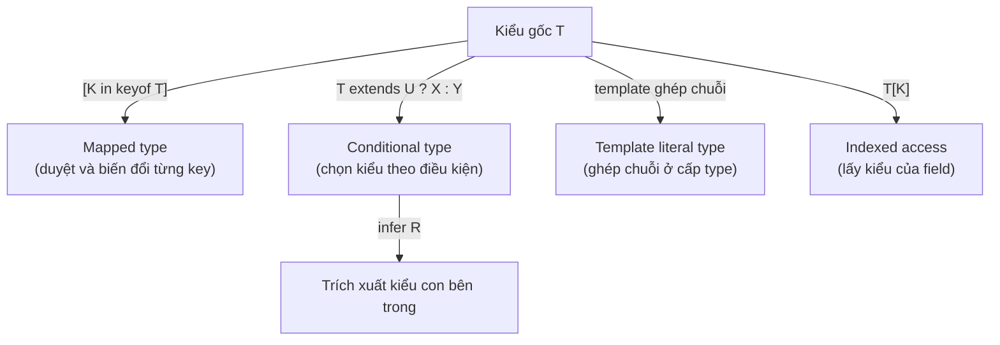
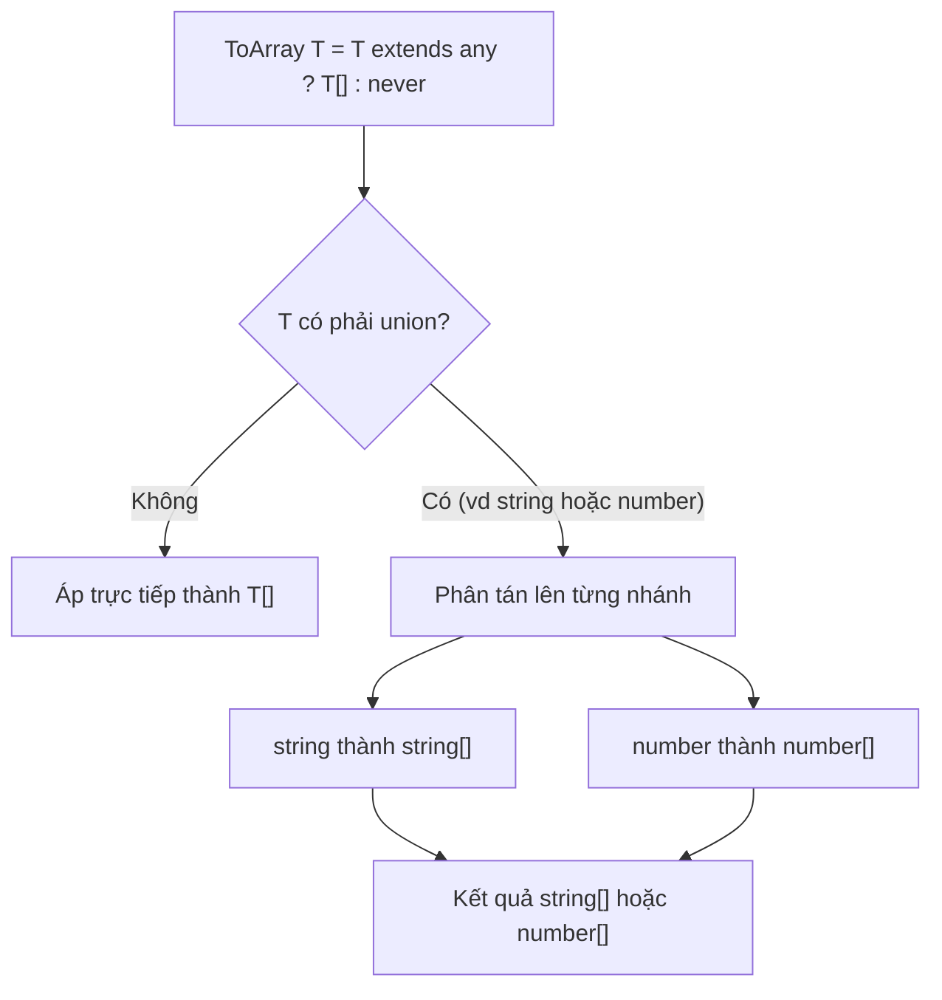

# Advanced Types

**Advanced types** (các kiểu nâng cao) là những kỹ thuật giúp bạn mô tả kiểu dữ liệu một cách chính xác và linh hoạt hơn so với các kiểu cơ bản. Chúng bao gồm những công cụ như literal type (kiểu giá trị cố định), mapped type (kiểu sinh ra từ kiểu khác) và conditional type (kiểu chọn theo điều kiện). Bài này giúp người mới học làm quen với cách "lập trình trên kiểu" để biểu diễn được những ràng buộc phức tạp trong TypeScript.

[](pathname:///img/typescript/advanced-types-1.webp)

[](pathname:///img/typescript/advanced-types-2.webp)

---

:::note[Ghi nhớ nhanh]

- ⭐ **"Lập trình trên kiểu" tạo kiểu TỪ kiểu khác tự động** — tránh trùng lặp và lệch nhau khi kiểu gốc thay đổi; cũng là nền tảng của các utility type built-in.
- **Literal & template literal type** — mô tả giá trị cố định (`"left" | "right"`) và ghép chuỗi ở cấp type (`on${Capitalize<T>}`).
- **Mapped type `{ [K in keyof T]: ... }`** — duyệt từng key, dùng modifier `+`/`-` để thêm/bớt optional/readonly và `as` để rename key.
- ⭐ **Conditional type `T extends U ? X : Y` + `infer`** — chọn kiểu theo điều kiện và trích kiểu con; distributive khi `T` là union (bọc `[T]` để tắt phân tán).
- **Recursive type mô tả cấu trúc lồng** — như `JSONValue`, `DeepReadonly`, nhưng TS giới hạn độ sâu đệ quy (~50) để tránh treo compiler.

:::

---

## Mục lục

- [Vì sao có các kiểu nâng cao?](#vì-sao-có-các-kiểu-nâng-cao)
- [Literal Types](#literal-types)
- [Template Literal Types](#template-literal-types)
- [Mapped Types](#mapped-types)
- [Conditional Types](#conditional-types)
- [Recursive Types](#recursive-types)
- [Câu hỏi phỏng vấn](#câu-hỏi-phỏng-vấn)

---

## Vì sao có các kiểu nâng cao?

Trong dự án thực, nhiều kiểu **phụ thuộc lẫn nhau** và phải đồng bộ với một kiểu gốc. Nếu viết tay từng kiểu, ta bị trùng lặp và dễ lệch khi kiểu gốc thay đổi.

**Vấn đề:**

```ts
interface User {
  id: number;
  name: string;
}

// Viết tay các kiểu "ăn theo" User — trùng lặp
interface UserPatch {
  id?: number;
  name?: string;
}

interface UserGetters {
  getId: () => number;
  getName: () => string;
}

// Thêm field `email` vào User → phải sửa tay cả 2 kiểu trên, dễ quên
```

**Giải pháp:**

```ts
// Tạo kiểu TỪ kiểu khác một cách tự động
type Patch<T> = { [K in keyof T]?: T[K] };          // mapped type
type Getters<T> = {
  [K in keyof T as `get${Capitalize<string & K>}`]: () => T[K];
};                                                   // mapped + template literal
type Return<F> = F extends (...a: any[]) => infer R ? R : never; // conditional + infer

type UserPatch = Patch<User>;     // tự động bám theo User
type UserGetters = Getters<User>; // sửa User → các kiểu này cập nhật theo
```

Các kiểu nâng cao — `keyof`, `typeof` (lấy kiểu từ giá trị), mapped types (`{ [K in keyof T]: ... }`), conditional types (`T extends U ? X : Y`), template literal types, indexed access `T[K]` và `infer` — cho phép biến đổi và suy diễn kiểu một cách mạnh mẽ, mô hình hoá API phức tạp mà vẫn type-safe. Đây cũng là nền tảng của các utility type built-in (`Partial`, `Readonly`, `ReturnType`...).

Sơ đồ dưới tổng hợp các công cụ "lập trình trên kiểu" khi xuất phát từ một kiểu gốc `T`:



:::tip[Dùng thực tế]

- **Tự sinh kiểu form từ model:** `Patch<User>` cho dữ liệu chỉnh sửa một phần, không cần khai báo lại.
- **Suy kiểu trả về API:** `Return<typeof fetchUser>` lấy đúng kiểu kết quả của hàm, tránh lệch.
- **Ràng buộc key hợp lệ bằng `keyof`:** chỉ cho truyền field có thật của object, sai key là báo lỗi ngay khi compile.
- **Build kiểu sự kiện bằng template literal:** `on${Capitalize<T>}` sinh `onClick`, `onChange`... type-safe.

:::

---

## Literal Types

Type chính là **một giá trị cụ thể**, không phải kiểu chung.

```ts
type Direction = "left" | "right" | "up" | "down";
type StatusCode = 200 | 404 | 500;
type IsTrue = true;
```

Kết hợp tạo discriminated union:

```ts
type Action =
  | { type: "INCREMENT" }
  | { type: "SET"; value: number };
```

---

## Template Literal Types

Type chuỗi được **ghép từ literal khác** — giống template string.

```ts
type Greeting = `Hello, ${string}`;
const g: Greeting = "Hello, An";   // OK
const x: Greeting = "Hi, An";      // Error

type Lang = "vi" | "en";
type Greet = `hello-${Lang}`; // "hello-vi" | "hello-en"
```

Kết hợp với utility build sẵn — `Uppercase`, `Lowercase`, `Capitalize`,
`Uncapitalize`:

```ts
type EventName<T extends string> = `on${Capitalize<T>}`;
type ClickEvent = EventName<"click">; // "onClick"
```

:::info[Phân tích]

Template literal type cho phép **type-level string manipulation**:

```ts
type Split<S extends string, D extends string> =
  S extends `${infer Head}${D}${infer Tail}`
    ? [Head, ...Split<Tail, D>]
    : [S];

type Parts = Split<"a,b,c,d", ",">; // ["a", "b", "c", "d"]
```

Ứng dụng thực: typing **route param** trong Express/Next, key path
trong i18n, SQL query builder type-safe...

:::

---

## Mapped Types

Sinh type mới bằng cách **duyệt qua key** của type khác.

```ts
type Optional<T> = {
  [K in keyof T]?: T[K];
};

type ReadonlyAll<T> = {
  readonly [K in keyof T]: T[K];
};

// Tương đương Partial / Readonly built-in
```

Modifier `+` / `-` để **thêm/bớt** optional và readonly:

```ts
type Mutable<T> = {
  -readonly [K in keyof T]: T[K];
};

type StrictRequired<T> = {
  [K in keyof T]-?: T[K];
};
```

Rename key với `as`:

```ts
type Getters<T> = {
  [K in keyof T as `get${Capitalize<string & K>}`]: () => T[K];
};

interface User { id: number; name: string; }
type UserGetters = Getters<User>;
// { getId: () => number; getName: () => string }
```

---

## Conditional Types

Cú pháp `T extends U ? X : Y` — chọn type theo điều kiện.

```ts
type IsString<T> = T extends string ? true : false;

type A = IsString<"hello">; // true
type B = IsString<42>;      // false
```

Kết hợp với `infer` để **trích xuất** type bên trong:

```ts
type ElementOf<T> = T extends (infer U)[] ? U : never;

type A = ElementOf<string[]>;    // string
type B = ElementOf<number[]>;    // number
type C = ElementOf<string>;      // never
```

```ts
type Return<F> = F extends (...args: any[]) => infer R ? R : never;
type Args<F>   = F extends (...args: infer A) => any ? A : never;
```

:::info[Phân tích]

**Distributive conditional types** — khi `T` là union, conditional sẽ
**phân tán** lên từng nhánh union:

```ts
type ToArray<T> = T extends any ? T[] : never;
type A = ToArray<string | number>;
// string[] | number[]  (KHÔNG phải (string | number)[])
```

Sơ đồ dưới minh hoạ cơ chế phân tán (distribute) khi `T` là union:



Cơ chế này giúp viết hàm áp dụng cho từng nhánh union. Để tắt
distribution, bọc trong tuple:

```ts
type ToArrayNonDist<T> = [T] extends [any] ? T[] : never;
type B = ToArrayNonDist<string | number>; // (string | number)[]
```

Hiểu distribution là chìa khoá đọc được code utility-type phức tạp như
trong `type-fest`, `ts-toolbelt`, React types...

:::

---

## Recursive Types

Type **gọi lại chính nó** — diễn tả cấu trúc lồng (cây, JSON, AST).

```ts
type JSONValue =
  | string
  | number
  | boolean
  | null
  | JSONValue[]
  | { [key: string]: JSONValue };

const data: JSONValue = {
  name: "An",
  age: 25,
  hobbies: ["code", "read"],
  nested: { x: true },
};
```

Recursive utility — `DeepReadonly`:

```ts
type DeepReadonly<T> = {
  readonly [K in keyof T]: T[K] extends object
    ? DeepReadonly<T[K]>
    : T[K];
};
```

:::warning[Cần lưu ý]

TS có **giới hạn độ sâu** đệ quy (~50 lần) để tránh treo compiler. Type
recursive quá sâu sẽ báo:

```
Type instantiation is excessively deep and possibly infinite.
```

Khi gặp lỗi này:

- Đơn giản hoá type — không cần đệ quy mọi tầng.
- Dùng **tail-recursion** trong type (đặt phép gọi đệ quy ở vị trí cuối).
- Cân nhắc giải pháp runtime thay vì cố nhồi vào type system.

Type system của TS **Turing-complete**, nhưng đừng lạm dụng — type
phức tạp làm chậm compile và khó maintain.

:::

:::tip[Mẹo]

Khi cần "ép" TS infer literal type sâu hơn (vd object literal), dùng
`as const`:

```ts
const config = {
  routes: {
    home: "/",
    profile: "/profile",
  },
} as const;

type RouteKey = keyof typeof config.routes; // "home" | "profile"
type RoutePath = typeof config.routes[RouteKey]; // "/" | "/profile"
```

Pattern này biến **dữ liệu thành nguồn của type** — single source of
truth, không phải duy trì hai chỗ.

:::

---

## Câu hỏi phỏng vấn

Những câu thường gặp về chủ đề này. Tự trả lời trước, rồi bấm **Xem đáp án** để đối chiếu.

**1. Literal type là gì? Vì sao gán cùng một chuỗi cho `const` và cho `let` lại cho ra hai kiểu khác nhau?**

<details className="qa">
<summary>Xem đáp án</summary>

**Literal type** là type chỉ nhận **đúng một giá trị cụ thể**, thay vì cả một kiểu chung: `type Direction = "left" | "right" | "up" | "down"`, `type StatusCode = 200 | 404 | 500`, `type IsTrue = true`.

Khác biệt `const` / `let` đến từ **literal widening**:

```ts
const a = "left";  // type: "left"   (literal type)
let   b = "left";  // type: string   (bị widen)
```

- `const` không thể gán lại, nên TS giữ nguyên kiểu hẹp nhất — chính literal `"left"`.
- `let` có thể gán lại về sau, nên TS **nới rộng** (widen) literal thành kiểu chứa nó là `string`, nếu không thì `b = "right"` sẽ báo lỗi vô lý.

Hệ quả thực tế: truyền `b` vào tham số kiểu `Direction` sẽ lỗi vì `string` không gán được cho union literal. Cách xử lý: khai báo kiểu tường minh `let b: Direction = "left"`, hoặc dùng `as const`.

</details>

**2. `as const` làm gì với object và array? Nó liên hệ thế nào tới literal type và readonly tuple?**

<details className="qa">
<summary>Xem đáp án</summary>

`as const` là **const assertion** — bảo TS suy kiểu ở dạng **hẹp nhất có thể** và đánh dấu mọi thứ là `readonly`, đệ quy xuống mọi tầng:

```ts
const config = {
  routes: { home: "/", profile: "/profile" },
} as const;
// { readonly routes: { readonly home: "/"; readonly profile: "/profile" } }

const arr = [1, 2, 3] as const;   // readonly [1, 2, 3] — tuple, không phải number[]
```

Ba tác dụng:

- Mọi literal **không bị widen**: `"/"` giữ nguyên là `"/"` chứ không thành `string`.
- Mọi property thành `readonly`, không gán lại được.
- Array thành **readonly tuple** — cố định độ dài và kiểu từng vị trí.

Liên hệ: nhờ literal được giữ nguyên, ta biến **dữ liệu thành nguồn của type** (single source of truth) như bài đã nêu — `keyof typeof config.routes` cho `"home" | "profile"`, không phải duy trì type ở hai chỗ.

</details>

**3. Mapped type `[K in keyof T]` hoạt động ra sao? Viết lại `Readonly` và `Partial` bằng mapped type.**

<details className="qa">
<summary>Xem đáp án</summary>

Mapped type **duyệt qua từng key** của một type khác và sinh ra type mới. `keyof T` cho union các key, `K in` lặp qua union đó, còn `T[K]` (indexed access) lấy kiểu của property tương ứng:

```ts
type MyReadonly<T> = {
  readonly [K in keyof T]: T[K];
};

type MyPartial<T> = {
  [K in keyof T]?: T[K];
};

interface User { id: number; name: string; }
type A = MyPartial<User>;  // { id?: number; name?: string }
type B = MyReadonly<User>; // { readonly id: number; readonly name: string }
```

Đây chính là cách `Readonly` và `Partial` built-in được định nghĩa trong `lib.es5.d.ts`. Lợi ích như phần "Vì sao có các kiểu nâng cao" đã nêu: kiểu dẫn xuất **tự bám theo** kiểu gốc — thêm field `email` vào `User` thì `MyPartial<User>` cập nhật theo, không phải sửa tay.

</details>

**4. Modifier `+` và `-` trong mapped type (`-readonly`, `-?`) dùng khi nào? Cho ví dụ `Mutable<T>`.**

<details className="qa">
<summary>Xem đáp án</summary>

Trong mapped type, `readonly` và `?` có thể đi kèm dấu:

- `+readonly` / `+?` — **thêm** modifier (mặc định, nên thường viết gọn không dấu).
- `-readonly` / `-?` — **gỡ bỏ** modifier có sẵn ở kiểu gốc.

```ts
type Mutable<T> = {
  -readonly [K in keyof T]: T[K];
};

type StrictRequired<T> = {
  [K in keyof T]-?: T[K];
};

interface Config { readonly host: string; port?: number; }
type A = Mutable<Config>;        // { host: string; port?: number }
type B = StrictRequired<Config>; // { readonly host: string; port: number }
```

Dùng khi nào: `-readonly` để "mở khoá" một kiểu `as const` hoặc `Readonly<T>` khi cần dựng object từng bước rồi mới freeze. `-?` chính là cách `Required<T>` built-in được viết — hữu ích sau khi đã merge default values, lúc đó mọi field chắc chắn có mặt nên không muốn phải kiểm tra `undefined` nữa.

</details>

**5. Key remapping bằng `as` (TS 4.1+) — viết một type sinh ra `getName` từ field `name`.**

<details className="qa">
<summary>Xem đáp án</summary>

Mệnh đề `as` trong mapped type cho phép **đổi tên key** khi sinh type mới. Kết hợp với template literal type và `Capitalize`:

```ts
type Getters<T> = {
  [K in keyof T as `get${Capitalize<string & K>}`]: () => T[K];
};

interface User { id: number; name: string; }
type UserGetters = Getters<User>;
// { getId: () => number; getName: () => string }
```

Vài điểm cần lưu ý:

- Phải giao với `string` (`string & K`) vì `keyof T` có thể chứa `symbol` hoặc `number`, mà template literal chỉ ghép được chuỗi.
- Biểu thức sau `as` phải cho ra kiểu gán được cho `PropertyKey`; nếu cho ra `never` thì key đó **bị loại khỏi** kết quả.
- Value type vẫn dùng `T[K]` — tức key gốc `K`, không phải key mới.

Ứng dụng: sinh interface getter/setter, thêm prefix cho action type, đổi `snake_case` sang `camelCase` ở cấp type.

</details>

**6. Làm sao loại bỏ một key trong mapped type bằng cách remap nó về `never`?**

<details className="qa">
<summary>Xem đáp án</summary>

Trong key remapping, nếu biểu thức sau `as` cho ra `never` thì key đó **biến mất** khỏi type kết quả. Đây là cách lọc key ngay trong mapped type:

```ts
// Bỏ các key nằm trong union K
type MyOmit<T, K extends keyof any> = {
  [P in keyof T as P extends K ? never : P]: T[P];
};

// Chỉ giữ các key có value là function
type MethodsOnly<T> = {
  [K in keyof T as T[K] extends Function ? K : never]: T[K];
};

interface User { id: number; name: string; save(): void; }
type A = MyOmit<User, "id">;   // { name: string; save(): void }
type B = MethodsOnly<User>;    // { save(): void }
```

Cơ chế: `P extends K ? never : P` là conditional type distributive trên union key, nhánh nào ra `never` thì bị "nuốt" khi hợp union lại — vì `never` là phần tử trung hoà của union. Trước TS 4.1, muốn làm việc này phải đi vòng qua `Pick<T, Exclude<keyof T, K>>`.

</details>

**7. Homomorphic mapped type là gì? Vì sao nó bảo toàn `readonly` / optional của kiểu gốc còn dạng không homomorphic thì không?**

<details className="qa">
<summary>Xem đáp án</summary>

**Homomorphic mapped type** là mapped type có dạng `{ [K in keyof T]: ... }` — duyệt trực tiếp trên `keyof T` với `T` là một type parameter. TS nhận diện dạng này đặc biệt và **sao chép nguyên modifier** (`readonly`, `?`) từ kiểu gốc sang, đồng thời "xuyên qua" được array và tuple.

```ts
interface Config { readonly host: string; port?: number; }

type Homo<T>    = { [K in keyof T]: T[K] };                  // homomorphic
type NonHomo<T> = { [K in Extract<keyof T, string>]: T[K] }; // KHÔNG homomorphic

type A = Homo<Config>;    // { readonly host: string; port?: number } — giữ nguyên
type B = NonHomo<Config>; // { host: string; port: number | undefined } — mất readonly và ?
type C = Homo<string[]>;  // vẫn là array, không thành object
```

Lý do: chỉ khi duyệt thẳng `keyof T`, compiler mới biết mỗi `K` ứng đúng một property của `T` để tra modifier gốc. Khi `keyof T` bị bọc qua một phép biến đổi (`Extract`, union tự viết...), quan hệ đó đứt, TS chỉ còn thấy một union key trơ.

</details>

**8. Template literal type dùng để làm gì? Cho ví dụ mô tả kiểu cho route hoặc tên event.**

<details className="qa">
<summary>Xem đáp án</summary>

Template literal type cho phép **ghép chuỗi ở cấp type**, cú pháp giống template string nhưng làm việc với type chứ không phải giá trị:

```ts
type Greeting = `Hello, ${string}`;
const g: Greeting = "Hello, An";   // OK
const x: Greeting = "Hi, An";      // Error

type Lang = "vi" | "en";
type Greet = `hello-${Lang}`;      // "hello-vi" | "hello-en"

// Route
type Resource = "users" | "posts";
type Route = `/api/${Resource}` | `/api/${Resource}/${string}`;

// Tên event
type EventName<T extends string> = `on${Capitalize<T>}`;
type ClickEvent = EventName<"click">; // "onClick"
```

Khi phần chèn là một union, kết quả cũng là union của mọi tổ hợp. Ứng dụng thực tế như bài đã nêu: typing route param trong Express/Next, key path trong i18n, SQL query builder type-safe, sinh tên handler sự kiện. Kết hợp với `infer` trong conditional type còn **tách chuỗi** được ở cấp type (ví dụ `Split<"a,b,c", ",">`).

</details>

**9. Khi ghép nhiều union trong một template literal type, kết quả là tích Descartes — rủi ro bùng nổ tổ hợp thể hiện thế nào và giới hạn của TS là bao nhiêu?**

<details className="qa">
<summary>Xem đáp án</summary>

Mỗi vị trí chèn là một union thì TS sinh ra **mọi tổ hợp** — số nhánh nhân lên chứ không cộng:

```ts
type A = "a" | "b" | "c";            // 3
type B = "x" | "y" | "z";            // 3
type AB = `${A}-${B}`;               // 9 nhánh

type Hex = "0"|"1"|"2"|"3"|"4"|"5"|"6"|"7"|"8"|"9"|"a"|"b"|"c"|"d"|"e"|"f"; // 16
type Byte = `${Hex}${Hex}`;          // 256
// type Color = `#${Byte}${Byte}${Byte}`; // ~16.7 triệu → compiler từ chối
```

Với 4–5 vị trí, mỗi vị trí vài chục nhánh là đã lên hàng triệu. TS đặt **trần kích thước union** (khoảng 100.000 phần tử); vượt qua sẽ báo *"Expression produces a union type that is too complex to represent"*. Ngay cả khi chưa chạm trần, union hàng chục nghìn nhánh làm compile chậm rõ rệt và IDE gợi ý ì ạch.

Cách tránh: giữ một vế là `string` thay vì union đầy đủ (`` `#${string}` ``), hoặc kiểm tra bằng conditional type + `infer` thay vì liệt kê mọi tổ hợp.

</details>

**10. `Uppercase` / `Capitalize` kết hợp template literal type để làm gì? Cho ví dụ sinh tên handler `onClick` từ `"click"`.**

<details className="qa">
<summary>Xem đáp án</summary>

`Uppercase`, `Lowercase`, `Capitalize`, `Uncapitalize` là bốn **intrinsic utility** built-in biến đổi chữ hoa/thường của một string literal type. Chúng chỉ có ý nghĩa ở cấp type và thường đi kèm template literal để sinh tên định danh:

```ts
type EventName<T extends string> = `on${Capitalize<T>}`;
type ClickEvent = EventName<"click">;   // "onClick"

type Handlers<T extends string> = {
  [K in T as `on${Capitalize<K>}`]: (e: Event) => void;
};
type H = Handlers<"click" | "focus">;
// { onClick: (e: Event) => void; onFocus: (e: Event) => void }

type Env = Uppercase<"api_url">;        // "API_URL"
```

Ứng dụng: sinh props handler trong React từ danh sách tên event, sinh getter/setter (`getName` / `setName`), map tên biến môi trường sang hằng viết hoa, chuyển đổi quy ước đặt tên giữa API và client. Lưu ý chúng chỉ biến đổi được literal cụ thể — với `string` chung thì kết quả vẫn là `string`.

</details>

**11. Conditional type `T extends U ? X : Y` được đánh giá lúc nào? Chuyện gì xảy ra khi `T` còn là generic chưa gán (deferred)?**

<details className="qa">
<summary>Xem đáp án</summary>

Conditional type chỉ được **giải (resolve)** khi compiler biết đủ thông tin để phán quyết `T extends U`. Nếu `T` đã cụ thể, kết quả tính ngay:

```ts
type IsString<T> = T extends string ? true : false;
type A = IsString<"hello">; // true
type B = IsString<42>;      // false
```

Nếu `T` vẫn là **type parameter chưa gán**, điều kiện chưa quyết được nên conditional bị **hoãn (deferred)** — nó tồn tại ở dạng chưa giải cho tới khi có type argument thật:

```ts
function f<T>(x: T): IsString<T> {
  // trong thân hàm, IsString<T> vẫn deferred
  return (typeof x === "string") as IsString<T>; // phải assert
}
```

Hệ quả thực tế: bên trong hàm generic, TS **không** biết `IsString<T>` là `true` hay `false`, nên không cho gán trực tiếp `true` vào — thường phải dùng overload hoặc type assertion. Deferred cũng là lý do conditional type có thể đệ quy (tự gọi lại) mà không lặp vô hạn ngay lúc khai báo.

</details>

**12. Distributive conditional type là gì? Vì sao `NonNullable` phân tán trên union, còn bọc `[T] extends [U]` thì tắt phân tán?**

<details className="qa">
<summary>Xem đáp án</summary>

Khi `T` là **naked type parameter** (đứng trần bên trái `extends`) và được gán một union, conditional type **phân tán** lên từng nhánh rồi hợp kết quả lại:

```ts
type ToArray<T> = T extends any ? T[] : never;
type A = ToArray<string | number>;
// string[] | number[]  (KHÔNG phải (string | number)[])

type MyNonNullable<T> = T extends null | undefined ? never : T;
type B = MyNonNullable<string | null | undefined>; // string
```

`NonNullable` dựa hoàn toàn vào cơ chế này: từng nhánh được xét riêng, nhánh `null` và `undefined` ra `never` nên bị loại khi hợp union.

Bọc trong tuple làm `T` **không còn trần**, phân tán bị tắt — cả union được xét như một khối:

```ts
type ToArrayNonDist<T> = [T] extends [any] ? T[] : never;
type C = ToArrayNonDist<string | number>; // (string | number)[]
```

Hiểu distribution là chìa khoá đọc được utility type phức tạp trong `type-fest`, `ts-toolbelt` hay React types.

</details>

**13. `infer` hoạt động thế nào? Hãy tự viết `MyReturnType` và `MyParameters`.**

<details className="qa">
<summary>Xem đáp án</summary>

`infer` chỉ dùng được **bên trong mệnh đề `extends` của conditional type**. Nó đặt một "biến type" vào vị trí cần bắt, để compiler khớp mẫu (pattern matching) và suy ra kiểu ở đó; biến này chỉ truy cập được ở **nhánh true**:

```ts
type MyReturnType<F> = F extends (...args: any[]) => infer R ? R : never;
type MyParameters<F> = F extends (...args: infer A) => any ? A : never;

type Fn = (id: number, name: string) => boolean;
type R = MyReturnType<Fn>; // boolean
type P = MyParameters<Fn>; // [id: number, name: string]

type ElementOf<T> = T extends (infer U)[] ? U : never;
type E = ElementOf<string[]>; // string
```

Có thể đặt `infer` ở bất kỳ vị trí nào của mẫu: phần tử mảng, tham số hàm, giá trị `Promise` (`T extends Promise<infer U>`), thậm chí bên trong template literal type để tách chuỗi. Nếu mẫu không khớp, nhánh false được chọn — vì vậy quy ước trả `never` để dễ lọc về sau.

</details>

**14. Nhiều vị trí `infer` cùng tên trong một conditional type cho ra union hay intersection? Điều đó phụ thuộc vị trí covariant hay contravariant ra sao?**

<details className="qa">
<summary>Xem đáp án</summary>

Cùng một tên `infer` xuất hiện ở nhiều vị trí thì TS phải gộp các ứng viên lại, và cách gộp phụ thuộc **phương sai (variance)** của vị trí:

- Vị trí **covariant** (kiểu trả về, phần tử mảng, property) → gộp thành **union**.
- Vị trí **contravariant** (tham số hàm) → gộp thành **intersection**.

```ts
// Covariant: cả hai đều ở vị trí "output" → union
type Co<T> = T extends { a: infer U; b: infer U } ? U : never;
type A = Co<{ a: string; b: number }>; // string | number

// Contravariant: cả hai đều là tham số hàm → intersection
type Contra<T> = T extends {
  a: (x: infer U) => void;
  b: (x: infer U) => void;
} ? U : never;
type B = Contra<{ a: (x: string) => void; b: (x: number) => void }>;
// string & number  (thực chất là never)
```

Chính đặc tính contravariant này là nền của thủ thuật kinh điển `UnionToIntersection` — đẩy union vào vị trí tham số hàm để compiler tự gộp thành intersection.

</details>

**15. `infer U extends string` (TS 4.8+) thêm được gì so với `infer U`?**

<details className="qa">
<summary>Xem đáp án</summary>

`infer U` bắt được kiểu ở vị trí khớp mẫu, nhưng kết quả luôn rộng như mẫu cho phép. Từ TS 4.8, có thể **thêm ràng buộc ngay tại chỗ infer**: `infer U extends string`. Điều này vừa lọc trường hợp không thoả, vừa giúp TS suy ra kiểu **hẹp hơn** mà không cần conditional lồng nhau:

```ts
// Trước 4.8: phải lồng thêm một tầng để kiểm tra
type FirstOld<T> = T extends [infer U, ...any[]]
  ? U extends string ? U : never
  : never;

// Từ 4.8: gọn hơn
type First<T> = T extends [infer U extends string, ...any[]] ? U : never;

type A = First<["a", 1]>; // "a"
type B = First<[1, "a"]>; // never
```

Lợi ích rõ nhất là khi kết hợp template literal — ràng buộc giúp giữ literal thay vì bị widen:

```ts
type ToNum<S> = S extends `${infer N extends number}` ? N : never;
type C = ToNum<"42">; // 42 (number literal), không phải string
```

Tóm lại: gọn code, suy kiểu chính xác hơn, và loại sớm các nhánh không hợp lệ.

</details>

**16. Làm sao kiểm tra hai type bằng nhau chính xác (`Equals<A, B>`) ở cấp type? Vì sao chỉ dùng `A extends B` là chưa đủ?**

<details className="qa">
<summary>Xem đáp án</summary>

`A extends B` chỉ kiểm tra **khả năng gán** (assignability) một chiều, nên không phải là phép bằng:

```ts
type T1 = "a" extends string ? true : false;  // true, nhưng "a" ≠ string
type T2 = any extends string ? true : false;  // vướng any
```

Thử hai chiều `A extends B ? (B extends A ? true : false) : false` cũng chưa đủ: `any` gán được cho mọi thứ, và conditional distributive khiến union bị xé nhỏ.

Thủ thuật chuẩn (dùng trong `type-fest`, thư viện test type):

```ts
type Equals<A, B> =
  (<T>() => T extends A ? 1 : 2) extends
  (<T>() => T extends B ? 1 : 2) ? true : false;

type X = Equals<{ a: string }, { a: string }>; // true
type Y = Equals<any, string>;                  // false
type Z = Equals<"a", string>;                  // false
```

Cơ chế: TS so sánh hai signature generic bằng **identity của type bên trong** chứ không qua assignability, nên phân biệt được cả `any` với `unknown`, và giữ nguyên union. Đây là hành vi nội bộ của compiler, không phải tính năng được đặc tả chính thức.

</details>

**17. Recursive type là gì? Giới hạn độ sâu đệ quy của TS và cách tránh lỗi "Type instantiation is excessively deep and possibly infinite".**

<details className="qa">
<summary>Xem đáp án</summary>

**Recursive type** là type **gọi lại chính nó** để mô tả cấu trúc lồng — cây, JSON, AST:

```ts
type JSONValue =
  | string | number | boolean | null
  | JSONValue[]
  | { [key: string]: JSONValue };
```

TS giới hạn **độ sâu instantiation** (khoảng 50 tầng) để compiler không treo với type đệ quy vô hạn. Vượt qua sẽ báo:

```
Type instantiation is excessively deep and possibly infinite.
```

Cách xử lý như bài đã nêu:

- **Đơn giản hoá type** — thường không cần đệ quy xuống mọi tầng, chỉ cần 2–3 tầng là đủ dùng.
- Viết dạng **tail-recursion**: đặt lời gọi đệ quy ở vị trí cuối; từ TS 4.5, conditional type tail-recursive được tối ưu và cho phép sâu tới khoảng 1000 tầng.
- Chấp nhận **giải pháp runtime** (validate bằng Zod, kiểm tra thủ công) thay vì cố nhồi mọi ràng buộc vào type system.

Type system của TS là Turing-complete, nhưng lạm dụng sẽ làm compile chậm và code khó maintain.

</details>

**18. Đọc hiểu: hãy viết `DeepReadonly<T>` và giải thích cách dừng đệ quy ở primitive, function, array và `Map` / `Set`.**

<details className="qa">
<summary>Xem đáp án</summary>

Bản đơn giản trong bài:

```ts
type DeepReadonly<T> = {
  readonly [K in keyof T]: T[K] extends object ? DeepReadonly<T[K]> : T[K];
};
```

Bản đầy đủ hơn cần xử lý riêng từng nhóm vì `extends object` "bắt" cả function, array, `Map`, `Set`:

```ts
type DeepReadonly<T> =
  T extends (...args: any[]) => any ? T                         // function: giữ nguyên
  : T extends ReadonlyArray<infer U> ? ReadonlyArray<DeepReadonly<U>>
  : T extends Map<infer K, infer V> ? ReadonlyMap<K, DeepReadonly<V>>
  : T extends Set<infer U> ? ReadonlySet<DeepReadonly<U>>
  : T extends object ? { readonly [K in keyof T]: DeepReadonly<T[K]> }
  : T;                                                          // primitive: dừng
```

Nguyên tắc dừng đệ quy: **primitive** (`string`, `number`, `boolean`, `null`, `undefined`, `symbol`, `bigint`) không có key để duyệt nên trả về chính nó; **function** nếu map qua mapped type sẽ mất call signature nên phải chặn trước; **array** cần đổi sang `ReadonlyArray` thay vì biến thành object; `Map` / `Set` cần bản readonly tương ứng. Thứ tự các nhánh rất quan trọng — nhánh hẹp phải đứng trước nhánh `object` chung.

</details>

**19. Phân biệt `keyof`, `typeof`, indexed access `T[K]`, và `T[number]` trên tuple/array. Mỗi cái trả về gì?**

<details className="qa">
<summary>Xem đáp án</summary>

| Toán tử | Đầu vào | Trả về |
|---|---|---|
| `keyof T` | một **type** | union các key của `T` |
| `typeof v` (type-level) | một **giá trị** | type của giá trị đó |
| `T[K]` | type + key | type của property `K` |
| `T[number]` | tuple/array type | union kiểu các phần tử |

```ts
interface User { id: number; name: string; }

type K = keyof User;        // "id" | "name"
type V = User["name"];      // string
type W = User[keyof User];  // number | string

const config = { routes: { home: "/", profile: "/profile" } } as const;
type RouteKey  = keyof typeof config.routes;              // "home" | "profile"
type RoutePath = (typeof config.routes)[RouteKey];        // "/" | "/profile"

const langs = ["vi", "en"] as const;
type Lang = (typeof langs)[number];                       // "vi" | "en"
```

Điểm hay gặp: `typeof` chuyển từ **thế giới giá trị** sang **thế giới type**, nên hay đứng ngay sau nó là `keyof` hoặc indexed access. `T[number]` hoạt động vì array được đánh index bằng số, đây là cách chuẩn để rút union literal ra từ một mảng `as const`.

</details>

**20. `never` xuất hiện ở đâu trong lập trình cấp type (lọc union, exhaustive check)? Vì sao `never` là phần tử trung hoà của union?**

<details className="qa">
<summary>Xem đáp án</summary>

`never` là **bottom type** — tập giá trị rỗng, gán được cho mọi type nhưng không gì gán được cho nó. Vì tập rỗng nên hợp với bất cứ gì cũng không thêm phần tử: `never | string` chính là `string`. Đó là lý do nó đóng vai trò **phần tử trung hoà của union**, và là "thùng rác" lý tưởng khi lọc.

Ba chỗ dùng phổ biến:

```ts
// Lọc union
type MyExclude<T, U> = T extends U ? never : T;
type A = MyExclude<"a" | "b" | "c", "b">; // "a" | "c"

// Loại key trong mapped type
type NoId<T> = { [K in keyof T as K extends "id" ? never : K]: T[K] };

// Exhaustive check
type Action = { type: "INCREMENT" } | { type: "SET"; value: number };
function reduce(a: Action) {
  switch (a.type) {
    case "INCREMENT": return 1;
    case "SET": return a.value;
    default: {
      const _exhaustive: never = a; // thêm nhánh mới mà quên xử lý → lỗi compile
      return _exhaustive;
    }
  }
}
```

Ngoài ra `never` còn là kiểu trả về của hàm không bao giờ kết thúc bình thường (throw hoặc vòng lặp vô hạn).

</details>

**21. Variadic tuple type (`[...T, U]`, TS 4.0+) giải quyết bài toán gì? Cho ví dụ với `curry` hoặc `Parameters`.**

<details className="qa">
<summary>Xem đáp án</summary>

Variadic tuple cho phép **trải (spread) một tuple type** vào trong tuple khác, ở vị trí bất kỳ. Trước TS 4.0, muốn mô tả "hàm nhận thêm một tham số ở đầu/cuối" phải viết hàng chục overload theo số lượng arity.

```ts
type Prepend<T extends unknown[], U> = [U, ...T];
type Append<T extends unknown[], U>  = [...T, U];

// Bỏ tham số đầu tiên của một hàm
type DropFirst<F> = F extends (first: any, ...rest: infer R) => infer Ret
  ? (...args: R) => Ret
  : never;

// Partial application: cố định tham số đầu
declare function bindFirst<A, R extends unknown[], Ret>(
  fn: (a: A, ...rest: R) => Ret,
  a: A
): (...rest: R) => Ret;

const f = (id: number, name: string, ok: boolean) => `${id}${name}${ok}`;
const g = bindFirst(f, 1); // (name: string, ok: boolean) => string
```

Ứng dụng thực tế: gõ kiểu cho `curry`, `partial`, `pipe`/`compose`, middleware nhận `...args` động, hoặc bọc hàm để chèn thêm tham số context mà vẫn giữ nguyên chữ ký phần còn lại. Kết hợp với `infer` trong `Parameters` là bộ đôi cốt lõi khi viết wrapper type-safe.

</details>

**22. Khi nào nên dừng lại và không viết type quá "clever"? Nêu đánh đổi giữa độ chính xác kiểu, tốc độ biên dịch và khả năng đọc của đồng đội.**

<details className="qa">
<summary>Xem đáp án</summary>

Ba dấu hiệu nên dừng:

- Không ai trong team (kể cả bạn sau một tháng) đọc được type đó nếu không có comment dài giải thích.
- Compile và IntelliSense chậm thấy rõ; hover ra một chuỗi type dài hàng chục dòng, thông báo lỗi trở nên vô nghĩa.
- Phải dùng nhiều `as any` hoặc `@ts-ignore` ở chỗ khác để "chiều" chính cái type đó.

Đánh đổi cần cân nhắc:

| Tiêu chí | Type "clever" | Type đơn giản |
|---|---|---|
| Độ chính xác | Bắt được nhiều lỗi hơn lúc compile | Bỏ lọt một số trường hợp biên |
| Tốc độ compile | Chậm, union/đệ quy bùng nổ | Nhanh, ổn định |
| Thông báo lỗi | Khó đọc, trỏ sai chỗ | Rõ ràng |
| Onboarding | Rào cản cao | Ai cũng sửa được |

Nguyên tắc thực dụng: type tồn tại để **phục vụ con người**, không phải để khoe kỹ thuật. Khi một ràng buộc quá khó biểu diễn, hãy chuyển sang kiểm tra runtime (Zod, assert) hoặc chấp nhận một type rộng hơn kèm test — đổi lại code dễ đọc, build nhanh và team đi nhanh hơn.

</details>
