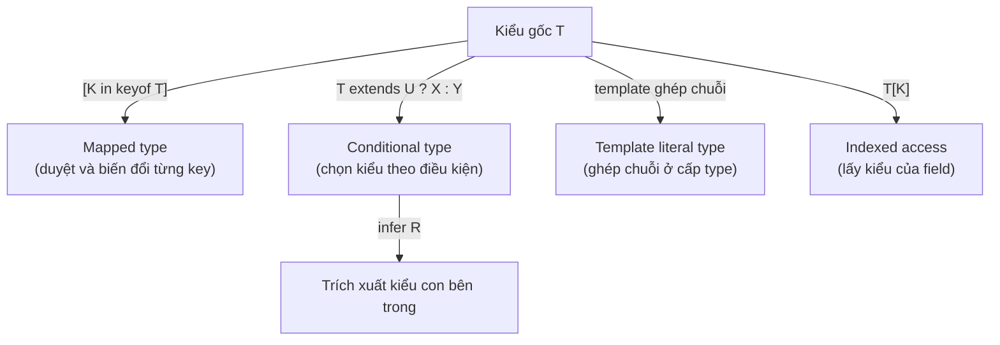
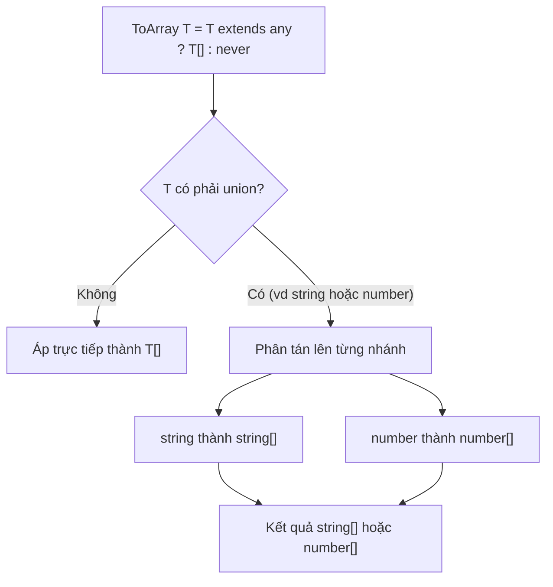

# Advanced Types

**Advanced types** (các kiểu nâng cao) là những kỹ thuật giúp bạn mô tả kiểu dữ liệu một cách chính xác và linh hoạt hơn so với các kiểu cơ bản. Chúng bao gồm những công cụ như literal type (kiểu giá trị cố định), mapped type (kiểu sinh ra từ kiểu khác) và conditional type (kiểu chọn theo điều kiện). Bài này giúp người mới học làm quen với cách "lập trình trên kiểu" để biểu diễn được những ràng buộc phức tạp trong TypeScript.

---

:::note[Ghi nhớ nhanh]

- ⭐ **"Lập trình trên kiểu" tạo kiểu TỪ kiểu khác tự động** — tránh trùng lặp và lệch nhau khi kiểu gốc thay đổi; cũng là nền tảng của các utility type built-in.
- **Literal & template literal type** — mô tả giá trị cố định (`"left" | "right"`) và ghép chuỗi ở cấp type (`on${Capitalize<T>}`).
- **Mapped type `{ [K in keyof T]: ... }`** — duyệt từng key, dùng modifier `+`/`-` để thêm/bớt optional/readonly và `as` để rename key.
- ⭐ **Conditional type `T extends U ? X : Y` + `infer`** — chọn kiểu theo điều kiện và trích kiểu con; distributive khi `T` là union (bọc `[T]` để tắt phân tán).
- **Recursive type mô tả cấu trúc lồng** — như `JSONValue`, `DeepReadonly`, nhưng TS giới hạn độ sâu đệ quy (~50) để tránh treo compiler.

:::

---

## Mục lục

- [Vì sao có các kiểu nâng cao?](#vì-sao-có-các-kiểu-nâng-cao)
- [Literal Types](#literal-types)
- [Template Literal Types](#template-literal-types)
- [Mapped Types](#mapped-types)
- [Conditional Types](#conditional-types)
- [Recursive Types](#recursive-types)
- [Câu hỏi phỏng vấn](#câu-hỏi-phỏng-vấn)

---

## Vì sao có các kiểu nâng cao?

Trong dự án thực, nhiều kiểu **phụ thuộc lẫn nhau** và phải đồng bộ với một kiểu gốc. Nếu viết tay từng kiểu, ta bị trùng lặp và dễ lệch khi kiểu gốc thay đổi.

**Vấn đề:**

```ts
interface User {
  id: number;
  name: string;
}

// Viết tay các kiểu "ăn theo" User — trùng lặp
interface UserPatch {
  id?: number;
  name?: string;
}

interface UserGetters {
  getId: () => number;
  getName: () => string;
}

// Thêm field `email` vào User → phải sửa tay cả 2 kiểu trên, dễ quên
```

**Giải pháp:**

```ts
// Tạo kiểu TỪ kiểu khác một cách tự động
type Patch<T> = { [K in keyof T]?: T[K] };          // mapped type
type Getters<T> = {
  [K in keyof T as `get${Capitalize<string & K>}`]: () => T[K];
};                                                   // mapped + template literal
type Return<F> = F extends (...a: any[]) => infer R ? R : never; // conditional + infer

type UserPatch = Patch<User>;     // tự động bám theo User
type UserGetters = Getters<User>; // sửa User → các kiểu này cập nhật theo
```

Các kiểu nâng cao — `keyof`, `typeof` (lấy kiểu từ giá trị), mapped types (`{ [K in keyof T]: ... }`), conditional types (`T extends U ? X : Y`), template literal types, indexed access `T[K]` và `infer` — cho phép biến đổi và suy diễn kiểu một cách mạnh mẽ, mô hình hoá API phức tạp mà vẫn type-safe. Đây cũng là nền tảng của các utility type built-in (`Partial`, `Readonly`, `ReturnType`...).

Sơ đồ dưới tổng hợp các công cụ "lập trình trên kiểu" khi xuất phát từ một kiểu gốc `T`:



:::tip[Dùng thực tế]

- **Tự sinh kiểu form từ model:** `Patch<User>` cho dữ liệu chỉnh sửa một phần, không cần khai báo lại.
- **Suy kiểu trả về API:** `Return<typeof fetchUser>` lấy đúng kiểu kết quả của hàm, tránh lệch.
- **Ràng buộc key hợp lệ bằng `keyof`:** chỉ cho truyền field có thật của object, sai key là báo lỗi ngay khi compile.
- **Build kiểu sự kiện bằng template literal:** `on${Capitalize<T>}` sinh `onClick`, `onChange`... type-safe.

:::

---

## Literal Types

Type chính là **một giá trị cụ thể**, không phải kiểu chung.

```ts
type Direction = "left" | "right" | "up" | "down";
type StatusCode = 200 | 404 | 500;
type IsTrue = true;
```

Kết hợp tạo discriminated union:

```ts
type Action =
  | { type: "INCREMENT" }
  | { type: "SET"; value: number };
```

---

## Template Literal Types

Type chuỗi được **ghép từ literal khác** — giống template string.

```ts
type Greeting = `Hello, ${string}`;
const g: Greeting = "Hello, An";   // OK
const x: Greeting = "Hi, An";      // Error

type Lang = "vi" | "en";
type Greet = `hello-${Lang}`; // "hello-vi" | "hello-en"
```

Kết hợp với utility build sẵn — `Uppercase`, `Lowercase`, `Capitalize`,
`Uncapitalize`:

```ts
type EventName<T extends string> = `on${Capitalize<T>}`;
type ClickEvent = EventName<"click">; // "onClick"
```

:::info[Phân tích]

Template literal type cho phép **type-level string manipulation**:

```ts
type Split<S extends string, D extends string> =
  S extends `${infer Head}${D}${infer Tail}`
    ? [Head, ...Split<Tail, D>]
    : [S];

type Parts = Split<"a,b,c,d", ",">; // ["a", "b", "c", "d"]
```

Ứng dụng thực: typing **route param** trong Express/Next, key path
trong i18n, SQL query builder type-safe...

:::

---

## Mapped Types

Sinh type mới bằng cách **duyệt qua key** của type khác.

```ts
type Optional<T> = {
  [K in keyof T]?: T[K];
};

type ReadonlyAll<T> = {
  readonly [K in keyof T]: T[K];
};

// Tương đương Partial / Readonly built-in
```

Modifier `+` / `-` để **thêm/bớt** optional và readonly:

```ts
type Mutable<T> = {
  -readonly [K in keyof T]: T[K];
};

type StrictRequired<T> = {
  [K in keyof T]-?: T[K];
};
```

Rename key với `as`:

```ts
type Getters<T> = {
  [K in keyof T as `get${Capitalize<string & K>}`]: () => T[K];
};

interface User { id: number; name: string; }
type UserGetters = Getters<User>;
// { getId: () => number; getName: () => string }
```

---

## Conditional Types

Cú pháp `T extends U ? X : Y` — chọn type theo điều kiện.

```ts
type IsString<T> = T extends string ? true : false;

type A = IsString<"hello">; // true
type B = IsString<42>;      // false
```

Kết hợp với `infer` để **trích xuất** type bên trong:

```ts
type ElementOf<T> = T extends (infer U)[] ? U : never;

type A = ElementOf<string[]>;    // string
type B = ElementOf<number[]>;    // number
type C = ElementOf<string>;      // never
```

```ts
type Return<F> = F extends (...args: any[]) => infer R ? R : never;
type Args<F>   = F extends (...args: infer A) => any ? A : never;
```

:::info[Phân tích]

**Distributive conditional types** — khi `T` là union, conditional sẽ
**phân tán** lên từng nhánh union:

```ts
type ToArray<T> = T extends any ? T[] : never;
type A = ToArray<string | number>;
// string[] | number[]  (KHÔNG phải (string | number)[])
```

Sơ đồ dưới minh hoạ cơ chế phân tán (distribute) khi `T` là union:



Cơ chế này giúp viết hàm áp dụng cho từng nhánh union. Để tắt
distribution, bọc trong tuple:

```ts
type ToArrayNonDist<T> = [T] extends [any] ? T[] : never;
type B = ToArrayNonDist<string | number>; // (string | number)[]
```

Hiểu distribution là chìa khoá đọc được code utility-type phức tạp như
trong `type-fest`, `ts-toolbelt`, React types...

:::

---

## Recursive Types

Type **gọi lại chính nó** — diễn tả cấu trúc lồng (cây, JSON, AST).

```ts
type JSONValue =
  | string
  | number
  | boolean
  | null
  | JSONValue[]
  | { [key: string]: JSONValue };

const data: JSONValue = {
  name: "An",
  age: 25,
  hobbies: ["code", "read"],
  nested: { x: true },
};
```

Recursive utility — `DeepReadonly`:

```ts
type DeepReadonly<T> = {
  readonly [K in keyof T]: T[K] extends object
    ? DeepReadonly<T[K]>
    : T[K];
};
```

:::warning[Cần lưu ý]

TS có **giới hạn độ sâu** đệ quy (~50 lần) để tránh treo compiler. Type
recursive quá sâu sẽ báo:

```
Type instantiation is excessively deep and possibly infinite.
```

Khi gặp lỗi này:

- Đơn giản hoá type — không cần đệ quy mọi tầng.
- Dùng **tail-recursion** trong type (đặt phép gọi đệ quy ở vị trí cuối).
- Cân nhắc giải pháp runtime thay vì cố nhồi vào type system.

Type system của TS **Turing-complete**, nhưng đừng lạm dụng — type
phức tạp làm chậm compile và khó maintain.

:::

:::tip[Mẹo]

Khi cần "ép" TS infer literal type sâu hơn (vd object literal), dùng
`as const`:

```ts
const config = {
  routes: {
    home: "/",
    profile: "/profile",
  },
} as const;

type RouteKey = keyof typeof config.routes; // "home" | "profile"
type RoutePath = typeof config.routes[RouteKey]; // "/" | "/profile"
```

Pattern này biến **dữ liệu thành nguồn của type** — single source of
truth, không phải duy trì hai chỗ.

:::

---

## Câu hỏi phỏng vấn

Những câu thường gặp về chủ đề này. Tự trả lời trước, rồi đối chiếu lại với nội dung phía trên.

1. Literal type là gì? Vì sao gán cùng một chuỗi cho `const` và cho `let` lại cho ra hai kiểu khác nhau?
2. `as const` làm gì với object và array? Nó liên hệ thế nào tới literal type và readonly tuple?
3. Mapped type `[K in keyof T]` hoạt động ra sao? Viết lại `Readonly` và `Partial` bằng mapped type.
4. Modifier `+` và `-` trong mapped type (`-readonly`, `-?`) dùng khi nào? Cho ví dụ `Mutable<T>`.
5. Key remapping bằng `as` (TS 4.1+) — viết một type sinh ra `getName` từ field `name`.
6. Làm sao **loại bỏ** một key trong mapped type bằng cách remap nó về `never`?
7. **Homomorphic mapped type** là gì? Vì sao nó bảo toàn `readonly` / optional của kiểu gốc còn dạng không homomorphic thì không?
8. Template literal type dùng để làm gì? Cho ví dụ mô tả kiểu cho route hoặc tên event.
9. Khi ghép nhiều union trong một template literal type, kết quả là tích Descartes — rủi ro bùng nổ tổ hợp thể hiện thế nào và giới hạn của TS là bao nhiêu?
10. `Uppercase` / `Capitalize` kết hợp template literal type để làm gì? Cho ví dụ sinh tên handler `onClick` từ `"click"`.
11. Conditional type `T extends U ? X : Y` được đánh giá lúc nào? Chuyện gì xảy ra khi `T` còn là generic chưa gán (deferred)?
12. **Distributive conditional type** là gì? Vì sao `NonNullable` phân tán trên union, còn bọc `[T] extends [U]` thì tắt phân tán?
13. `infer` hoạt động thế nào? Hãy tự viết `MyReturnType` và `MyParameters`.
14. Nhiều vị trí `infer` cùng tên trong một conditional type cho ra union hay intersection? Điều đó phụ thuộc vị trí covariant hay contravariant ra sao?
15. `infer U extends string` (TS 4.8+) thêm được gì so với `infer U`?
16. Làm sao kiểm tra hai type **bằng nhau chính xác** (`Equals<A, B>`) ở cấp type? Vì sao chỉ dùng `A extends B` là chưa đủ?
17. Recursive type là gì? Giới hạn độ sâu đệ quy của TS và cách tránh lỗi "Type instantiation is excessively deep and possibly infinite".
18. Đọc hiểu: hãy viết `DeepReadonly<T>` và giải thích cách dừng đệ quy ở primitive, function, array và `Map` / `Set`.
19. Phân biệt `keyof`, `typeof`, indexed access `T[K]`, và `T[number]` trên tuple/array. Mỗi cái trả về gì?
20. `never` xuất hiện ở đâu trong lập trình cấp type (lọc union, exhaustive check)? Vì sao `never` là phần tử trung hoà của union?
21. Variadic tuple type (`[...T, U]`, TS 4.0+) giải quyết bài toán gì? Cho ví dụ với `curry` hoặc `Parameters`.
22. Khi nào nên **dừng lại** và không viết type quá "clever"? Nêu đánh đổi giữa độ chính xác kiểu, tốc độ biên dịch và khả năng đọc của đồng đội.

