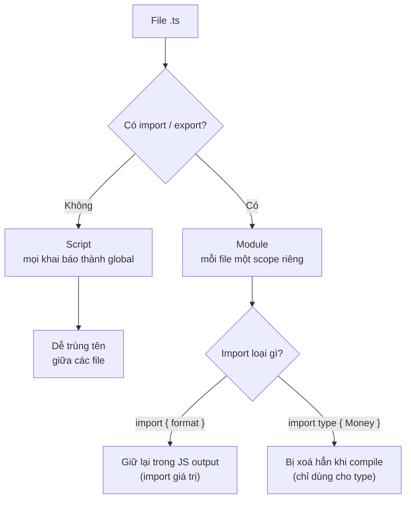

# TypeScript Modules

**Module** (mô-đun, một tệp mã nguồn độc lập) là cách chia chương trình thành nhiều tệp riêng biệt, mỗi tệp có thể `export` (xuất ra) những gì muốn chia sẻ và `import` (nhập vào) thứ cần dùng từ tệp khác. Cơ chế này giúp tổ chức code rõ ràng, tránh trùng tên và chỉ lộ ra phần thật sự cần thiết. Bài này giúp người mới học hiểu cách dùng ES Modules, import/export và một số kỹ thuật quản lý mô-đun trong TypeScript.

[](pathname:///img/typescript/modules-1.webp)

[](pathname:///img/typescript/modules-2.webp)

---

:::note[Ghi nhớ nhanh]

- ⭐ **File có `import`/`export` là module (scope riêng)** — file không có thì là script, mọi khai báo thành global và dễ trùng tên; thêm `export {}` để ép file rỗng thành module.
- **ES Modules dùng `import`/`export`** — hỗ trợ named, `default` và namespace import `* as`.
- ⭐ **`import type`/`export type` bị xoá hoàn toàn khi compile** — tránh side effect và giúp bundler strip type chính xác; nên bật `verbatimModuleSyntax` (TS 5.0+).
- **Re-export / barrel file (`index.ts`) gom một entry điểm** — nhưng dễ gây tree-shaking kém và circular dependency trong project lớn.
- **`namespace` là cách cũ, không dùng cho code app** — chỉ còn hữu dụng trong `.d.ts`; module augmentation (declaration merging) dùng để vá/mở rộng type của module hay global có sẵn.

:::

---

## Mục lục

- [Vì sao có module (và namespace)?](#vì-sao-có-module-và-namespace)
- [ES Modules](#es-modules)
- [Type-only import / export](#type-only-import--export)
- [Re-export](#re-export)
- [Namespaces](#namespaces)
- [Ambient Modules và .d.ts](#ambient-modules-và-dts)
- [Module Augmentation](#module-augmentation)
- [Câu hỏi phỏng vấn](#câu-hỏi-phỏng-vấn)

---

## Vì sao có module (và namespace)?

**Vấn đề:** Khi chia code ra nhiều file, ta cần cách **chia sẻ cả giá trị
lẫn kiểu** giữa các file mà không làm bẩn global, đồng thời khai báo phụ
thuộc thật rõ ràng. Riêng với TS còn rủi ro: import lẫn lộn giữa **import
kiểu** và **import giá trị** có thể ảnh hưởng bundle / việc loại bỏ code
lúc compile.

```ts
// file: format.ts — không có import/export → là "script"
type Money = number;             // type lẫn vào global
function format(m: Money) { return `$${m}`; }
// → format và Money trở thành global, dễ trùng tên với file khác

// file: report.ts
function format() { /* ... */ }  // TRÙNG TÊN ngầm → xung đột global
```

**Giải pháp:** Dùng **ES Modules** với `import` / `export` để chia sẻ cả
kiểu lẫn giá trị, mỗi file có scope riêng. Khi chỉ cần kiểu, dùng
`import type` / `export type` để TS **xoá hẳn lúc compile** (tránh side
effect, giúp bundler strip type chính xác). `namespace` là giải pháp gom
nhóm **cũ** trước khi có ES Module — nay hầu như không dùng cho code app,
chỉ còn gặp trong file `.d.ts`.

```ts
// file: types.ts
export type Money = number;

// file: format.ts — có export → là module, scope riêng
import type { Money } from "./types"; // chỉ import KIỂU, bị xoá khi compile
export function format(m: Money) { return `$${m}`; }

// file: report.ts — format ở đây không đụng format bên kia
import { format } from "./format";
format(100);
```

Sơ đồ dưới đây tóm tắt cách TS phân loại một file và số phận của từng loại import khi compile:



:::tip[Dùng thực tế]

- **Tách kiểu dùng chung** ra một file `types.ts`, các module khác
  `import type { ... }` về dùng.
- **Tối ưu bundle**: dùng `import type` cho thứ chỉ cần kiểu → output JS
  không kéo theo module thừa.
- **Code mới luôn dùng module**, không dùng `namespace` để gom nhóm.
- **Khai báo kiểu cho thư viện** thiếu type bằng file `.d.ts` (nơi
  `namespace` vẫn còn hữu dụng).

:::

---

## ES Modules

TS dùng cú pháp ES Module chuẩn — `import` / `export`.

```ts
// file: math.ts
export function add(a: number, b: number) { return a + b; }
export const PI = 3.14;
export default function multiply(a: number, b: number) { return a * b; }
```

```ts
// file: app.ts
import multiply, { add, PI } from "./math";
import * as Math2 from "./math";

add(1, 2);
Math2.PI;
multiply(2, 3);
```

:::warning[Cần lưu ý]

**File có `import` hoặc `export` được coi là module** — biến/hàm trong
file không tự động global.

File **không có** `import`/`export` được coi là **script** — mọi khai báo
trở thành global → dễ trùng tên.

Khi muốn file rỗng làm module (chỉ để augment), thêm `export {}`:

```ts
// utils.d.ts
export {};

declare global {
  interface Window { myApp: any; }
}
```

:::

---

## Type-only import / export

TS 3.8+ — đánh dấu `import` chỉ dành cho type:

```ts
import type { User } from "./types";
import { type Config, fetchData } from "./api";
```

Khác `import` thường:

- **Bị xoá hoàn toàn** sau compile → không ảnh hưởng runtime.
- Không trigger side effect khi load file.
- Tránh circular dependency liên quan đến type.

:::info[Phân tích]

Bật flag `verbatimModuleSyntax: true` (TS 5.0+) để TS **bắt buộc** dùng
`type` keyword khi import chỉ để type. Lợi ích:

1. **Bundler không cần biết** đâu là type, đâu là value — esbuild, swc,
   Bun có thể strip type chính xác mà không cần TS compiler.
2. **Loại bỏ import thừa** — file `import type` không bao giờ được giữ
   trong output JS, tránh load module không cần thiết.
3. **CommonJS/ESM interop** rõ ràng — type không lẫn vào require/import.

Trong project Next.js 14+, Bun, Vite hiện đại, đây là flag nên bật.

:::

---

## Re-export

Gom nhiều module thành một entry điểm:

```ts
// index.ts
export { add, PI } from "./math";
export { fetchUser } from "./api";
export type { User } from "./types";

// Re-export tất cả
export * from "./helpers";

// Re-export với tên mới
export { default as Logger } from "./logger";
```

Pattern **barrel file** (`index.ts`) cho phép caller viết:

```ts
import { add, fetchUser, User } from "@/lib";
// thay vì
import { add } from "@/lib/math";
import { fetchUser } from "@/lib/api";
```

:::warning[Cần lưu ý]

Barrel file dễ gây **tree-shaking kém** và **circular dependency**:

- Nếu bundler không loại bỏ được code không dùng, import 1 hàm có thể
  load cả 50 file.
- Module A và B cùng re-export qua barrel → dễ tạo vòng tròn ngầm.

Trong project lớn (Next.js, monorepo), cân nhắc:

- Dùng barrel chỉ ở **public API package** (vd `packages/ui/index.ts`).
- Trong code app, **import thẳng đường dẫn** thay vì qua barrel.

:::

---

## Namespaces

Cách cũ (pre-ES Module) để gom code thành "namespace".

```ts
namespace Validators {
  export function isEmail(s: string) { return /@/.test(s); }
  export function isPhone(s: string) { return /^\d+$/.test(s); }
}

Validators.isEmail("a@b.c");
```

:::warning[Cần lưu ý]

**Không dùng `namespace` trong code mới.** Lý do:

- ES Module + folder structure thay thế hoàn toàn.
- Namespace không tree-shake được tốt.
- Tooling hiện đại (Vite, esbuild, Bun) đều ưu tiên ESM.

Namespace **vẫn hữu dụng** trong file `.d.ts` để khai báo type của thư
viện UMD/global (jQuery, Lodash khi nạp qua `<script>`):

```ts
// jquery.d.ts
declare namespace JQuery {
  interface Options { /* ... */ }
}
```

:::

---

## Ambient Modules và .d.ts

File `.d.ts` (declaration file) **chỉ chứa type**, không có code runtime.

Mô tả thư viện không có type sẵn:

```ts
// my-lib.d.ts
declare module "my-lib" {
  export function doSomething(x: number): string;
}
```

Mô tả file non-JS (cho bundler):

```ts
// global.d.ts
declare module "*.svg" {
  const content: string;
  export default content;
}

declare module "*.module.css" {
  const classes: { [key: string]: string };
  export default classes;
}
```

Khai báo biến global của môi trường:

```ts
declare const __APP_VERSION__: string; // được Vite/Webpack inject
declare function gtag(...args: any[]): void; // Google Analytics global
```

---

## Module Augmentation

Thêm property vào module/global có sẵn.

```ts
// Augment Express Request
declare module "express" {
  interface Request {
    userId?: string;
  }
}

// Augment Window
declare global {
  interface Window {
    dataLayer: any[];
  }
}

export {}; // Cần để file này là module
```

:::info[Phân tích]

Module augmentation là **kỹ thuật chỉ TS có**, không có gì tương đương
trong JS. Cơ chế dựa vào **declaration merging** — khai báo `interface`
cùng tên trong nhiều file sẽ tự gộp.

Pattern hay gặp:

- **Mở rộng request/response** của framework (Express, Fastify) với
  field do middleware thêm vào.
- **Thêm prop vào global** (Window, NodeJS.ProcessEnv).
- **Vá type của thư viện npm** thiếu hoặc sai type.

```ts
// Mở rộng process.env
declare global {
  namespace NodeJS {
    interface ProcessEnv {
      DATABASE_URL: string;
      JWT_SECRET: string;
    }
  }
}
```

→ Cho phép `process.env.DATABASE_URL` có type `string` thay vì
`string | undefined`. Đặt file này trong `src/types/env.d.ts` và include
trong `tsconfig.json`.

:::

---

## Câu hỏi phỏng vấn

Những câu thường gặp về chủ đề này. Tự trả lời trước, rồi bấm **Xem đáp án** để đối chiếu.

**1. TypeScript phân biệt một file là module hay script dựa vào đâu? Nếu file không có `import`/`export` thì các khai báo bên trong đi về đâu, và hệ quả là gì?**

<details className="qa">
<summary>Xem đáp án</summary>

Tiêu chí rất đơn giản: **file có `import` hoặc `export` ở cấp cao nhất thì là module**, không có thì là **script**.

- **Module**: mỗi file có **scope riêng**. Biến, hàm, type khai báo bên trong chỉ thấy được trong file, muốn chia sẻ phải `export`.
- **Script**: mọi khai báo rơi vào **global scope** dùng chung cho toàn project.

```ts
// format.ts — không có import/export → script
type Money = number;
function format(m: Money) { return `$${m}`; }

// report.ts — cũng là script
function format() { /* ... */ }  // TRÙNG TÊN với format ở trên → lỗi
```

Hệ quả của script: dễ trùng tên ngầm giữa các file, không khai báo được phụ thuộc rõ ràng, và IDE gợi ý ra cả những thứ file này không hề dùng. Vì vậy code mới luôn nên là module. Với file thực sự không cần xuất gì (ví dụ file augment type), thêm `export {}` để ép nó thành module.

</details>

**2. Vì sao đôi khi phải thêm dòng `export {}` vào một file `.ts` hoặc `.d.ts` dù file đó không xuất ra gì cả?**

<details className="qa">
<summary>Xem đáp án</summary>

Vì `export {}` là cách **ép file thành module** khi file không có gì để export. Tình huống điển hình là module augmentation: `declare global` và `declare module "x"` chỉ hợp lệ **bên trong một module**; nếu file vẫn là script thì mọi khai báo đã là global rồi, TS sẽ báo lỗi *"Augmentations for the global scope can only be directly nested in external modules"*.

```ts
// utils.d.ts
export {};

declare global {
  interface Window { myApp: any; }
}
```

Lý do thứ hai: tránh **ô nhiễm global**. Một file chỉ chứa hằng số hay type nội bộ, nếu là script thì các tên đó thành global và có thể trùng với file khác. Thêm `export {}` là "đóng cửa" file lại, cho nó scope riêng.

`export {}` không sinh ra gì thêm trong output JS — nó chỉ là tín hiệu cho compiler biết đây là module.

</details>

**3. Phân biệt named export, `default` export và namespace import `import * as X`. Khi nào bạn chọn `default` export, khi nào tránh nó?**

<details className="qa">
<summary>Xem đáp án</summary>

```ts
// math.ts
export function add(a: number, b: number) { return a + b; }  // named
export const PI = 3.14;                                       // named
export default function multiply(a: number, b: number) { return a * b; } // default

// app.ts
import multiply, { add, PI } from "./math"; // default + named
import * as MathLib from "./math";          // namespace import
```

| | Named export | Default export | `import * as X` |
|---|---|---|---|
| Số lượng/file | Nhiều | Tối đa 1 | — |
| Tên khi import | Phải đúng tên (hoặc `as`) | Đặt tuỳ ý | Gom mọi export vào 1 object |
| Auto-import của IDE | Chính xác | Hay đoán sai tên | — |
| Refactor đổi tên | Đồng bộ toàn repo | Mỗi nơi một tên khác nhau | — |

**Chọn `default`** khi module chỉ có một "thứ chính" và đó là quy ước của framework: một React component mỗi file, page trong Next.js, config file.

**Tránh `default`** trong thư viện tiện ích và code chung: tên không nhất quán giữa các nơi import, tree-shaking và auto-import kém thuận lợi hơn, và `export default` cũng khó re-export gọn (phải viết `export { default as Logger } from "./logger"`).

</details>

**4. `import type { User } from "./types"` khác `import { User } from "./types"` ở điểm nào về mặt output JS sau khi compile?**

<details className="qa">
<summary>Xem đáp án</summary>

`import type` được TS **xoá hoàn toàn** khỏi output — không còn dòng import nào trong JS:

```ts
// input
import type { User } from "./types";
import { fetchUser } from "./api";

export function show(u: User) { return fetchUser(u.id); }
```

```js
// output JS
import { fetchUser } from "./api";      // giữ lại
// dòng import type đã biến mất hoàn toàn
export function show(u) { return fetchUser(u.id); }
```

Với `import` thường, TS sẽ cố loại bỏ import nếu thấy nó **chỉ dùng cho type** (import elision), nhưng việc này phụ thuộc phân tích của compiler và không phải lúc nào cũng làm được — nhất là khi transpile từng file riêng lẻ.

Ba hệ quả thực tế của `import type`:

- Không kéo theo module ở runtime → bundle nhẹ hơn.
- Không kích hoạt **side effect** của file được import.
- Cắt được vòng phụ thuộc (circular dependency) khi vòng đó chỉ tồn tại vì type.

</details>

**5. Cờ `verbatimModuleSyntax` (TS 5.0+) giải quyết vấn đề gì? Vì sao bundler như esbuild, swc, Bun lại cần nó?**

<details className="qa">
<summary>Xem đáp án</summary>

`verbatimModuleSyntax: true` bắt TS giữ **đúng nguyên văn** cú pháp import/export: import nào có từ khoá `type` thì bị xoá, import nào không có thì **luôn được giữ lại** trong output. Nói cách khác, nó tắt cơ chế "import elision" đoán mò và buộc lập trình viên đánh dấu rõ ràng.

```ts
import type { User } from "./types";   // chắc chắn bị xoá
import { type Config, fetchData } from "./api"; // Config xoá, fetchData giữ
import "./polyfill";                   // side-effect import luôn được giữ
```

Lý do bundler cần: esbuild, swc, Bun transpile **từng file một, không đọc type**. Chúng nhìn `import { User } from "./types"` mà không biết `User` là interface hay là một hàm thật, nên hoặc giữ lại import thừa (kéo theo module không cần thiết, chạy side effect ngoài ý muốn), hoặc xoá nhầm. Khi có `verbatimModuleSyntax`, thông tin nằm ngay trong cú pháp — bundler strip type chính xác mà không cần TS compiler. Đây là flag nên bật trong project Next.js, Vite, Bun hiện đại.

</details>

**6. Vì sao esbuild/swc/Bun không thể tự biết một import là type hay value? Điều này liên quan gì tới `isolatedModules`?**

<details className="qa">
<summary>Xem đáp án</summary>

Vì các công cụ này làm **single-file transpilation**: mỗi file được dịch độc lập, không load toàn bộ đồ thị phụ thuộc và không chạy type checker. Khi thấy `import { Foo } from "./x"`, chúng chỉ có tên `Foo` chứ không biết trong `./x` thì `Foo` là `interface` (phải xoá) hay là `class`/hàm (phải giữ). TS compiler làm được vì nó đọc cả project; esbuild thì không, và đó là cái giá của tốc độ.

`isolatedModules: true` chính là flag bắt TS **cảnh báo trước** những chỗ code không thể transpile an toàn theo từng file, ví dụ:

```ts
export { User } from "./types";   // lỗi khi isolatedModules: User có thể là type
export type { User } from "./types"; // đúng

const enum E { A }  // const enum cần thông tin liên file → bị cấm
```

Quan hệ giữa hai flag: `isolatedModules` phát hiện vấn đề, còn `verbatimModuleSyntax` (TS 5.0+) đưa ra quy tắc dứt khoát để giải quyết. Project dùng bundler nhanh nên bật cả hai.

</details>

**7. `import type` giúp tránh circular dependency như thế nào? Cho một tình huống thực tế mà `import type` phá được vòng lặp.**

<details className="qa">
<summary>Xem đáp án</summary>

Vòng phụ thuộc chỉ gây lỗi ở **runtime**, khi module A cần giá trị của B trong lúc B đang được khởi tạo dở. Type thì không tồn tại lúc runtime, nên nếu vòng lặp sinh ra chỉ vì trao đổi kiểu, chuyển sang `import type` là cắt được vòng — dòng import biến mất khỏi JS output.

Tình huống thường gặp: hai entity tham chiếu lẫn nhau.

```ts
// user.ts
import type { Order } from "./order";     // chỉ cần kiểu
export class User {
  orders: Order[] = [];
}

// order.ts
import { User } from "./user";            // cần giá trị thật (class)
export class Order {
  constructor(public owner: User) {}
}
```

Nếu `user.ts` dùng `import { Order }` thường, hai file phụ thuộc vòng tròn ở runtime; tuỳ thứ tự nạp, một bên có thể nhận `undefined` và vỡ khi gọi `new`. Đổi sang `import type` thì `user.ts` không còn import `order.ts` trong JS nữa, vòng lặp biến mất trong khi type vẫn đầy đủ.

</details>

**8. Barrel file (`index.ts`) là gì? Nó mang lại tiện lợi gì và đánh đổi những gì về tree-shaking cũng như thời gian build?**

<details className="qa">
<summary>Xem đáp án</summary>

**Barrel file** là một `index.ts` gom (re-export) nhiều module con thành một entry điểm duy nhất:

```ts
// lib/index.ts
export { add, PI } from "./math";
export { fetchUser } from "./api";
export type { User } from "./types";
export * from "./helpers";
```

Tiện lợi: caller chỉ cần `import { add, fetchUser, User } from "@/lib"` thay vì ba dòng import theo đường dẫn; đồng thời nó định nghĩa rõ **public API** của một package — thứ gì không xuất qua barrel thì coi là nội bộ.

Đánh đổi:

- **Tree-shaking kém**: bundler phải nạp và phân tích cả barrel; nếu một module con có side effect hoặc `sideEffects` không được khai báo đúng trong `package.json`, import một hàm có thể kéo theo hàng chục file.
- **Build và type-check chậm**: mọi file import qua barrel đều khiến TS phải xử lý toàn bộ module con trong đó.
- **Circular dependency ngầm**: module con import ngược qua barrel là tạo vòng.

</details>

**9. Trong một monorepo lớn, bạn đặt quy tắc dùng barrel ở đâu và cấm ở đâu? Vì sao một file bên trong thư mục không nên import ngược qua barrel của chính thư mục đó?**

<details className="qa">
<summary>Xem đáp án</summary>

Quy tắc thực dụng:

- **Dùng barrel ở ranh giới package** — `packages/ui/index.ts`, `packages/core/index.ts`. Đây là public API, nơi barrel có giá trị thật: giấu cấu trúc nội bộ, cho phép refactor bên trong mà không phá code người dùng.
- **Cấm barrel trong code app và bên trong package** — import thẳng đường dẫn (`@/lib/math`) để bundler tree-shake tốt và build nhanh.

Vì sao file con không nên import ngược qua barrel của chính thư mục mình: barrel `index.ts` import file con, file con lại import `index.ts` → **vòng tròn trực tiếp**. Ở runtime, thứ tự khởi tạo trở nên khó đoán và một bên có thể nhận `undefined`:

```ts
// lib/index.ts
export * from "./math";
export * from "./format";

// lib/format.ts
import { PI } from ".";   // ❌ import ngược qua barrel → vòng
import { PI } from "./math"; // ✅ import thẳng
```

Có thể ép quy tắc này bằng ESLint (`import/no-cycle`, `no-restricted-imports`) thay vì trông chờ vào kỷ luật cá nhân.

</details>

**10. Circular dependency giữa các module xuất hiện thế nào trong TypeScript? Runtime báo lỗi ra sao và bạn phát hiện, gỡ nó bằng cách nào?**

<details className="qa">
<summary>Xem đáp án</summary>

Vòng phụ thuộc xảy ra khi A import B, B import A (trực tiếp hoặc qua nhiều chặng, thường là qua barrel file). TS **không báo lỗi lúc compile** — vòng chỉ lộ ra lúc chạy: module đang khởi tạo dở trả về binding chưa gán, dẫn tới `undefined`.

Triệu chứng hay gặp:

```
TypeError: Cannot read properties of undefined (reading 'x')
ReferenceError: Cannot access 'User' before initialization
Class extends value undefined is not a constructor or null
```

Lỗi thường xuất hiện ở chỗ trông rất vô lý, và có thể "biến mất" khi đổi thứ tự import — dấu hiệu kinh điển của circular dependency.

Cách phát hiện: ESLint rule `import/no-cycle`, công cụ `madge --circular`, hoặc cảnh báo của bundler.

Cách gỡ:

- Nếu vòng chỉ vì kiểu → đổi sang `import type`.
- Tách phần dùng chung ra **module thứ ba** (thường là `types.ts` hoặc `constants.ts`) để cả hai cùng phụ thuộc vào nó.
- Bỏ import ngược qua barrel, import thẳng đường dẫn.
- Trì hoãn truy cập bằng dynamic `import()` hoặc chuyển phụ thuộc vào trong hàm thay vì ở top-level.

</details>

**11. `namespace` khác module ES ở chỗ nào? Vì sao code app hiện đại không nên dùng `namespace` nữa, và nó còn hữu dụng ở đâu?**

<details className="qa">
<summary>Xem đáp án</summary>

`namespace` là giải pháp gom nhóm **có trước ES Module**, sinh ra một object bao ngoài ngay trong JS output:

```ts
namespace Validators {
  export function isEmail(s: string) { return /@/.test(s); }
}
Validators.isEmail("a@b.c");
```

| | `namespace` | ES Module |
|---|---|---|
| Ranh giới | Logic, nhiều file có thể gộp chung một namespace | Theo file |
| Phụ thuộc | Ngầm, dựa vào thứ tự nạp script | Tường minh qua `import` |
| Tree-shaking | Kém — cả object bị giữ | Tốt |
| Chuẩn | Riêng của TS | Chuẩn ECMAScript |

Không dùng cho code mới vì: ES Module + cấu trúc thư mục thay thế hoàn toàn, namespace tree-shake kém, và toàn bộ tooling hiện đại (Vite, esbuild, Bun) đều ưu tiên ESM.

Vẫn hữu dụng trong file `.d.ts`: khai báo type cho thư viện UMD/global nạp qua `<script>` (jQuery, Lodash), và gom nhóm type global như `declare global { namespace NodeJS { interface ProcessEnv { ... } } }`.

</details>

**12. File `.d.ts` (declaration file) chứa gì và không chứa gì? Nó sinh ra file `.js` sau khi compile không?**

<details className="qa">
<summary>Xem đáp án</summary>

File `.d.ts` **chỉ chứa khai báo kiểu**, không chứa code thực thi. Bên trong có: `interface`, `type`, `declare const/function/class`, `declare module`, `declare namespace`, `declare global`, và các câu lệnh `import`/`export` type.

Không được có: thân hàm, giá trị khởi tạo, logic runtime. `declare` nghĩa là "tôi cam đoan thứ này tồn tại ở đâu đó lúc chạy", việc cung cấp nó là của JS thật hoặc của môi trường.

```ts
// my-lib.d.ts
declare module "my-lib" {
  export function doSomething(x: number): string; // chỉ chữ ký, không có thân
}

declare const __APP_VERSION__: string;  // Vite/Webpack inject lúc build
declare function gtag(...args: any[]): void;
```

**Không sinh ra `.js`.** Toàn bộ nội dung bị xoá khi compile, vì nó thuần type. Ngược lại, khi bật `declaration: true` trong `tsconfig.json`, chính TS sẽ **sinh ra** file `.d.ts` từ code `.ts` của bạn — đó là cách một package npm viết bằng TS cung cấp type cho người dùng.

</details>

**13. Khi dùng một package npm không có type, bạn có những lựa chọn nào? So sánh cài `@types/...`, tự viết `declare module "my-lib"`, và khai báo tạm kiểu `any`.**

<details className="qa">
<summary>Xem đáp án</summary>

| Cách làm | Ưu | Nhược |
|---|---|---|
| `npm i -D @types/my-lib` (DefinitelyTyped) | Type đầy đủ, cộng đồng bảo trì, không tốn công | Có thể lệch phiên bản với package thật; không phải lib nào cũng có |
| Tự viết `declare module "my-lib"` trong `.d.ts` | Type-safe cho đúng phần mình dùng, kiểm soát hoàn toàn | Phải tự bảo trì khi lib nâng cấp |
| Khai báo trống cho ra `any` | Nhanh nhất, gỡ lỗi compile ngay | Mất hoàn toàn type safety, dễ quên và tồn tại mãi |

```ts
// types/my-lib.d.ts — tự viết, chỉ khai báo phần đang dùng
declare module "my-lib" {
  export function doSomething(x: number): string;
}

// hoặc tạm thời (nên kèm TODO)
declare module "my-lib"; // mọi import từ đây có kiểu any
```

Thứ tự ưu tiên hợp lý: kiểm tra `@types/...` trước; không có thì tự viết khai báo tối thiểu cho các API thực sự dùng — thường chỉ vài dòng. Chỉ dùng `any` như biện pháp tạm và ghi chú rõ để quay lại. Nhớ đặt file `.d.ts` trong thư mục nằm trong phạm vi `include` của `tsconfig.json`.

</details>

**14. Giải thích `declare module "*.svg"` hoặc `declare module "*.module.css"` — vì sao bundler (Vite/Webpack) cần khai báo này?**

<details className="qa">
<summary>Xem đáp án</summary>

Bundler cho phép import file không phải JS — ảnh, CSS module, SVG — và tự biến chúng thành giá trị JS (URL chuỗi, object chứa class name...). TypeScript **không biết gì về quy ước này**: với nó, `import logo from "./logo.svg"` là import một module không tồn tại, nên báo *"Cannot find module './logo.svg'"*.

Khai báo wildcard module lấp đúng khoảng trống đó:

```ts
// global.d.ts
declare module "*.svg" {
  const content: string;
  export default content;
}

declare module "*.module.css" {
  const classes: { [key: string]: string };
  export default classes;
}
```

Từ đó `import logo from "./logo.svg"` cho `logo: string`, còn `import styles from "./a.module.css"` cho object tra được `styles.title`.

Lưu ý: đây thuần là **hợp đồng kiểu**, TS không kiểm chứng gì; việc biến file thành giá trị JS vẫn do loader của bundler làm. Nếu khai báo sai kiểu so với cấu hình loader thì code vẫn compile nhưng vỡ lúc chạy. Nhiều framework (Vite, Next.js) đã cung cấp sẵn các khai báo này qua `vite/client` hoặc `next-env.d.ts`.

</details>

**15. Module augmentation là gì và dựa trên cơ chế nào của TypeScript? Vì sao chỉ `interface` gộp được mà `type` alias thì không?**

<details className="qa">
<summary>Xem đáp án</summary>

**Module augmentation** là kỹ thuật **thêm khai báo vào một module hoặc global có sẵn** mà không sửa source gốc — thứ chỉ TS mới có, JS không có gì tương đương.

```ts
declare module "express" {
  interface Request { userId?: string; }
}

declare global {
  interface Window { dataLayer: any[]; }
}

export {}; // cần để file này là module
```

Cơ chế bên dưới là **declaration merging**: nhiều khai báo `interface` cùng tên trong cùng một scope sẽ tự động **gộp thành một**, hợp nhất tất cả member.

`type` alias thì **không gộp được** — khai báo trùng tên sẽ báo lỗi *"Duplicate identifier"*. Lý do: `interface` được thiết kế "mở" (open-ended), compiler thu thập dần mọi khai báo rồi mới chốt hình dạng cuối; còn `type` alias là một **phép gán tên cho một kiểu đã xác định**, nó có thể là union, conditional, mapped type — những thứ không có khái niệm "gộp thêm member" một cách hợp lý.

Đây cũng là một lý do các thư viện công khai thường ưu tiên `interface` cho các kiểu mà người dùng có thể cần mở rộng.

</details>

**16. Bạn thêm field `userId` do middleware gán vào `Request` của Express như thế nào cho type-safe? Nêu các bước và lý do file khai báo phải là module.**

<details className="qa">
<summary>Xem đáp án</summary>

Các bước:

Tạo file khai báo, ví dụ `src/types/express.d.ts`, augment `interface Request` của module `express`, rồi đảm bảo file nằm trong `include` của `tsconfig.json`.

```ts
// src/types/express.d.ts
import "express";

declare module "express" {
  interface Request {
    userId?: string;
  }
}
```

```ts
// middleware
app.use((req, res, next) => {
  req.userId = verifyToken(req.headers.authorization); // type-safe
  next();
});
```

Vì sao file phải là module: `declare module "express"` bên trong một **script** sẽ bị hiểu là *khai báo mới* một ambient module tên `"express"` — tức ghi đè, thay thế toàn bộ type gốc của Express. Chỉ khi file là module (có `import`/`export`, hoặc thêm `export {}`), TS mới coi đó là **augmentation** và gộp vào interface có sẵn.

Nên để `userId?` optional vì trước khi middleware chạy thì field chưa tồn tại; muốn chắc chắn hơn, dùng một type riêng `AuthedRequest` cho các route đã qua middleware.

</details>

**17. `declare global` dùng khi nào? Cho ví dụ mở rộng `Window` và mở rộng `NodeJS.ProcessEnv`, kèm lưu ý về rủi ro khi ép `process.env` thành `string`.**

<details className="qa">
<summary>Xem đáp án</summary>

`declare global` dùng khi cần **thêm khai báo vào global scope từ bên trong một module** — ví dụ biến do script bên thứ ba gắn vào `window`, hoặc biến môi trường.

```ts
// src/types/global.d.ts
export {}; // ép file thành module

declare global {
  interface Window {
    dataLayer: any[];
  }
  namespace NodeJS {
    interface ProcessEnv {
      DATABASE_URL: string;
      JWT_SECRET: string;
    }
  }
}
```

Kết quả: `window.dataLayer.push(...)` và `process.env.DATABASE_URL` có type đúng, không còn `string | undefined`.

**Rủi ro:** khai báo `string` chỉ là **lời hứa**, TS không kiểm chứng gì lúc chạy. Nếu quên set biến trên server, `process.env.DATABASE_URL` vẫn là `undefined` nhưng compiler đã tin là `string` — lỗi nổ ở chỗ khác, rất khó lần. Cách an toàn hơn là **validate lúc khởi động** bằng schema (Zod, envalid) rồi export ra một object config đã được kiểm tra, và code chỉ đọc từ object đó thay vì đọc thẳng `process.env`.

</details>

**18. Sự khác nhau giữa CommonJS và ES Modules ảnh hưởng thế nào tới TypeScript? Nêu vai trò của `esModuleInterop`, `allowSyntheticDefaultImports` và các giá trị `moduleResolution` (`node`, `node16`, `bundler`).**

<details className="qa">
<summary>Xem đáp án</summary>

| | CommonJS | ES Modules |
|---|---|---|
| Cú pháp | `require` / `module.exports` | `import` / `export` |
| Thời điểm giải | Runtime, đồng bộ | Tĩnh, phân tích trước khi chạy |
| Default export | Không có khái niệm — chỉ có `module.exports` | Có `default` riêng biệt |

Chính sự lệch về `default` sinh ra hai flag:

- **`esModuleInterop: true`** — TS sinh helper (`__importDefault`, `__importStar`) khi output CommonJS, để `import express from "express"` hoạt động đúng với package chỉ có `module.exports = ...`. Ảnh hưởng cả type lẫn JS output.
- **`allowSyntheticDefaultImports`** — chỉ nới lỏng **type checker**, cho phép viết default import mà không báo lỗi; không sinh helper. `esModuleInterop` tự bật flag này.

`moduleResolution` quyết định cách TS tìm file từ một chuỗi import:

- **`node`** (classic Node CommonJS): bỏ được đuôi file, tra `node_modules`, đọc `main` trong `package.json`. Không hiểu `exports`.
- **`node16` / `nodenext`**: theo đúng luật Node hiện đại — phân biệt CJS/ESM theo `type` trong `package.json`, hiểu field `exports`, và **bắt buộc ghi đuôi `.js`** trong import ESM.
- **`bundler`** (TS 5.0+): dành cho Vite, webpack, esbuild — hiểu `exports` nhưng vẫn cho phép bỏ đuôi file, sát với cách bundler thực sự làm việc.

</details>
