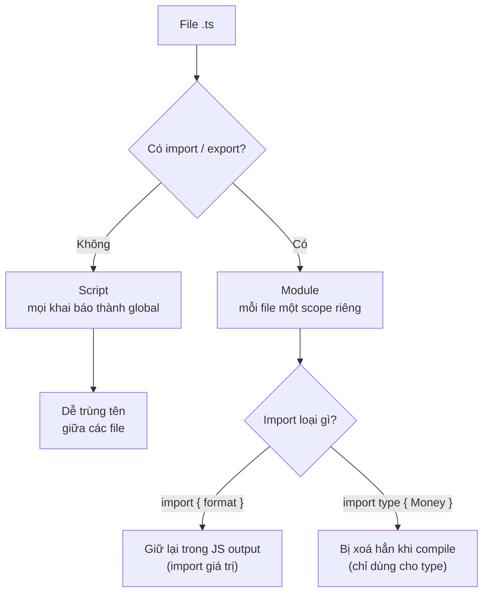

# TypeScript Modules

**Module** (mô-đun, một tệp mã nguồn độc lập) là cách chia chương trình thành nhiều tệp riêng biệt, mỗi tệp có thể `export` (xuất ra) những gì muốn chia sẻ và `import` (nhập vào) thứ cần dùng từ tệp khác. Cơ chế này giúp tổ chức code rõ ràng, tránh trùng tên và chỉ lộ ra phần thật sự cần thiết. Bài này giúp người mới học hiểu cách dùng ES Modules, import/export và một số kỹ thuật quản lý mô-đun trong TypeScript.

---

:::note[Ghi nhớ nhanh]

- ⭐ **File có `import`/`export` là module (scope riêng)** — file không có thì là script, mọi khai báo thành global và dễ trùng tên; thêm `export {}` để ép file rỗng thành module.
- **ES Modules dùng `import`/`export`** — hỗ trợ named, `default` và namespace import `* as`.
- ⭐ **`import type`/`export type` bị xoá hoàn toàn khi compile** — tránh side effect và giúp bundler strip type chính xác; nên bật `verbatimModuleSyntax` (TS 5.0+).
- **Re-export / barrel file (`index.ts`) gom một entry điểm** — nhưng dễ gây tree-shaking kém và circular dependency trong project lớn.
- **`namespace` là cách cũ, không dùng cho code app** — chỉ còn hữu dụng trong `.d.ts`; module augmentation (declaration merging) dùng để vá/mở rộng type của module hay global có sẵn.

:::

---

## Mục lục

- [Vì sao có module (và namespace)?](#vì-sao-có-module-và-namespace)
- [ES Modules](#es-modules)
- [Type-only import / export](#type-only-import--export)
- [Re-export](#re-export)
- [Namespaces](#namespaces)
- [Ambient Modules và .d.ts](#ambient-modules-và-dts)
- [Module Augmentation](#module-augmentation)
- [Câu hỏi phỏng vấn](#câu-hỏi-phỏng-vấn)

---

## Vì sao có module (và namespace)?

**Vấn đề:** Khi chia code ra nhiều file, ta cần cách **chia sẻ cả giá trị
lẫn kiểu** giữa các file mà không làm bẩn global, đồng thời khai báo phụ
thuộc thật rõ ràng. Riêng với TS còn rủi ro: import lẫn lộn giữa **import
kiểu** và **import giá trị** có thể ảnh hưởng bundle / việc loại bỏ code
lúc compile.

```ts
// file: format.ts — không có import/export → là "script"
type Money = number;             // type lẫn vào global
function format(m: Money) { return `$${m}`; }
// → format và Money trở thành global, dễ trùng tên với file khác

// file: report.ts
function format() { /* ... */ }  // TRÙNG TÊN ngầm → xung đột global
```

**Giải pháp:** Dùng **ES Modules** với `import` / `export` để chia sẻ cả
kiểu lẫn giá trị, mỗi file có scope riêng. Khi chỉ cần kiểu, dùng
`import type` / `export type` để TS **xoá hẳn lúc compile** (tránh side
effect, giúp bundler strip type chính xác). `namespace` là giải pháp gom
nhóm **cũ** trước khi có ES Module — nay hầu như không dùng cho code app,
chỉ còn gặp trong file `.d.ts`.

```ts
// file: types.ts
export type Money = number;

// file: format.ts — có export → là module, scope riêng
import type { Money } from "./types"; // chỉ import KIỂU, bị xoá khi compile
export function format(m: Money) { return `$${m}`; }

// file: report.ts — format ở đây không đụng format bên kia
import { format } from "./format";
format(100);
```

Sơ đồ dưới đây tóm tắt cách TS phân loại một file và số phận của từng loại import khi compile:



:::tip[Dùng thực tế]

- **Tách kiểu dùng chung** ra một file `types.ts`, các module khác
  `import type { ... }` về dùng.
- **Tối ưu bundle**: dùng `import type` cho thứ chỉ cần kiểu → output JS
  không kéo theo module thừa.
- **Code mới luôn dùng module**, không dùng `namespace` để gom nhóm.
- **Khai báo kiểu cho thư viện** thiếu type bằng file `.d.ts` (nơi
  `namespace` vẫn còn hữu dụng).

:::

---

## ES Modules

TS dùng cú pháp ES Module chuẩn — `import` / `export`.

```ts
// file: math.ts
export function add(a: number, b: number) { return a + b; }
export const PI = 3.14;
export default function multiply(a: number, b: number) { return a * b; }
```

```ts
// file: app.ts
import multiply, { add, PI } from "./math";
import * as Math2 from "./math";

add(1, 2);
Math2.PI;
multiply(2, 3);
```

:::warning[Cần lưu ý]

**File có `import` hoặc `export` được coi là module** — biến/hàm trong
file không tự động global.

File **không có** `import`/`export` được coi là **script** — mọi khai báo
trở thành global → dễ trùng tên.

Khi muốn file rỗng làm module (chỉ để augment), thêm `export {}`:

```ts
// utils.d.ts
export {};

declare global {
  interface Window { myApp: any; }
}
```

:::

---

## Type-only import / export

TS 3.8+ — đánh dấu `import` chỉ dành cho type:

```ts
import type { User } from "./types";
import { type Config, fetchData } from "./api";
```

Khác `import` thường:

- **Bị xoá hoàn toàn** sau compile → không ảnh hưởng runtime.
- Không trigger side effect khi load file.
- Tránh circular dependency liên quan đến type.

:::info[Phân tích]

Bật flag `verbatimModuleSyntax: true` (TS 5.0+) để TS **bắt buộc** dùng
`type` keyword khi import chỉ để type. Lợi ích:

1. **Bundler không cần biết** đâu là type, đâu là value — esbuild, swc,
   Bun có thể strip type chính xác mà không cần TS compiler.
2. **Loại bỏ import thừa** — file `import type` không bao giờ được giữ
   trong output JS, tránh load module không cần thiết.
3. **CommonJS/ESM interop** rõ ràng — type không lẫn vào require/import.

Trong project Next.js 14+, Bun, Vite hiện đại, đây là flag nên bật.

:::

---

## Re-export

Gom nhiều module thành một entry điểm:

```ts
// index.ts
export { add, PI } from "./math";
export { fetchUser } from "./api";
export type { User } from "./types";

// Re-export tất cả
export * from "./helpers";

// Re-export với tên mới
export { default as Logger } from "./logger";
```

Pattern **barrel file** (`index.ts`) cho phép caller viết:

```ts
import { add, fetchUser, User } from "@/lib";
// thay vì
import { add } from "@/lib/math";
import { fetchUser } from "@/lib/api";
```

:::warning[Cần lưu ý]

Barrel file dễ gây **tree-shaking kém** và **circular dependency**:

- Nếu bundler không loại bỏ được code không dùng, import 1 hàm có thể
  load cả 50 file.
- Module A và B cùng re-export qua barrel → dễ tạo vòng tròn ngầm.

Trong project lớn (Next.js, monorepo), cân nhắc:

- Dùng barrel chỉ ở **public API package** (vd `packages/ui/index.ts`).
- Trong code app, **import thẳng đường dẫn** thay vì qua barrel.

:::

---

## Namespaces

Cách cũ (pre-ES Module) để gom code thành "namespace".

```ts
namespace Validators {
  export function isEmail(s: string) { return /@/.test(s); }
  export function isPhone(s: string) { return /^\d+$/.test(s); }
}

Validators.isEmail("a@b.c");
```

:::warning[Cần lưu ý]

**Không dùng `namespace` trong code mới.** Lý do:

- ES Module + folder structure thay thế hoàn toàn.
- Namespace không tree-shake được tốt.
- Tooling hiện đại (Vite, esbuild, Bun) đều ưu tiên ESM.

Namespace **vẫn hữu dụng** trong file `.d.ts` để khai báo type của thư
viện UMD/global (jQuery, Lodash khi nạp qua `<script>`):

```ts
// jquery.d.ts
declare namespace JQuery {
  interface Options { /* ... */ }
}
```

:::

---

## Ambient Modules và .d.ts

File `.d.ts` (declaration file) **chỉ chứa type**, không có code runtime.

Mô tả thư viện không có type sẵn:

```ts
// my-lib.d.ts
declare module "my-lib" {
  export function doSomething(x: number): string;
}
```

Mô tả file non-JS (cho bundler):

```ts
// global.d.ts
declare module "*.svg" {
  const content: string;
  export default content;
}

declare module "*.module.css" {
  const classes: { [key: string]: string };
  export default classes;
}
```

Khai báo biến global của môi trường:

```ts
declare const __APP_VERSION__: string; // được Vite/Webpack inject
declare function gtag(...args: any[]): void; // Google Analytics global
```

---

## Module Augmentation

Thêm property vào module/global có sẵn.

```ts
// Augment Express Request
declare module "express" {
  interface Request {
    userId?: string;
  }
}

// Augment Window
declare global {
  interface Window {
    dataLayer: any[];
  }
}

export {}; // Cần để file này là module
```

:::info[Phân tích]

Module augmentation là **kỹ thuật chỉ TS có**, không có gì tương đương
trong JS. Cơ chế dựa vào **declaration merging** — khai báo `interface`
cùng tên trong nhiều file sẽ tự gộp.

Pattern hay gặp:

- **Mở rộng request/response** của framework (Express, Fastify) với
  field do middleware thêm vào.
- **Thêm prop vào global** (Window, NodeJS.ProcessEnv).
- **Vá type của thư viện npm** thiếu hoặc sai type.

```ts
// Mở rộng process.env
declare global {
  namespace NodeJS {
    interface ProcessEnv {
      DATABASE_URL: string;
      JWT_SECRET: string;
    }
  }
}
```

→ Cho phép `process.env.DATABASE_URL` có type `string` thay vì
`string | undefined`. Đặt file này trong `src/types/env.d.ts` và include
trong `tsconfig.json`.

:::

---

## Câu hỏi phỏng vấn

Những câu thường gặp về chủ đề này. Tự trả lời trước, rồi đối chiếu lại với nội dung phía trên.

1. TypeScript phân biệt một file là **module** hay **script** dựa vào đâu? Nếu file không có `import`/`export` thì các khai báo bên trong đi về đâu, và hệ quả là gì?
2. Vì sao đôi khi phải thêm dòng `export {}` vào một file `.ts` hoặc `.d.ts` dù file đó không xuất ra gì cả?
3. Phân biệt named export, `default` export và namespace import `import * as X`. Khi nào bạn chọn `default` export, khi nào tránh nó?
4. `import type { User } from "./types"` khác `import { User } from "./types"` ở điểm nào về mặt output JS sau khi compile?
5. Cờ `verbatimModuleSyntax` (TS 5.0+) giải quyết vấn đề gì? Vì sao bundler như esbuild, swc, Bun lại cần nó?
6. Vì sao esbuild/swc/Bun không thể tự biết một import là type hay value? Điều này liên quan gì tới `isolatedModules`?
7. `import type` giúp tránh circular dependency như thế nào? Cho một tình huống thực tế mà `import type` phá được vòng lặp.
8. Barrel file (`index.ts`) là gì? Nó mang lại tiện lợi gì và đánh đổi những gì về tree-shaking cũng như thời gian build?
9. Trong một monorepo lớn, bạn đặt quy tắc dùng barrel ở đâu và cấm ở đâu? Vì sao một file bên trong thư mục không nên import ngược qua barrel của chính thư mục đó?
10. Circular dependency giữa các module xuất hiện thế nào trong TypeScript? Runtime báo lỗi ra sao và bạn phát hiện, gỡ nó bằng cách nào?
11. `namespace` khác module ES ở chỗ nào? Vì sao code app hiện đại không nên dùng `namespace` nữa, và nó còn hữu dụng ở đâu?
12. File `.d.ts` (declaration file) chứa gì và không chứa gì? Nó sinh ra file `.js` sau khi compile không?
13. Khi dùng một package npm không có type, bạn có những lựa chọn nào? So sánh cài `@types/...`, tự viết `declare module "my-lib"`, và khai báo tạm kiểu `any`.
14. Giải thích `declare module "*.svg"` hoặc `declare module "*.module.css"` — vì sao bundler (Vite/Webpack) cần khai báo này?
15. Module augmentation là gì và dựa trên cơ chế nào của TypeScript? Vì sao chỉ `interface` gộp được mà `type` alias thì không?
16. Bạn thêm field `userId` do middleware gán vào `Request` của Express như thế nào cho type-safe? Nêu các bước và lý do file khai báo phải là module.
17. `declare global` dùng khi nào? Cho ví dụ mở rộng `Window` và mở rộng `NodeJS.ProcessEnv`, kèm lưu ý về rủi ro khi ép `process.env` thành `string`.
18. Sự khác nhau giữa CommonJS và ES Modules ảnh hưởng thế nào tới TypeScript? Nêu vai trò của `esModuleInterop`, `allowSyntheticDefaultImports` và các giá trị `moduleResolution` (`node`, `node16`, `bundler`).
