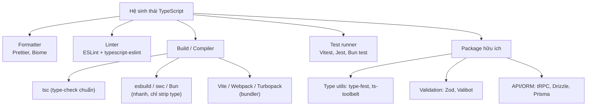
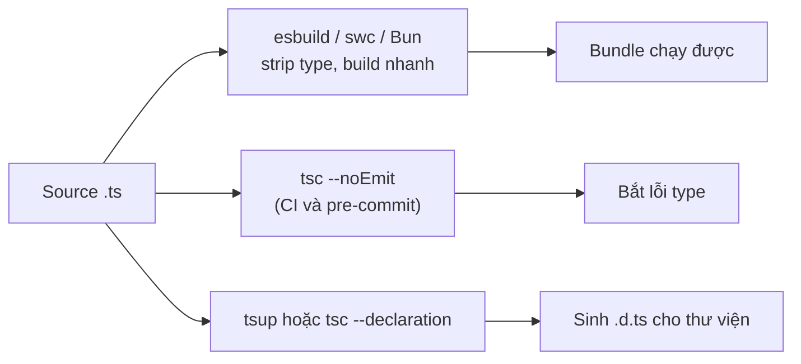

# Ecosystem

**Ecosystem** (hệ sinh thái, tập hợp công cụ xoay quanh ngôn ngữ) là các công cụ thường đi kèm khi làm việc với TypeScript trong thực tế, chứ không phải bản thân ngôn ngữ. Nó gồm những thứ như trình định dạng code (formatter), trình kiểm tra lỗi phong cách (linter), công cụ build và công cụ chạy test. Bài này giúp người mới học hình dung bức tranh tổng thể về các công cụ hỗ trợ để viết và bảo trì dự án TypeScript chuyên nghiệp.

Sơ đồ dưới phác hoạ cây công cụ chính của hệ sinh thái TypeScript theo từng nhóm nhiệm vụ:



---

:::note[Ghi nhớ nhanh]

- ⭐ **Formatter (Prettier/Biome) + Linter (ESLint + typescript-eslint)** — chuẩn hoá style và bắt bad pattern; `TSLint` đã deprecated từ 2019.
- **ESLint có 2 chế độ** — syntax-only (nhanh) và type-aware (bật `parserOptions.project`, bắt nhiều bug hơn như `no-floating-promises` nhưng chậm hơn).
- ⭐ **esbuild/swc/Bun chỉ strip type, KHÔNG type-check** — phải chạy `tsc --noEmit` riêng trong CI/pre-commit; sinh `.d.ts` bằng `tsup` hoặc `tsc --declaration`.
- **Test runner** — Vitest (khuyên dùng cho project mới), Jest, Bun test, Node test runner built-in (Node 20+).
- **Package hữu ích** — `type-fest`/`ts-toolbelt` (type utils), `zod` (validation de-facto), `tRPC`, `drizzle`/`prisma` → stack type-safe single source of truth.

:::

---

## Mục lục

- [Formatting (Prettier)](#formatting-prettier)
- [Linting (ESLint)](#linting-eslint)
- [Build Tools](#build-tools)
- [Test Runners](#test-runners)
- [Useful Packages](#useful-packages)

---

## Formatting (Prettier)

[Prettier](https://prettier.io) là tool format code chuẩn — gần như mặc
định cho mọi project TS.

```bash
npm install --save-dev prettier
```

File `.prettierrc`:

```json
{
  "semi": true,
  "singleQuote": false,
  "trailingComma": "all",
  "printWidth": 100,
  "tabWidth": 2
}
```

Chạy:

```bash
npx prettier --write "src/**/*.{ts,tsx}"
```

:::tip[Mẹo]

Bật **format on save** trong VSCode (`editor.formatOnSave: true`) + cài
extension Prettier. Code tự format mỗi lần lưu, không bao giờ phải nghĩ
về style.

:::

---

## Linting (ESLint)

[ESLint](https://eslint.org) — phát hiện lỗi logic, bad pattern, code
smell. **TSLint đã bị deprecated** từ 2019.

Setup cho TypeScript:

```bash
npm install --save-dev eslint @typescript-eslint/parser @typescript-eslint/eslint-plugin
```

`eslint.config.js` (flat config, ESLint 9+):

```js
import tseslint from "typescript-eslint";

export default tseslint.config(
  ...tseslint.configs.recommended,
  {
    rules: {
      "@typescript-eslint/no-unused-vars": "warn",
      "@typescript-eslint/no-explicit-any": "error",
    },
  },
);
```

:::info[Phân tích]

ESLint cho TS hoạt động ở **hai chế độ**:

1. **Syntax-only** — chạy nhanh, không cần `tsc`. Chỉ check rule không
   phụ thuộc type.
2. **Type-aware** — bật `parserOptions.project: true`, cho phép rule
   dùng thông tin type. Bắt được nhiều bug hơn nhưng chậm hơn 5-10 lần.

Rule type-aware mạnh:

- `no-floating-promises` — phát hiện Promise chưa await.
- `no-misused-promises` — Promise dùng sai trong if/for.
- `strict-boolean-expressions` — cấm dùng truthy với nullable.
- `no-unsafe-assignment` / `no-unsafe-call` — chặn lan truyền `any`.

Trong CI nên chạy ESLint type-aware. Trong pre-commit hook nên dùng
phiên bản nhẹ để không chậm dev.

:::

---

## Build Tools

| Tool | Mục đích | Tốc độ |
|------|----------|--------|
| **tsc** | Compiler chính thức của TS | Chậm |
| **esbuild** | Bundler/transpiler viết bằng Go | Cực nhanh |
| **swc** | Compiler bằng Rust (Next.js dùng) | Cực nhanh |
| **Vite** | Dev server + build dùng esbuild/Rollup | Nhanh |
| **Webpack** | Bundler lâu đời, mạnh, chậm | Chậm |
| **Turbopack** | Successor của Webpack bằng Rust | Nhanh |
| **tsup** | Wrapper esbuild, sinh kèm `.d.ts` | Nhanh |
| **Bun** | Runtime + bundler + test runner | Cực nhanh |

:::warning[Cần lưu ý]

**esbuild / swc / Bun không type-check** — chúng chỉ **strip type** rồi
build. Lỗi type **không bị bắt** trong quá trình bundle.

→ Workflow đúng:

1. **Dev/build runtime**: dùng tool nhanh (Vite, esbuild, Bun).
2. **Type-check tách riêng**: `tsc --noEmit` trong CI và pre-commit.
3. **Sinh `.d.ts` cho thư viện**: dùng `tsup` hoặc `tsc --declaration`.

Đừng dựa vào esbuild/swc để phát hiện lỗi type — chúng không làm.

Sơ đồ dưới tóm tắt workflow tách bạch giữa build runtime nhanh và bước type-check riêng:



:::

---

## Test Runners

| Runner | Đặc điểm |
|--------|----------|
| **Vitest** | API giống Jest, dùng Vite/esbuild → nhanh hơn nhiều |
| **Jest** | Chuẩn cũ, cộng đồng lớn, cần `ts-jest` hoặc `@swc/jest` |
| **Bun test** | Tích hợp sẵn trong Bun, cực nhanh |
| **Node test runner** | Built-in từ Node 20+, không cần cài |

Vitest setup (khuyên dùng cho project mới):

```bash
npm install --save-dev vitest
```

```ts
// math.test.ts
import { expect, test } from "vitest";
import { add } from "./math";

test("add", () => {
  expect(add(1, 2)).toBe(3);
});
```

```bash
npx vitest
```

---

## Useful Packages

**Type utilities:**

- [`type-fest`](https://github.com/sindresorhus/type-fest) — bộ utility
  type bổ sung (DeepReadonly, RequireAtLeastOne, Promisable...).
- [`ts-toolbelt`](https://github.com/millsp/ts-toolbelt) — utility cấp
  cao hơn, dùng cho type metaprogramming.

**Validation runtime:**

- [`zod`](https://zod.dev) — schema validation, infer type tự động.
  De-facto standard 2025+.
- [`valibot`](https://valibot.dev) — alternative cho Zod, tree-shakeable
  hơn.
- [`io-ts`](https://github.com/gcanti/io-ts) — functional style.

**HTTP / API:**

- [`trpc`](https://trpc.io) — end-to-end type-safe API, không cần code
  gen.
- [`hono`](https://hono.dev) — framework web siêu nhẹ, type-safe.

**ORM:**

- [`drizzle-orm`](https://orm.drizzle.team) — SQL builder type-safe,
  lightweight, không decorator.
- [`prisma`](https://www.prisma.io) — ORM phổ biến với schema riêng.

:::tip[Mẹo]

**Bộ "starter kit" type-safe** hiện đại cho project mới (2026):

- Framework: **Next.js** hoặc **Hono**.
- ORM: **Drizzle**.
- Validation: **Zod**.
- API layer: **tRPC**.
- Form: **react-hook-form** + **Zod resolver**.
- Linter: **ESLint type-aware**.
- Formatter: **Prettier** (hoặc **Biome** thay cho cả ESLint + Prettier).
- Build: **Vite** / **Next** (Turbopack) / **Bun**.
- Test: **Vitest**.

Stack này tận dụng tối đa type system của TS — single source of truth
từ DB → API → form, không phải duy trì type ở nhiều tầng.

:::
