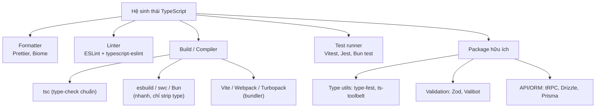
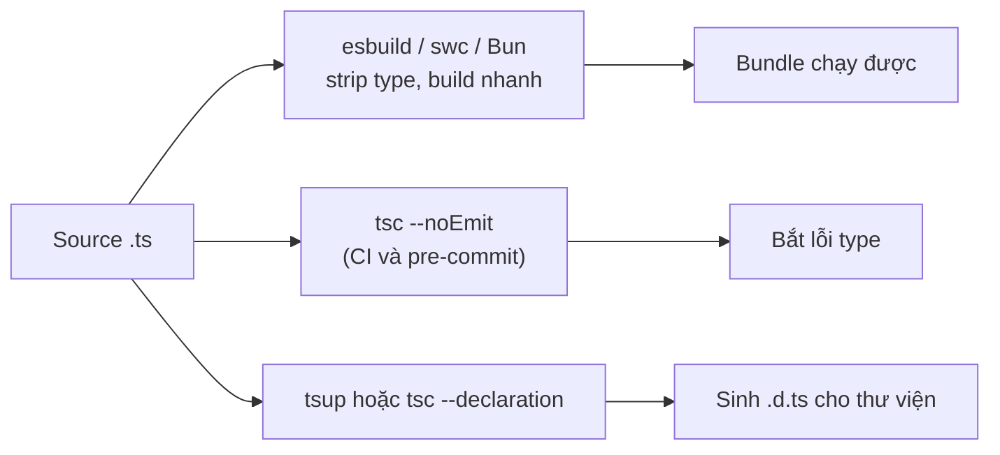

# Ecosystem

**Ecosystem** (hệ sinh thái, tập hợp công cụ xoay quanh ngôn ngữ) là các công cụ thường đi kèm khi làm việc với TypeScript trong thực tế, chứ không phải bản thân ngôn ngữ. Nó gồm những thứ như trình định dạng code (formatter), trình kiểm tra lỗi phong cách (linter), công cụ build và công cụ chạy test. Bài này giúp người mới học hình dung bức tranh tổng thể về các công cụ hỗ trợ để viết và bảo trì dự án TypeScript chuyên nghiệp.

Sơ đồ dưới phác hoạ cây công cụ chính của hệ sinh thái TypeScript theo từng nhóm nhiệm vụ:



[](pathname:///img/typescript/ecosystem-1.webp)

[](pathname:///img/typescript/ecosystem-2.webp)

---

:::note[Ghi nhớ nhanh]

- ⭐ **Formatter (Prettier/Biome) + Linter (ESLint + typescript-eslint)** — chuẩn hoá style và bắt bad pattern; `TSLint` đã deprecated từ 2019.
- **ESLint có 2 chế độ** — syntax-only (nhanh) và type-aware (bật `parserOptions.project`, bắt nhiều bug hơn như `no-floating-promises` nhưng chậm hơn).
- ⭐ **esbuild/swc/Bun chỉ strip type, KHÔNG type-check** — phải chạy `tsc --noEmit` riêng trong CI/pre-commit; sinh `.d.ts` bằng `tsup` hoặc `tsc --declaration`.
- **Test runner** — Vitest (khuyên dùng cho project mới), Jest, Bun test, Node test runner built-in (Node 20+).
- **Package hữu ích** — `type-fest`/`ts-toolbelt` (type utils), `zod` (validation de-facto), `tRPC`, `drizzle`/`prisma` → stack type-safe single source of truth.

:::

---

## Mục lục

- [Formatting (Prettier)](#formatting-prettier)
- [Linting (ESLint)](#linting-eslint)
- [Build Tools](#build-tools)
- [Test Runners](#test-runners)
- [Useful Packages](#useful-packages)
- [Câu hỏi phỏng vấn](#câu-hỏi-phỏng-vấn)

---

## Formatting (Prettier)

[Prettier](https://prettier.io) là tool format code chuẩn — gần như mặc
định cho mọi project TS.

```bash
npm install --save-dev prettier
```

File `.prettierrc`:

```json
{
  "semi": true,
  "singleQuote": false,
  "trailingComma": "all",
  "printWidth": 100,
  "tabWidth": 2
}
```

Chạy:

```bash
npx prettier --write "src/**/*.{ts,tsx}"
```

:::tip[Mẹo]

Bật **format on save** trong VSCode (`editor.formatOnSave: true`) + cài
extension Prettier. Code tự format mỗi lần lưu, không bao giờ phải nghĩ
về style.

:::

---

## Linting (ESLint)

[ESLint](https://eslint.org) — phát hiện lỗi logic, bad pattern, code
smell. **TSLint đã bị deprecated** từ 2019.

Setup cho TypeScript:

```bash
npm install --save-dev eslint @typescript-eslint/parser @typescript-eslint/eslint-plugin
```

`eslint.config.js` (flat config, ESLint 9+):

```js
import tseslint from "typescript-eslint";

export default tseslint.config(
  ...tseslint.configs.recommended,
  {
    rules: {
      "@typescript-eslint/no-unused-vars": "warn",
      "@typescript-eslint/no-explicit-any": "error",
    },
  },
);
```

:::info[Phân tích]

ESLint cho TS hoạt động ở **hai chế độ**:

1. **Syntax-only** — chạy nhanh, không cần `tsc`. Chỉ check rule không
   phụ thuộc type.
2. **Type-aware** — bật `parserOptions.project: true`, cho phép rule
   dùng thông tin type. Bắt được nhiều bug hơn nhưng chậm hơn 5-10 lần.

Rule type-aware mạnh:

- `no-floating-promises` — phát hiện Promise chưa await.
- `no-misused-promises` — Promise dùng sai trong if/for.
- `strict-boolean-expressions` — cấm dùng truthy với nullable.
- `no-unsafe-assignment` / `no-unsafe-call` — chặn lan truyền `any`.

Trong CI nên chạy ESLint type-aware. Trong pre-commit hook nên dùng
phiên bản nhẹ để không chậm dev.

:::

---

## Build Tools

| Tool | Mục đích | Tốc độ |
|------|----------|--------|
| **tsc** | Compiler chính thức của TS | Chậm |
| **esbuild** | Bundler/transpiler viết bằng Go | Cực nhanh |
| **swc** | Compiler bằng Rust (Next.js dùng) | Cực nhanh |
| **Vite** | Dev server + build dùng esbuild/Rollup | Nhanh |
| **Webpack** | Bundler lâu đời, mạnh, chậm | Chậm |
| **Turbopack** | Successor của Webpack bằng Rust | Nhanh |
| **tsup** | Wrapper esbuild, sinh kèm `.d.ts` | Nhanh |
| **Bun** | Runtime + bundler + test runner | Cực nhanh |

:::warning[Cần lưu ý]

**esbuild / swc / Bun không type-check** — chúng chỉ **strip type** rồi
build. Lỗi type **không bị bắt** trong quá trình bundle.

→ Workflow đúng:

1. **Dev/build runtime**: dùng tool nhanh (Vite, esbuild, Bun).
2. **Type-check tách riêng**: `tsc --noEmit` trong CI và pre-commit.
3. **Sinh `.d.ts` cho thư viện**: dùng `tsup` hoặc `tsc --declaration`.

Đừng dựa vào esbuild/swc để phát hiện lỗi type — chúng không làm.

Sơ đồ dưới tóm tắt workflow tách bạch giữa build runtime nhanh và bước type-check riêng:



:::

---

## Test Runners

| Runner | Đặc điểm |
|--------|----------|
| **Vitest** | API giống Jest, dùng Vite/esbuild → nhanh hơn nhiều |
| **Jest** | Chuẩn cũ, cộng đồng lớn, cần `ts-jest` hoặc `@swc/jest` |
| **Bun test** | Tích hợp sẵn trong Bun, cực nhanh |
| **Node test runner** | Built-in từ Node 20+, không cần cài |

Vitest setup (khuyên dùng cho project mới):

```bash
npm install --save-dev vitest
```

```ts
// math.test.ts
import { expect, test } from "vitest";
import { add } from "./math";

test("add", () => {
  expect(add(1, 2)).toBe(3);
});
```

```bash
npx vitest
```

---

## Useful Packages

**Type utilities:**

- [`type-fest`](https://github.com/sindresorhus/type-fest) — bộ utility
  type bổ sung (DeepReadonly, RequireAtLeastOne, Promisable...).
- [`ts-toolbelt`](https://github.com/millsp/ts-toolbelt) — utility cấp
  cao hơn, dùng cho type metaprogramming.

**Validation runtime:**

- [`zod`](https://zod.dev) — schema validation, infer type tự động.
  De-facto standard 2025+.
- [`valibot`](https://valibot.dev) — alternative cho Zod, tree-shakeable
  hơn.
- [`io-ts`](https://github.com/gcanti/io-ts) — functional style.

**HTTP / API:**

- [`trpc`](https://trpc.io) — end-to-end type-safe API, không cần code
  gen.
- [`hono`](https://hono.dev) — framework web siêu nhẹ, type-safe.

**ORM:**

- [`drizzle-orm`](https://orm.drizzle.team) — SQL builder type-safe,
  lightweight, không decorator.
- [`prisma`](https://www.prisma.io) — ORM phổ biến với schema riêng.

:::tip[Mẹo]

**Bộ "starter kit" type-safe** hiện đại cho project mới (2026):

- Framework: **Next.js** hoặc **Hono**.
- ORM: **Drizzle**.
- Validation: **Zod**.
- API layer: **tRPC**.
- Form: **react-hook-form** + **Zod resolver**.
- Linter: **ESLint type-aware**.
- Formatter: **Prettier** (hoặc **Biome** thay cho cả ESLint + Prettier).
- Build: **Vite** / **Next** (Turbopack) / **Bun**.
- Test: **Vitest**.

Stack này tận dụng tối đa type system của TS — single source of truth
từ DB → API → form, không phải duy trì type ở nhiều tầng.

:::

---

## Câu hỏi phỏng vấn

Những câu thường gặp về chủ đề này. Tự trả lời trước, rồi bấm **Xem đáp án** để đối chiếu.

**1. Formatter và linter khác nhau ở vai trò gì? Vì sao một dự án nghiêm túc thường dùng cả Prettier lẫn ESLint chứ không chỉ một?**

<details className="qa">
<summary>Xem đáp án</summary>

| | Formatter (Prettier) | Linter (ESLint) |
|---|---|---|
| Quan tâm | Hình thức: xuống dòng, dấu nháy, dấu chấm phẩy, thụt lề | Nội dung: bad pattern, code smell, lỗi tiềm ẩn |
| Cách làm việc | Parse rồi **in lại** code theo một quy tắc duy nhất | Duyệt AST, khớp rule, báo lỗi/cảnh báo |
| Ví dụ | `printWidth: 100`, `trailingComma: "all"` | `no-floating-promises`, `no-explicit-any` |

Hai công cụ giải hai bài toán khác nhau nên không thay thế được cho nhau. Prettier **không** biết bạn quên `await` một Promise; ESLint **không** có nhiệm vụ quyết định code xuống dòng ở đâu.

Dùng cả hai còn giúp chấm dứt tranh cãi style trong code review: Prettier định đoạt mọi thứ về hình thức (không có option để cãi), ESLint tập trung vào chất lượng logic. Lưu ý tắt các rule style của ESLint để không đá nhau với Prettier — hoặc dùng **Biome**, công cụ gộp cả hai vai trò.

</details>

**2. `TSLint` hiện còn dùng được không? Nếu tiếp quản một codebase cũ còn `tslint.json`, bạn di trú sang `typescript-eslint` theo các bước nào?**

<details className="qa">
<summary>Xem đáp án</summary>

**Không.** TSLint đã bị deprecated từ 2019, không còn nhận rule mới hay hỗ trợ cú pháp TS hiện đại. Toàn bộ cộng đồng đã dồn về **ESLint + `typescript-eslint`**.

Các bước di trú:

1. Cài `eslint`, `@typescript-eslint/parser`, `@typescript-eslint/eslint-plugin`.
2. Chuyển cấu hình: chạy `tslint-to-eslint-config` để sinh bản nháp, rồi rà lại thủ công — nhiều rule TSLint không có bản tương đương một-một.
3. Bắt đầu từ `tseslint.configs.recommended`, chỉ thêm rule tuỳ chỉnh khi thật sự cần, thay vì bê nguyên danh sách rule cũ.
4. Tách phần style sang **Prettier**, bỏ các rule format khỏi lint.
5. Bật dần rule nghiêm: đặt mức `warn` trước, sửa dần, rồi nâng lên `error`.
6. Gỡ `tslint.json`, `tslint` khỏi `package.json`, cập nhật script CI và extension trong IDE.

Mẹo: đừng cố đạt zero-warning ngay. Dùng `--max-warnings` giảm dần theo từng PR, hoặc chỉ lint file thay đổi trong pre-commit để team không bị chặn.

</details>

**3. ESLint flat config (`eslint.config.js`, ESLint 9+) khác `.eslintrc` ở điểm nào? Cấu hình `typescript-eslint` trong flat config ra sao?**

<details className="qa">
<summary>Xem đáp án</summary>

| | `.eslintrc.*` (legacy) | `eslint.config.js` (flat) |
|---|---|---|
| Định dạng | JSON/YAML/JS, có `extends` chuỗi tên | JS thuần, export một **mảng** config |
| Nạp plugin | Theo tên chuỗi, ESLint tự resolve | `import` trực tiếp — rõ ràng, theo chuẩn ESM |
| Kế thừa | `extends` + cascade theo thư mục | Ghép mảng, object sau đè object trước |
| Phạm vi file | `overrides`, `.eslintignore` | `files` / `ignores` ngay trong từng object |

Flat config là mặc định từ ESLint 9, dễ đoán hơn vì không còn cơ chế cascade ngầm theo thư mục.

```js
// eslint.config.js
import tseslint from "typescript-eslint";

export default tseslint.config(
  ...tseslint.configs.recommended,
  {
    rules: {
      "@typescript-eslint/no-unused-vars": "warn",
      "@typescript-eslint/no-explicit-any": "error",
    },
  },
);
```

Muốn bật type-aware thì thay `recommended` bằng `recommendedTypeChecked` và khai báo `languageOptions.parserOptions.projectService: true`.

</details>

**4. ESLint cho TypeScript có hai chế độ syntax-only và type-aware. Bật type-aware bằng cách nào và đánh đổi về hiệu năng là gì?**

<details className="qa">
<summary>Xem đáp án</summary>

- **Syntax-only**: ESLint chỉ dựng AST từ từng file, không gọi TS compiler. Nhanh, nhưng chỉ chạy được rule không cần biết kiểu.
- **Type-aware**: bật `parserOptions.project` (hoặc `projectService: true` ở bản mới), ESLint khởi tạo **TypeScript Program** thật và rule truy cập được type checker.

```js
import tseslint from "typescript-eslint";

export default tseslint.config(
  ...tseslint.configs.recommendedTypeChecked,
  {
    languageOptions: {
      parserOptions: { projectService: true, tsconfigRootDir: import.meta.dirname },
    },
  },
);
```

Đánh đổi: type-aware chậm hơn khoảng **5–10 lần** vì phải parse toàn bộ đồ thị phụ thuộc, kể cả `node_modules` type; tốn RAM và làm IDE phản hồi trễ trên repo lớn.

Chiến lược thực dụng như bài đã nêu: chạy **type-aware trong CI** để không bỏ lọt bug, còn **pre-commit dùng bản nhẹ** (syntax-only, chỉ trên file thay đổi) để vòng lặp phát triển vẫn nhanh.

</details>

**5. Nêu vài rule chỉ chạy được ở chế độ type-aware (ví dụ `no-floating-promises`, `no-misused-promises`) và giải thích chúng bắt được lớp bug nào mà syntax-only bỏ sót.**

<details className="qa">
<summary>Xem đáp án</summary>

Bốn rule type-aware đáng giá nhất:

- **`no-floating-promises`** — Promise được tạo nhưng không `await`, không `.catch()`. Lỗi bị nuốt lặng lẽ, thứ tự thực thi sai.
- **`no-misused-promises`** — Promise dùng ở chỗ cần boolean hoặc callback đồng bộ.
- **`strict-boolean-expressions`** — cấm dùng truthy với giá trị nullable, tránh nhầm `0`/`""` với `undefined`.
- **`no-unsafe-assignment` / `no-unsafe-call`** — chặn `any` lan từ thư viện vào code sạch.

```ts
async function save() { /* ... */ }

save();                       // no-floating-promises: quên await, lỗi bị nuốt

if (save()) { /* ... */ }     // no-misused-promises: Promise luôn truthy!

items.filter(async (x) => await check(x)); // luôn trả Promise → filter vô nghĩa
```

Vì sao syntax-only bỏ sót: nhìn vào AST, `save()` chỉ là một lời gọi hàm bình thường — phải **biết kiểu trả về là `Promise`** mới kết luận được. Tương tự, để biết `x` có nullable hay không thì cần type checker. Đây chính là lớp bug bất đồng bộ tốn nhiều giờ debug nhất trên production.

</details>

**6. ESLint có thay thế được `tsc` trong việc bắt lỗi type không? Vì sao?**

<details className="qa">
<summary>Xem đáp án</summary>

**Không.** Hai công cụ có nhiệm vụ khác hẳn nhau:

- **`tsc`** kiểm tra **tính đúng đắn về kiểu** của toàn chương trình: gán sai kiểu, thiếu property, gọi hàm sai số tham số, union chưa xử lý hết nhánh... Đây là bài toán toàn cục, cần dựng cả đồ thị module.
- **ESLint** chạy **tập rule rời rạc** trên AST từng file. Ngay cả ở chế độ type-aware, nó chỉ *mượn* type checker để phục vụ một số rule cụ thể, chứ không báo cáo mọi type error.

```ts
const n: number = "hello"; // tsc: error. ESLint: im lặng (không rule nào bắt)
```

Ngược lại `tsc` cũng không thay được ESLint: nó không quan tâm bạn quên `await`, đặt tên biến xấu, import vòng hay để lại `console.log`.

Kết luận thực tế: pipeline cần **cả hai**, chạy song song — `tsc --noEmit` cho type, `eslint` cho pattern và code smell. Bỏ một trong hai là để lọt một lớp lỗi riêng.

</details>

**7. Trong CI và trong pre-commit hook, bạn cấu hình lint/type-check khác nhau thế nào để vừa an toàn vừa không làm chậm dev?**

<details className="qa">
<summary>Xem đáp án</summary>

Nguyên tắc: **pre-commit ưu tiên tốc độ, CI ưu tiên độ phủ**.

| | Pre-commit (husky + lint-staged) | CI |
|---|---|---|
| Phạm vi | Chỉ file staged | Toàn repo |
| Format | `prettier --write` | `prettier --check` |
| Lint | ESLint syntax-only, `--fix` | ESLint **type-aware**, `--max-warnings 0` |
| Type-check | Thường bỏ qua (hoặc chạy nền) | `tsc --noEmit` bắt buộc |
| Test | Bỏ qua hoặc chỉ test liên quan | Toàn bộ + coverage |

```json
// package.json
"lint-staged": {
  "*.{ts,tsx}": ["prettier --write", "eslint --fix"]
}
```

Lý do: `tsc --noEmit` là kiểm tra **toàn project**, không thể giới hạn theo file staged, nên đặt vào pre-commit sẽ khiến mỗi commit chờ hàng chục giây — lập trình viên sẽ bắt đầu dùng `--no-verify`. Đặt nó ở CI (và ở IDE, nơi TS server đã chạy sẵn realtime) là hợp lý hơn.

Ngoài ra nên bật cache (`eslint --cache`) và `incremental` cho `tsc` để CI cũng nhanh dần.

</details>

**8. Vì sao esbuild, swc và Bun build cực nhanh nhưng lại không type-check? Giải thích cơ chế transpile từng file (single-file transform) đứng sau điều đó.**

<details className="qa">
<summary>Xem đáp án</summary>

Các công cụ này chỉ làm đúng một việc: **strip type** — xoá phần chú thích kiểu khỏi cú pháp rồi xuất JS. Chúng xử lý **từng file độc lập** (single-file transform), không đọc file khác, không dựng đồ thị phụ thuộc, không có type checker.

```ts
// input
const n: number = compute();
interface User { id: number }

// output — chỉ đơn giản xoá phần type
const n = compute();
```

Nhờ đó chúng song song hoá được hoàn toàn theo file và viết bằng Go (esbuild) hay Rust (swc) — nhanh hơn `tsc` hàng chục lần. Nhưng cái giá là: muốn biết `compute()` trả về `number` hay `string` thì phải mở file khác, phân tích cả chương trình — đúng việc mà chúng cố tình không làm.

Hệ quả: **lỗi type không bị bắt trong quá trình bundle**, code sai kiểu vẫn build thành công. Vì vậy workflow đúng như bài đã nêu: dùng tool nhanh cho build runtime, và chạy `tsc --noEmit` **riêng** trong CI/pre-commit. Cơ chế này cũng là lý do `isolatedModules` và `verbatimModuleSyntax` tồn tại.

</details>

**9. Mô tả workflow chuẩn khi dùng Vite hoặc Next.js: bước nào lo runtime, bước nào lo type-check, và `tsc --noEmit` đặt ở đâu?**

<details className="qa">
<summary>Xem đáp án</summary>

Ba việc tách bạch:

- **Runtime (dev + build)**: Vite dùng esbuild để transform và Rollup để bundle; Next.js dùng swc/Turbopack. Cả hai chỉ strip type — nhanh, không kiểm tra kiểu.
- **Type-check khi viết code**: TypeScript language server trong IDE báo lỗi realtime. Đây mới là vòng phản hồi chính của lập trình viên.
- **Type-check tự động**: `tsc --noEmit` chạy như một script riêng.

```json
"scripts": {
  "dev": "vite",
  "build": "tsc --noEmit && vite build",
  "typecheck": "tsc --noEmit"
}
```

Đặt `tsc --noEmit` ở đâu:

- **Bắt buộc trong CI** — cổng chặn cuối cùng trước khi merge.
- **Trước bước build production** (như script `build` ở trên) để không deploy code sai kiểu.
- **Tuỳ chọn ở dev**: plugin `vite-plugin-checker` chạy type-check song song trong background, hiện lỗi ngay trên trình duyệt mà không làm chậm HMR.

Điểm cần nhớ: `vite build` hay `next build` **thành công không có nghĩa là code đúng kiểu** (Next có chạy type-check mặc định, nhưng nhiều dự án tắt đi để build nhanh).

</details>

**10. Khi publish một thư viện TypeScript lên npm, bạn sinh file `.d.ts` bằng cách nào? So sánh `tsup` với `tsc --declaration`, và nêu vai trò của trường `types`/`exports` trong `package.json`.**

<details className="qa">
<summary>Xem đáp án</summary>

| | `tsc --declaration` | `tsup` |
|---|---|---|
| Bản chất | Compiler chính thức | Wrapper quanh esbuild, kèm bước sinh `.d.ts` |
| Tốc độ | Chậm | Nhanh |
| Output | JS + `.d.ts` theo cấu trúc thư mục | Bundle gọn, xuất được cả CJS và ESM cùng lúc |
| Cấu hình | `tsconfig.json` | Vài dòng trong `tsup.config.ts` |
| Độ chuẩn xác `.d.ts` | Chuẩn tuyệt đối | Rất tốt, nhưng có thể vướng ở type quá phức tạp |

Cách phổ biến: dùng `tsup` (hoặc `unbuild`) cho thư viện thường, dùng `tsc --declaration --emitDeclarationOnly` khi cần độ chính xác tối đa hoặc khi type rất phức tạp.

Trong `package.json`:

```json
{
  "types": "./dist/index.d.ts",
  "exports": {
    ".": {
      "types": "./dist/index.d.ts",
      "import": "./dist/index.mjs",
      "require": "./dist/index.cjs"
    }
  },
  "files": ["dist"]
}
```

`types` là trường cũ, cho TS biết file khai báo ở đâu. `exports` là chuẩn hiện đại: khai báo entry point theo điều kiện (import/require/types), đồng thời **khoá** các đường dẫn nội bộ không cho import bừa. Với `moduleResolution: "node16"/"bundler"`, TS đọc `exports` nên `types` phải nằm **đầu tiên** trong mỗi nhánh điều kiện.

</details>

**11. So sánh `tsc`, `esbuild`, `swc`, `Vite`, `Webpack`, `Turbopack` và `tsup` theo mục đích sử dụng. Với một CLI Node nội bộ và với một app web lớn, bạn chọn gì?**

<details className="qa">
<summary>Xem đáp án</summary>

| Tool | Vai trò chính | Type-check | Tốc độ |
|---|---|---|---|
| `tsc` | Compiler chuẩn, nguồn chân lý về type | Có | Chậm |
| `esbuild` | Transpiler/bundler viết bằng Go | Không | Cực nhanh |
| `swc` | Transpiler viết bằng Rust (Next.js, Jest dùng) | Không | Cực nhanh |
| `Vite` | Dev server + build (esbuild + Rollup) | Không | Nhanh |
| `Webpack` | Bundler lâu đời, hệ plugin khổng lồ | Không | Chậm |
| `Turbopack` | Successor của Webpack, viết bằng Rust | Không | Nhanh |
| `tsup` | Đóng gói thư viện, sinh kèm `.d.ts` | Không | Nhanh |

**CLI Node nội bộ**: nhu cầu đơn giản, ít phụ thuộc — dùng `tsup` (hoặc thậm chí chỉ `tsc`) để xuất một file chạy được, thêm `tsx` cho lúc dev. Không cần bundler web.

**App web lớn**: chọn theo framework — Next.js thì đi kèm swc/Turbopack; SPA hoặc thư viện UI thì Vite. Webpack chỉ nên giữ khi codebase cũ đã phụ thuộc sâu vào hệ plugin của nó.

Điểm chung: dù chọn gì, luôn có `tsc --noEmit` chạy riêng, vì không tool nào trong nhóm nhanh làm việc đó.

</details>

**12. Muốn chạy trực tiếp một file `.ts` không qua bước build thì dùng gì? So sánh `ts-node`, `tsx` và `bun run` về tốc độ, khả năng type-check và hỗ trợ ESM.**

<details className="qa">
<summary>Xem đáp án</summary>

| | `ts-node` | `tsx` | `bun run` |
|---|---|---|---|
| Nền tảng | TS compiler | esbuild | Runtime Bun (JavaScriptCore) |
| Tốc độ khởi động | Chậm | Nhanh | Nhanh nhất |
| Type-check | **Có** (mặc định; `-T` để tắt) | Không | Không |
| ESM / CJS | Cấu hình khá rắc rối | Chạy được cả hai, gần như không cần cấu hình | Hỗ trợ sẵn |
| Cài đặt | npm package | npm package | Cần cài runtime Bun |

```bash
npx ts-node script.ts   # có kiểm tra kiểu, chậm
npx tsx script.ts       # strip type, nhanh
bun run script.ts       # nhanh nhất, cần Bun
```

Chọn thế nào: dùng **`tsx`** cho hầu hết trường hợp (script, seed database, watch mode khi dev) — nhanh, ít cấu hình, và dù sao type cũng đã được `tsc --noEmit` lo. Dùng **`ts-node`** khi thực sự muốn chương trình dừng lại nếu sai kiểu. Dùng **`bun run`** nếu dự án đã ở trong hệ sinh thái Bun. Nhớ rằng cả `tsx` lẫn `bun` đều **không** thay thế được bước type-check riêng.

</details>

**13. `DefinitelyTyped` và các package `@types/...` hoạt động thế nào? Khi nào một thư viện không cần `@types` nữa, và bạn xử lý ra sao khi `@types` lệch phiên bản với thư viện?**

<details className="qa">
<summary>Xem đáp án</summary>

**DefinitelyTyped** là repo cộng đồng khổng lồ chứa file `.d.ts` cho các thư viện JS không tự cung cấp type. Mỗi thư mục trong đó được publish thành một package `@types/<tên-lib>` trên npm. TS tự động tìm type trong `node_modules/@types` mà không cần cấu hình gì.

```bash
npm i -D @types/express @types/node
```

**Khi nào không cần nữa:** khi chính thư viện được viết bằng TS hoặc tự ship `.d.ts` và khai báo qua trường `types`/`exports` trong `package.json` — ví dụ `zod`, `drizzle-orm`, `vitest`. Cài thêm `@types/...` lúc đó là thừa và có thể gây xung đột. Cách kiểm tra: xem có thư mục `dist/*.d.ts` và trường `types` trong `package.json` của lib không.

**Khi lệch phiên bản** (lib nâng lên v5 mà `@types` còn v4):

- Nâng `@types` lên bản khớp major, kiểm tra bảng tương thích trên npm.
- Nếu chưa có bản mới, tạm dùng **module augmentation** trong file `.d.ts` của mình để vá phần thiếu.
- Ghim phiên bản trong `package.json` và mở issue/PR lên DefinitelyTyped.
- Giải pháp cuối: `declare module` tự viết cho phần đang dùng.

</details>

**14. So sánh Vitest, Jest, Bun test và Node test runner built-in. Nếu dự án đang dùng Vite thì vì sao Vitest thường là lựa chọn hợp lý?**

<details className="qa">
<summary>Xem đáp án</summary>

| Runner | Đặc điểm | TS |
|---|---|---|
| **Vitest** | API gần như giống Jest, chạy trên Vite/esbuild, watch mode rất nhanh | Sẵn sàng |
| **Jest** | Chuẩn cũ, hệ sinh thái lớn nhất, nhiều tài liệu | Cần `ts-jest` hoặc `@swc/jest` |
| **Bun test** | Tích hợp sẵn trong Bun, cực nhanh, API kiểu Jest | Sẵn sàng |
| **Node test runner** | Built-in từ Node 20+, không cần cài gì | Cần `tsx` hoặc type stripping |

Vì sao Vitest hợp với dự án Vite:

- **Dùng chung một pipeline transform**: cùng `vite.config.ts`, cùng plugin, cùng alias, cùng biến môi trường. Không phải duy trì hai cấu hình build song song như khi ghép Jest với Vite.
- Hỗ trợ ESM, TS, JSX, CSS module ngay từ đầu — đúng những chỗ Jest hay vướng.
- Watch mode chỉ chạy lại test bị ảnh hưởng, phản hồi gần như tức thì.
- API tương thích Jest nên di trú thường chỉ là đổi import và vài chỗ mock.

Giữ Jest khi codebase đã lớn, phụ thuộc nhiều preset/plugin chỉ có trên Jest, hoặc trong React Native.

</details>

**15. Chạy Jest với TypeScript có những cách nào? So sánh `ts-jest` và `@swc/jest` về tốc độ và khả năng bắt lỗi type trong test.**

<details className="qa">
<summary>Xem đáp án</summary>

Jest không hiểu TS, nên cần một transformer. Ba lựa chọn: `ts-jest`, `@swc/jest`, hoặc `babel-jest` với `@babel/preset-typescript`.

| | `ts-jest` | `@swc/jest` |
|---|---|---|
| Nền tảng | TS compiler | swc (Rust) |
| Type-check khi chạy test | **Có** | Không |
| Tốc độ | Chậm, nhất là suite lớn | Nhanh hơn nhiều lần |
| Cấu hình | Đọc `tsconfig.json` | Cấu hình riêng trong `.swcrc` |

```js
// jest.config.js
export default { transform: { "^.+\\.tsx?$": "@swc/jest" } };
```

Chọn thế nào: `@swc/jest` (hoặc `babel-jest`) cho tốc độ, và để `tsc --noEmit` lo phần type — miễn là `tsconfig.json` có **include cả thư mục test**, nếu không lỗi kiểu trong file test sẽ không ai bắt. Đây là cái bẫy hay gặp.

`ts-jest` đáng dùng khi bạn muốn test **thất bại ngay** vì lỗi kiểu, hoặc khi test phụ thuộc vào các tính năng cần compiler thật. Đánh đổi là thời gian chạy suite tăng rõ rệt.

</details>

**16. Type của TypeScript biến mất lúc runtime, vậy dữ liệu từ API hay form được đảm bảo đúng kiểu bằng cách nào? Vai trò của `zod`/`valibot` và ý nghĩa của việc infer type từ schema.**

<details className="qa">
<summary>Xem đáp án</summary>

TS chỉ kiểm tra lúc compile. Khi gọi API, `const user: User = await res.json()` thực chất là một **lời hứa suông** — `json()` trả `any`, backend đổi field là code vỡ ở nơi khác mà compiler im lặng. Mọi dữ liệu từ ngoài (API, form, `localStorage`, biến môi trường, query param) đều phải **validate lúc runtime**.

`zod` / `valibot` giải quyết bằng cách để bạn khai báo **schema là nguồn duy nhất**, rồi suy ngược ra type:

```ts
import { z } from "zod";

const UserSchema = z.object({
  id: z.number(),
  email: z.string().email(),
  age: z.number().int().min(0).max(150),
});

type User = z.infer<typeof UserSchema>; // type suy ra TỪ schema

const user = UserSchema.parse(await res.json()); // sai dữ liệu → throw ngay
```

Ý nghĩa của `z.infer`: không phải duy trì song song một `interface` và một bộ validator — sửa schema thì type tự đổi theo, không bao giờ lệch nhau. Đây chính là tinh thần "single source of truth" mà stack type-safe hiện đại theo đuổi. Dùng `safeParse` khi muốn xử lý lỗi thay vì throw.

</details>

**17. So sánh `zod` và `valibot`. Khi nào kích thước bundle khiến bạn chọn cái tree-shakeable hơn?**

<details className="qa">
<summary>Xem đáp án</summary>

| | `zod` | `valibot` |
|---|---|---|
| API | Method chaining: `z.string().email().min(5)` | Hàm rời: `v.pipe(v.string(), v.email())` |
| Tree-shaking | Hạn chế — chaining kéo theo cả class schema | Tốt — chỉ bundle validator thực dùng |
| Bundle | Nặng hơn đáng kể | Nhẹ hơn nhiều lần |
| Hệ sinh thái | Rất lớn (tRPC, react-hook-form, Drizzle, nhiều framework) | Đang phát triển, đã có resolver phổ biến |
| Độ trưởng thành | De-facto standard | Mới hơn |

Lý do khác biệt: chaining của Zod buộc mọi method phải nằm trên prototype của schema nên bundler khó loại bỏ; Valibot tách mỗi validator thành một hàm độc lập, không dùng thì không bundle.

Khi nào ưu tiên bundle size:

- Ứng dụng chạy ở **edge/serverless** có giới hạn dung lượng.
- **Trang public** quan tâm Core Web Vitals, mobile mạng yếu.
- Widget/SDK nhúng vào site của người khác.
- Thư viện npm không muốn ép dependency nặng lên người dùng.

Ngược lại, với app nội bộ, dashboard sau đăng nhập hay code chạy ở backend thì vài chục KB không đáng kể — chọn Zod để hưởng hệ sinh thái.

</details>

**18. "Type-safe end-to-end" nghĩa là gì trong stack `tRPC` + `drizzle`/`prisma` + `zod`? Nó khác cách sinh type từ OpenAPI/GraphQL codegen ở điểm nào?**

<details className="qa">
<summary>Xem đáp án</summary>

**Type-safe end-to-end** nghĩa là một type duy nhất chảy suốt từ database → server → client, không đứt đoạn ở bất kỳ ranh giới nào:

- **Drizzle/Prisma** suy type của bảng từ schema DB.
- **Zod** validate input và suy type từ chính schema validate.
- **tRPC** để client **import trực tiếp type của router** trên server, nên `trpc.user.getById.query()` biết luôn kiểu tham số và kiểu trả về.

Đổi tên một cột trong DB → TS báo lỗi ngay ở component React đang dùng field đó, trước cả khi chạy.

Khác với OpenAPI/GraphQL codegen:

| | tRPC (inference) | OpenAPI / GraphQL codegen |
|---|---|---|
| Cách có type | Client `import type` thẳng từ server | Chạy tool sinh file type từ spec |
| Đồng bộ | Tức thì, không thể lệch | Phải nhớ chạy lại codegen; quên là lệch |
| Điều kiện | Client và server **cùng một repo TS** | Hoạt động với mọi ngôn ngữ, mọi client |
| Hợp đồng API | Không có spec độc lập | Có spec chuẩn, chia sẻ được cho team khác |

Nói ngắn gọn: tRPC nhanh và liền mạch nhất cho monorepo TypeScript full-stack; OpenAPI/GraphQL phù hợp khi API là public hoặc client viết bằng ngôn ngữ khác.

</details>

**19. `Biome` định vị ở đâu so với ESLint + Prettier? Nêu lý do chọn và lý do chưa nên chuyển sang nó.**

<details className="qa">
<summary>Xem đáp án</summary>

**Biome** là một toolchain viết bằng Rust, gộp **formatter + linter** vào một binary duy nhất, nhắm thay thế cả Prettier lẫn ESLint. Format của nó gần như tương thích Prettier, còn rule lint phần lớn được port từ ESLint và `typescript-eslint`.

Lý do chọn:

- **Nhanh hơn rất nhiều** — đáng kể trên repo lớn và trong CI.
- **Một công cụ, một file cấu hình** (`biome.json`) thay vì Prettier + ESLint + hàng loạt plugin và cấu hình chống xung đột.
- Không cần Node runtime để chạy, cài đặt đơn giản.

Lý do chưa nên chuyển:

- **Chưa có lint type-aware đầy đủ** — mất những rule giá trị nhất như `no-floating-promises`. Nhiều team vẫn phải giữ ESLint song song, thành ra không giảm được công cụ.
- Hệ sinh thái plugin còn nhỏ; các rule riêng cho React, Next.js, testing library, accessibility chưa phủ hết.
- Không viết được custom rule bằng JS như ESLint.

Lựa chọn thực tế: dùng Biome thay **Prettier** trước (rủi ro thấp, lợi ích tốc độ rõ), giữ ESLint cho phần lint type-aware cho tới khi Biome bắt kịp.

</details>

**20. Khi `tsc` chạy ngày càng chậm trên codebase lớn, bạn tối ưu bằng những cách nào? Nhắc tới `incremental`, `skipLibCheck`, project references và cách chia package.**

<details className="qa">
<summary>Xem đáp án</summary>

Trước hết hãy **đo**: `tsc --diagnostics` (hoặc `--extendedDiagnostics`) cho biết thời gian nằm ở parse, bind hay check, và `--generateTrace` chỉ ra type nào tốn nhất.

Các cách tối ưu, theo thứ tự chi phí tăng dần:

```json
{
  "compilerOptions": {
    "skipLibCheck": true,
    "incremental": true,
    "tsBuildInfoFile": "./node_modules/.cache/tsbuildinfo"
  }
}
```

- **`skipLibCheck: true`** — bỏ kiểm tra chéo các file `.d.ts` trong `node_modules`. Gần như luôn nên bật, hiệu quả tức thì.
- **`incremental: true`** — lưu `.tsbuildinfo`, lần chạy sau chỉ check phần thay đổi. Nhớ cache file này trong CI.
- **Thu hẹp `include`** — đừng để `tsc` quét cả `dist`, `coverage`, file build.
- **Project references** (`composite: true` + `tsc --build`) — chia repo thành các sub-project có ranh giới rõ; mỗi project build và cache độc lập, chỉ rebuild phần bị ảnh hưởng.
- **Chia package trong monorepo** — mỗi package một `tsconfig.json`, phụ thuộc lẫn nhau qua `.d.ts` đã build chứ không qua source, kết hợp Turborepo/Nx để cache theo task.
- **Đơn giản hoá type** — union khổng lồ, conditional đệ quy sâu và inference phức tạp là thủ phạm thường gặp; đôi khi chỉ cần chú thích kiểu tường minh là compile nhanh hẳn.

</details>

**21. `type-fest` và `ts-toolbelt` giải quyết nhu cầu gì? Cho ví dụ một utility type bạn từng cần nhưng TypeScript không có sẵn.**

<details className="qa">
<summary>Xem đáp án</summary>

TS chỉ ship một nhóm utility type cơ bản: `Partial`, `Required`, `Readonly`, `Pick`, `Omit`, `Record`, `ReturnType`, `Parameters`, `Awaited`... Trong dự án thực, nhu cầu vượt xa danh sách đó.

- **`type-fest`** — thư viện utility type "dùng hằng ngày", đã được kiểm chứng và có tài liệu rõ ràng.
- **`ts-toolbelt`** — nhắm vào type metaprogramming cấp cao (tính toán trên số, thao tác tuple, chuỗi ở cấp type). Mạnh hơn nhưng nặng và hại thời gian compile.

Vài utility hay cần mà TS không có:

```ts
import type { RequireAtLeastOne, SetOptional, Simplify, Jsonify } from "type-fest";

// Bắt buộc có ít nhất một trong các cách liên hệ
type Contact = RequireAtLeastOne<{ email?: string; phone?: string }, "email" | "phone">;

// Lấy type từ DB nhưng cho phép thiếu id khi tạo mới
type NewUser = SetOptional<User, "id" | "createdAt">;

// Làm phẳng type lồng nhau cho dễ đọc khi hover
type Flat = Simplify<A & B>;
```

Ngoài ra còn `DeepReadonly`, `Promisable`, `LiteralUnion` (union literal nhưng vẫn gợi ý autocomplete khi kèm `string`). Lời khuyên: ưu tiên import từ `type-fest` thay vì tự viết — vừa đỡ sai, vừa tránh làm chậm compile bằng những type đệ quy tự chế.

</details>
