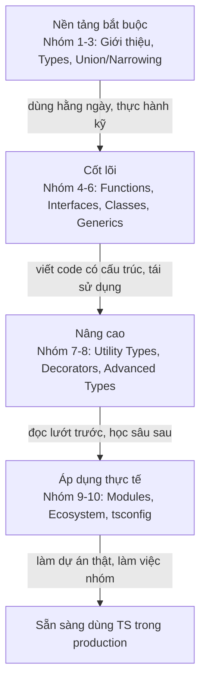

# Lộ trình học TypeScript

:::note[Ghi nhớ nhanh]

- ⭐ **TypeScript = JavaScript + kiểu tĩnh** — mọi code JavaScript hợp lệ đều là code TypeScript hợp lệ.
- ⭐ **Cần nắm vững JavaScript trước** — TS chỉ thêm phần kiểu lên trên nền JS, chưa chắc JS thì học TS rất khó.
- **Phải biên dịch** — trình duyệt và Node.js không chạy trực tiếp `.ts`, code TS được compile ngược về `.js` rồi mới chạy.
- **Lộ trình 10 nhóm, học lần lượt 1→10** — nhóm 1-3 là nền tảng bắt buộc, nhóm 4-6 cốt lõi, 7-8 nâng cao, 9-10 áp dụng thực tế.
- **Phần mở rộng tệp** — dùng `.ts` (hoặc `.tsx` cho React).

:::

## TypeScript là gì?

**TypeScript** là một ngôn ngữ lập trình được xây dựng dựa trên **JavaScript**, bổ sung thêm hệ thống **kiểu tĩnh** (static typing - kiểm tra kiểu dữ liệu ngay khi viết code, trước khi chạy chương trình). Hiểu đơn giản, TypeScript chính là JavaScript được thêm "lớp áo giáp" về kiểu dữ liệu.

Mọi đoạn code JavaScript hợp lệ đều là code TypeScript hợp lệ. Vì vậy nếu bạn đã biết JavaScript, bạn gần như đã biết một phần lớn TypeScript rồi.

## Vì sao nên dùng TypeScript?

- **Bắt lỗi sớm**: TypeScript phát hiện lỗi ngay lúc viết code (trong trình soạn thảo), thay vì đợi đến khi chạy chương trình mới phát hiện. Ví dụ gọi sai tên hàm, truyền sai kiểu tham số sẽ bị báo đỏ ngay lập tức.
- **Code an toàn hơn**: Khi mọi biến, hàm đều có kiểu rõ ràng, bạn ít mắc lỗi vặt và tự tin hơn khi sửa code.
- **Gợi ý code thông minh**: Trình soạn thảo (như VS Code) hiểu rõ kiểu dữ liệu nên gợi ý (autocomplete - tự động hoàn thành) chính xác hơn rất nhiều.
- **Dễ bảo trì dự án lớn**: Khi dự án có hàng nghìn dòng code và nhiều người cùng làm, kiểu dữ liệu giúp mọi người hiểu code của nhau nhanh hơn.

## TypeScript khác JavaScript thế nào?

| Khía cạnh | JavaScript | TypeScript |
| --- | --- | --- |
| Kiểu dữ liệu | Kiểu động (kiểm tra lúc chạy) | Kiểu tĩnh (kiểm tra lúc viết) |
| Bắt lỗi | Chủ yếu khi chạy chương trình | Ngay khi đang viết code |
| Trình duyệt hiểu trực tiếp | Có | Không, phải **biên dịch** (compile - chuyển TypeScript thành JavaScript) trước |
| Phần mở rộng tệp | `.js` | `.ts` (hoặc `.tsx` cho React) |

> Lưu ý: Trình duyệt và Node.js **không chạy trực tiếp** TypeScript. Code TypeScript sẽ được biên dịch ngược về JavaScript thuần rồi mới chạy.

## Cần biết gì trước khi học?

Bạn **cần nắm vững JavaScript trước**: biến, hàm, mảng, đối tượng (object), vòng lặp, và lập trình bất đồng bộ (async/await). TypeScript chỉ thêm phần kiểu dữ liệu lên trên nền JavaScript, nên nếu chưa chắc JavaScript thì học TypeScript sẽ rất khó hiểu.

## Lộ trình học

| # | Chủ đề | Mô tả |
| --- | --- | --- |
| 1 | Giới thiệu | Làm quen TypeScript, cài đặt, biên dịch và chạy chương trình đầu tiên |
| 2 | Các kiểu dữ liệu (Types) | Học những kiểu cơ bản: `string`, `number`, `boolean`, mảng, `any`, `unknown` |
| 3 | Kết hợp & Thu hẹp Type | Kiểu hợp (Union Types), kiểu giao (Intersection Types) và thu hẹp kiểu (Type Narrowing) |
| 4 | Hàm & Giao diện (Functions & Interfaces) | Khai báo kiểu cho hàm, định nghĩa hình dạng đối tượng bằng Interface |
| 5 | Lớp (Classes) | Lập trình hướng đối tượng: lớp, kế thừa, phạm vi truy cập (public/private) |
| 6 | Generics | Viết code dùng lại được cho nhiều kiểu dữ liệu khác nhau |
| 7 | Utility Types & Decorators | Các kiểu tiện ích có sẵn (`Partial`, `Pick`...) và bộ trang trí (Decorators) |
| 8 | Kiểu nâng cao (Advanced Types) | Kiểu có điều kiện (Conditional Types), kiểu ánh xạ (Mapped Types), Type Guards |
| 9 | Modules | Chia code thành nhiều tệp, dùng `import` và `export` để tổ chức dự án |
| 10 | Hệ sinh thái (Ecosystem) | Cấu hình `tsconfig.json`, công cụ kiểm tra, và TypeScript trong dự án thực tế |

## Học theo thứ tự nào?

Hãy học **lần lượt từ nhóm 1 đến nhóm 10**, không nên nhảy cóc. Mỗi nhóm là nền tảng cho nhóm tiếp theo:

1. **Nhóm 1-3** là phần nền tảng bắt buộc. Đây là kiến thức bạn dùng hằng ngày, hãy thực hành thật kỹ.
2. **Nhóm 4-6** là phần cốt lõi giúp bạn viết code có cấu trúc và dùng lại được. Đặc biệt Generics (nhóm 6) cần luyện tập nhiều mới quen.
3. **Nhóm 7-8** là phần nâng cao. Người mới có thể đọc lướt qua trước, rồi quay lại học sâu khi đã vững nền tảng.
4. **Nhóm 9-10** giúp bạn áp dụng TypeScript vào dự án thật, biết cách cấu hình và làm việc trong nhóm.

Sơ đồ dưới đây tóm tắt lộ trình học theo 4 chặng, mỗi chặng là nền tảng cho chặng sau:

Lời khuyên: với mỗi chủ đề, hãy **tự gõ lại ví dụ và thử sửa cho lỗi cố tình** để xem TypeScript báo lỗi như thế nào. Học bằng cách thực hành sẽ nhớ lâu hơn nhiều so với chỉ đọc.
