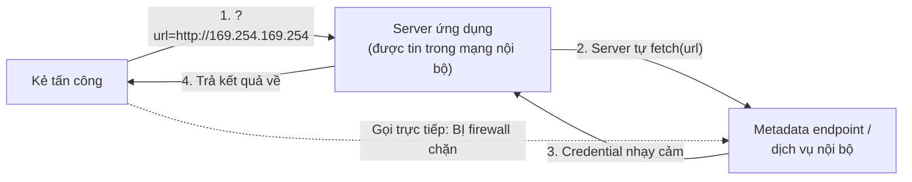

# SSRF & Clickjacking

Bài này khép lại mục tấn công phổ biến với hai lỗ hổng quan trọng: **SSRF**
(server bị lừa gửi request thay kẻ tấn công) và **Clickjacking** (lừa người dùng
bấm vào thứ họ không thấy). Cả hai đều khai thác việc hệ thống "tin nhầm" một thứ
gì đó — và đều có cách phòng thủ rõ ràng.

---

## Mục lục

- [SSRF là gì?](#ssrf-là-gì)
- [Vì sao SSRF nguy hiểm?](#vì-sao-ssrf-nguy-hiểm)
- [Phòng thủ SSRF](#phòng-thủ-ssrf)
- [Clickjacking là gì?](#clickjacking-là-gì)
- [Phòng thủ Clickjacking](#phòng-thủ-clickjacking)
- [Tóm tắt](#tóm-tắt)

---

## SSRF là gì?

**SSRF** (Server-Side Request Forgery — giả mạo yêu cầu phía server) xảy ra khi
ứng dụng nhận một **URL từ người dùng** rồi **tự đi gọi URL đó** từ phía server —
mà không kiểm soát đích đến.

```js
// LỖ HỔNG: server gọi bất kỳ URL nào người dùng đưa vào
app.get('/fetch', async (req, res) => {
  const data = await fetch(req.query.url) // url do người dùng kiểm soát!
  res.send(await data.text())
})

// Kẻ tấn công: ?url=http://169.254.169.254/latest/meta-data/
// → truy cập "metadata endpoint" nội bộ của cloud, lấy credential
```

Kẻ tấn công không với tới được mạng nội bộ, nhưng **mượn tay server** thì được:



Các tình huống dễ dính SSRF: tính năng tải ảnh từ URL, webhook, "xem trước link",
import từ URL, chuyển đổi tài liệu...

## Vì sao SSRF nguy hiểm?

Server thường nằm **trong mạng nội bộ** và **được tin tưởng hơn** client. Khi
"mượn" được server đi gọi request, kẻ tấn công có thể:

- Truy cập **dịch vụ nội bộ** không lộ ra Internet (DB, admin panel, metadata
  endpoint của cloud).
- Lấy **credential cloud** từ metadata endpoint (vd `169.254.169.254`) → leo
  thang chiếm cả hạ tầng.
- Quét cổng mạng nội bộ, vượt qua tường lửa.

## Phòng thủ SSRF

| Biện pháp | Mô tả |
| --- | --- |
| **Danh sách trắng đích đến** | Chỉ cho phép gọi tới các domain/host đã duyệt trước |
| **Chặn IP nội bộ** | Từ chối `localhost`, `127.0.0.1`, dải private (`10.x`, `192.168.x`, `169.254.x`) |
| **Validate & phân giải DNS** | Kiểm tra URL *sau khi* phân giải DNS, đề phòng "DNS rebinding" |
| **Chặn redirect** | Không tự đi theo redirect tới đích ngoài danh sách trắng |
| **Tách mạng** | Đặt dịch vụ gọi-ra ở mạng không truy cập được tài nguyên nhạy cảm |

```js
// Ý tưởng: chỉ cho phép domain trong danh sách trắng
const ALLOWED_HOSTS = new Set(['images.myapp.com', 'cdn.partner.com'])

function assertAllowedUrl(raw) {
  const url = new URL(raw)
  if (url.protocol !== 'https:') throw new Error('Chỉ chấp nhận HTTPS')
  if (!ALLOWED_HOSTS.has(url.hostname)) throw new Error('Host không được phép')
  return url
}
```

:::warning Chặn IP nội bộ là bắt buộc với cloud
Trên môi trường cloud (AWS/GCP/Azure), **metadata endpoint** chứa credential rất
nhạy cảm. Nếu cho phép server gọi URL tuỳ ý mà không chặn IP nội bộ, một lỗ hổng
SSRF có thể dẫn tới chiếm toàn bộ tài khoản cloud.
:::

## Clickjacking là gì?

**Clickjacking** (cướp cú click) là khi kẻ tấn công nhúng trang web thật của bạn
vào một `<iframe>` **trong suốt**, đặt đè lên giao diện giả, rồi lừa người dùng
bấm vào những nút họ không nhìn thấy (vd nút "Xoá tài khoản", "Chuyển tiền").

> Người dùng nghĩ họ đang bấm "Nhận quà" trên trang giả, nhưng thực ra đang bấm
> nút thật trên trang của bạn bị làm trong suốt phía trên.

## Phòng thủ Clickjacking

Cách chống là **không cho phép trang của bạn bị nhúng trong iframe** của site
khác, bằng các header:

```text
# Cách hiện đại (khuyến nghị) — qua CSP:
Content-Security-Policy: frame-ancestors 'self'

# Cách cũ, vẫn được hỗ trợ rộng:
X-Frame-Options: DENY
```

- **`frame-ancestors 'self'`** — chỉ cho phép chính domain của bạn nhúng (hoặc
  `'none'` để cấm hoàn toàn).
- **`X-Frame-Options: DENY`** — cấm mọi nhúng iframe; `SAMEORIGIN` cho phép cùng
  origin.

```js
// Express: dùng helmet để đặt sẵn các header này
const helmet = require('helmet')
app.use(helmet()) // gồm X-Frame-Options và nhiều header an toàn khác
```

> Các header này thuộc nhóm **security headers**, được trình bày kỹ ở mục **4.
> Transport & Headers**.

## Tóm tắt

- **SSRF**: server bị lừa gọi URL do kẻ tấn công kiểm soát → truy cập dịch vụ nội
  bộ, **lấy credential cloud** từ metadata endpoint. Phòng thủ: **danh sách trắng
  đích**, **chặn IP nội bộ**, kiểm soát redirect, tách mạng.
- **Clickjacking**: nhúng trang thật vào iframe trong suốt để cướp click. Phòng
  thủ: **`CSP frame-ancestors`** hoặc **`X-Frame-Options`** (dễ nhất là dùng
  `helmet`).
- Cả hai đều là dạng "tin nhầm": SSRF tin nhầm URL, clickjacking lợi dụng việc
  trang cho phép bị nhúng.

Hết mục Tấn công phổ biến. Mục tiếp theo: **Xác thực & Phiên**.
